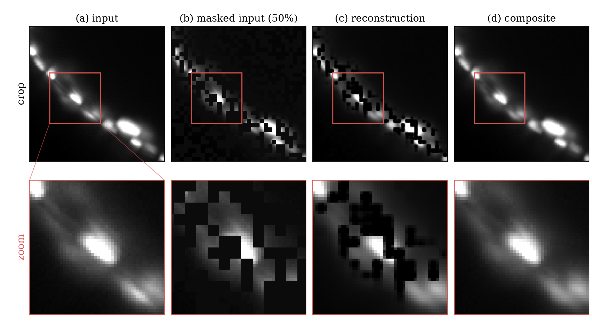
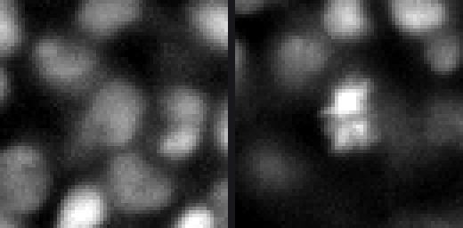
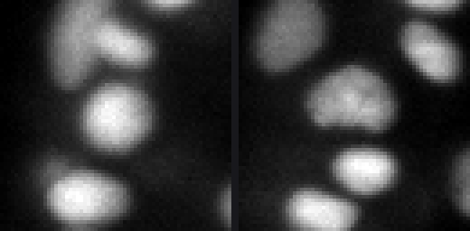
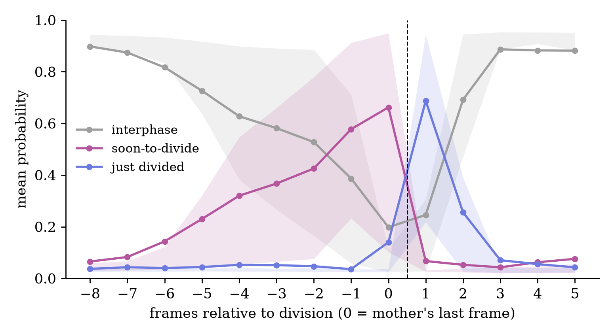
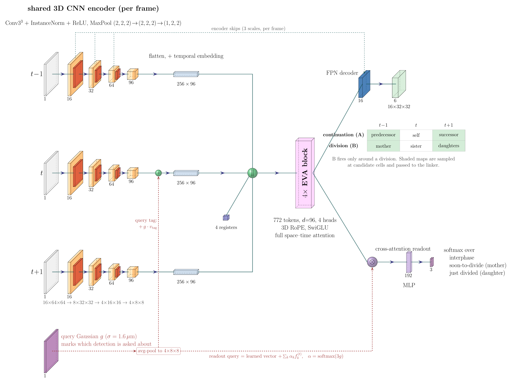
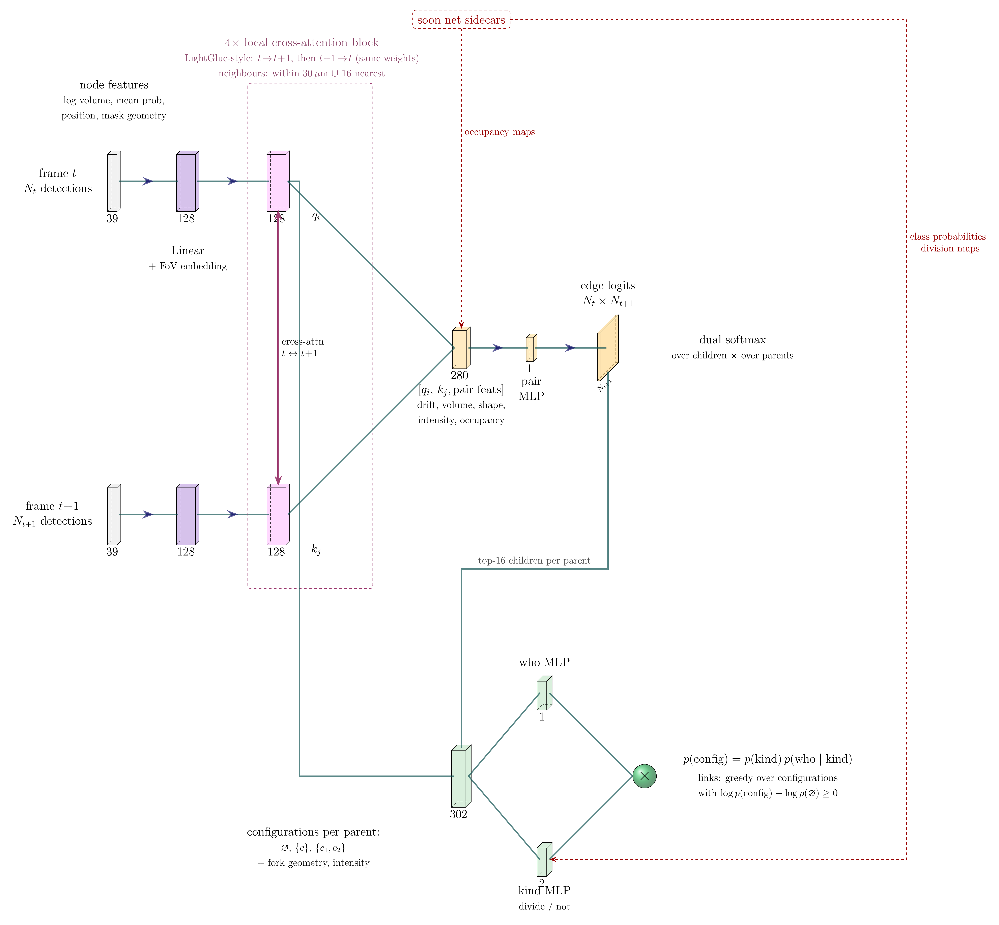

# 1st place — Sergio Alvarez: 1st Place Solution

> Tracking-by-detection with a per-cell visual tracker

| | |
|---|---|
| Private | rank 1, 0.97759 (Gold) |
| Public | rank 3, 0.97635 |
| Team | Sergio Alvarez (@sersasj) |
| Writeup by | Sergio Alvarez |
| Published | 2026-10-01 (updated 2026-10-02) |
| Source | https://www.kaggle.com/competitions/biohub-cell-tracking-during-development/writeups/1st-place-solution |
| Comments | 27 |

---
Thanks to BioHub and Kaggle for hosting such an amazing competition. When I started participating in Kaggle competitions 2 years ago I could have never imagined coming this far. Really proud of this first solo gold and 1st place.

----------
When reading the solution, bear in mind that it was not designed from scratch. It grew as ideas came up and were added along the way, and they didn't come in a straight line, I tried a lot of stuff. So there are some parts that could perhaps be simplified and made more elegant without losing score, maybe even improving it. 

I entered the competition just 4h after it was launched. I didn't know much about tracking in general, much less cell tracking. But I wanted to try for a solo gold, so I was very invested in learning the subject. 

At the beginning of the competition, while I was trying to get more acquainted with the task, I was very intrigued that, contrary to other fields of computer vision, cell tracking was not following the trend of 'let's just scale things up', as a matter of fact, it mostly uses "hand-made" features like geometry, intensity, velocity and so on, and these features are blind, they never look at the cell itself. This was one of the things that stayed in my mind throughout the competition, and one of the things my ideas wandered around.

The second main driver, which helped me with ideas (not so much with improving the scores), was a quote from an ultrack presentation that I watched on [YouTube](https://www.youtube.com/watch?v=98dahngkNOI), where Jordão Bragantini (one of the hosts) [1] says "tracking is hard, because segmentation is hard. If segmentation was solved, tracking would be much easier...". Because of this, in the first half of the competition I tried mainly to improve the detection part, with little to no progress. This month and a half of attacking the segmentation part led me to try the desperate measure of manually annotating cells. I'm used to doing this kind of manual work from my undergraduate research and my master's, but man, annotating 3D cells is very hard. I spent a lot of time on it and only managed to annotate about 1,800 cells, less than 2% of what was already provided, so it was too much effort for almost nothing in the detection part. 

Still, I don't regret doing it, because spending dozens of hours looking at cells gave me a lot of ideas for moving away from the hand-made features that are so dominant. Yes, tracking is hard, cells are extremely similar to each other, they constantly change and, worse, they DIVIDE. But that doesn't stop me, a human who had never tracked cells before, from looking at 3 frames and saying with confidence, this is cell X in frame t-1, this is cell X in t, and here are its daughter cells in t+1. So a machine should be able to learn this somehow.

**Here's the 1st place solution for Biohub - Cell Tracking During Development.**

----

# Overview of the approach

My solution follows the tracking-by-detection paradigm and has 3 main stages plus decoding. 

The first stage, the detection part, is a vanilla U-Net with a Cellpose-style head [2], which predicts a foreground probability and a flow field pointing to each cell's center. The model was pretrained with MAE [3], finetuned with manual annotations + 4.305 µm stamps on GT nodes, and then retrained on pseudo labels generated by that first model. 

The second stage is the fun part of the approach, here I'll call it Soon Net. It looks at 3 frames cropped around each cell and tries to predict its division state (interphase, soon to divide, just divided), where it was and where it went. The architecture is a very small CNN encoder (236K parameters) + transformer (508K parameters) .

The third stage is a learned linker, also a transformer, with some LightGlue [4] inspirations. It scores the edges between frames t and t+1 and decides divisions, using the detector's geometry and the Soon Net's outputs.

Finally, a greedy decode turns the linker scores into lineages. The overview can also be seen in the image below.

# Detection

The detector is a vanilla 3D U-Net with a Cellpose-style head. It has about 3.1M parameters and was trained on crops of size 128×128×64. The encoder has 3 downsampling stages (24, 48 and 96 channels) followed by a 192-channel bottleneck, and each block is 2 × (3×3×3 conv + BatchNorm + ReLU). Pooling is anisotropic, (1,2,2), (1,2,2), (2,2,2). At the end of the decoder, two 1×1×1 heads predict a foreground probability and a 3-channel flow field pointing to the cell center. I also use deep supervision at ½ and ¼ resolution.

To get the instances, like in Cellpose, every voxel with probability > 0.5 follows the flow until it stops at a cell center, and voxels that end up at the same place (within 3 µm) become one instance. Instances smaller than 10 voxels are dropped.

The anisotropic pooling is one of the parameters I'm not so sure about. I tried it as a way of handling the anisotropy of the data in Z, and the loss curves were a little lower with it, so I kept it. Anyway, it's probably not doing much...

The architecture can be seen in the figure below.

I chose to try a mask output instead of a Gaussian blob, which was the dominant strategy in other competitions like CZII and BYU, because many tracking papers like HOCT [5] use geometric features and Ultrack [6] also needs masks, and a simple Gaussian blob would not be able to provide them.

The model was first pretrained with a very "light" MAE (Masked Autoencoder). Normally, MAE masks a big portion of the frame with large blocks. I opted for a much lighter version, masking 50% of the volume in tiny blocks of 2×4×4 voxels (about 3.25 µm on each side, roughly a third of a nucleus). Since the cells are very small, it didn't make sense to me to use large blocks, the model would have to completely hallucinate the cells. With a light MAE it could learn useful features without having to hallucinate. I used 180 movies from the competition (18,000 frames, 15 more held out to check the reconstruction) and 1,500 external frames (150 crops × 10 time points) from the ultrack zebrafish embryo, and trained for 30 epochs. Honestly, I can't say how much it improved the metrics, or even if it improved them at all. In earlier experiments, I was working with an out-of-embryo split and saw a small improvement in recall, so I kept using it. I just wanted to make sure my detector would be more robust against the embryo variety it may encounter in the private LB. And finally, even if it doesn't improve the scores, it helped my models converge much faster, which cannot be a bad thing. This decision was also supported by the literature, the FOCUS-3D paper [7] that @hengck23 shared in the discussions uses MAE pretraining.

The code for MAE is from the amazing MIC-DKFZ group and can be found in their [github](https://github.com/MIC-DKFZ/nnssl) [8]. In the figure below we can see the MAE reconstruction, showing that it did in fact learn to reconstruct.

The first finetune uses my hand-painted masks (~1,800 cells over 583 frames) and 4.305 µm stamps on the 133k annotated GT cells. Models were trained for 40 epochs, using heavy augmentation and EMA.

After the first finetune, I generated pseudo labels for all 195 movies + the 150 external crops using a 5-fold average + 4x flip TTA. After this, I kept only high-confidence detections, generated tracks with the public twoPass tracker and filtered for min length > 3 to help me keep only high-confidence detections. Yes, this leaks into CV, so Round 2 validation scores are optimistic, but since GT was sparse and I could visually see improvements I accepted the trade.

For the final submission, 5 folds × 4x TTA were used, resulting in 20 forward passes per frame.

# Soon to Divide / Visual Tracking

When doing the manual annotation to help my detector, I noticed that divisions were very easy to spot visually. Cells, at least in zebrafish embryos, follow a pretty standard process, they start jiggling, get brighter, then get bigger and suddenly explode in two. The first idea came from seeing this. I didn't even need to see the division happening to know that the cell was going to divide soon. Don't believe me? See for yourself in the gifs below.

I showed no division, and I bet you were able to identify with your eyes which cell was going to divide (the ones on the right).

From this concept came my initial model. At first, the purpose was just to create three features for my linker, Soon-to-Divide, Just-Divided and Interphase, and the probabilities of these 3 classes could then be used however I pleased. The soon-to-divide class comprises the stages of mitosis where I can visually see that something is going on with the cell, probably prophase, metaphase and anaphase, but I wasn't worried about the scientific names, nor about making sure that every step of mitosis was identified. If something was happening with the cell, I labeled it.

The idea in my mind was that soon-to-divide would show a linear increase in probability until its peak when the daughters appear at t+1, and then a sudden change to just divided, and with this the linker would know that a division happened. In the end, I simplified soon-to-divide to be only the last two frames of the mother, t-1 and t, with the daughters appearing at t+1, and not all the frames I labeled. This linear increase does happen, as can be seen in the plot below, even though only the last two frames were labeled soon-to-divide, the probability starts rising about 6 frames before the division. But as you're going to see further on in my Linker section, I only have two frames and never really expanded the temporal features.

The initial architecture was simple. For each detection, I cut a small 16×64×64 crop around it in frames t-1, t and t+1 and added a fourth channel with a Gaussian at the cell's position in frame t, so the model knows which cell I'm asking about. The three frames go through the same small 3D CNN, a small transformer attends over the tokens of all 3 frames, and a learned query seeded at the cell's position reads out the class.

The result of the soon-to-divide model was already good, I was stuck around ~0.925 on the public LB, and it helped me go to ~0.963 public LB with improvements in divisions alone. After a while, I realized that I was not using the full potential of the data. I just showed 3 frames, set a query on the cell I was asking about and classified it, but I had tracks! In last year's RSNA competition, @tomoon33's 1st place solution [9] used auxiliary detection heads to improve their results, and I wanted to try something similar.

That's when I started attacking the second thing that bothered me about tracking. By adding an FPN head, my model no longer only said the state of the cell, it could also say where the cell was and where it went, just by looking at it. The FPN takes the encoder features of each frame and the transformer tokens, and predicts two occupancy maps for each of the 3 frames, one for continuation and one for division. The targets are small spheres at the positions of the query cell and its relatives. For an ordinary cell, its position in t-1, t and t+1 lights up in the continuation maps, so the map for t+1 says "this is where this cell will be in the next frame", which is exactly the question the linker has to answer. For a mother, both daughters light up in the division map of t+1, and for a newborn daughter, its mother lights up in the division map of t-1. 

The architecture is shown below. A lot of it comes from Primus [10] by MIC-DKFZ (yup, them again). The idea of using a small CNN as a tokenizer before a transformer is something I first learned from them, but their tokenizer is much larger and was overfitting easily, so I simplified it as much as I could and ended up with this small CNN. The EVA [11] blocks also come from Primus, and here I have to be honest, I used them just because they did, there was no proper ablation against plain transformer blocks.

The idea of the occupancy maps is simple, but the training recipe needed a couple of tweaks to make it work. I couldn't always put the query cell at the center of the crop, because the model would get lazy and predict occupancy for the cell in the center instead of the queried one. So I use a very large FOV jitter (±3 px in z, ±16 px in xy). I also use a kind of time-step augmentation for interphase cells, frame t-1 is sometimes actually t-2 or t-3, and t+1 is sometimes t+2 or t+3, so the model learns that cells can move far. 

The examples below query a cell and move the FOV around it, and as can be seen, the occupancy maps and class probabilities stay consistent. 

I used early versions of the Soon Net to mine divisions and visually checked a couple hundred of them. In the final version I had 515 divisions to train with, against the 151 in the original GT.

The class head uses a cross-entropy over the 3 classes with label smoothing of 0.1. The occupancy maps use a BCE with foreground and background weighted equally, plus a Focal-Tversky term on the maps that have spheres.  Maps of the wrong type, like the division map of an interphase cell, get an extra BCE on their 512 highest voxels to avoid ghost blobs. The total loss is the class loss + 2 × the map loss.

Training consisted of two rounds. Round 1 was trained for 100 epochs, showing about 6650 crops per epoch with a balanced 1:1:1 split (interphase, soon-to-divide, just divided). In round 2 I used round 1 to mine hard interphases, i.e. cells in interphase tracks that round 1 scored as soon-to-divide (p ≥ 0.5) or just divided (p ≥ 0.3), out-of-fold, which gave 2492 hard negatives. The second version was again trained for 100 epochs, with 6600 crops per epoch and a 1:1:1:1 split (random interphase, hard interphase, soon-to-divide, just divided).

By itself, the Soon Net can already track, using a greedy decode on the occupancy fields. I haven't submitted it, but here are the scores in my 5-fold CV, on the original tracks and on my augmented tracks with manual annotations, mined divisions and a couple of corrections where the original tracks were missing a division annotation.

| GT | Official score, Round 1 | Official score, Round 2 | adj. edge Jaccard (R1 / R2) | division Jaccard (R1 / R2) | Divisions TP/FP/FN (R1 → R2) |
|---|---|---|---|---|---|
| Original GT | 0.9270 | **0.9288** | 0.8926 / 0.8914 | 0.3439 / 0.3738 | 76/73/72 → 77/58/71 |
| Augmented GT | 0.9459 | **0.9464** | 0.8914 / 0.8903 | 0.5443 / 0.5617 | 313/70/192 → 314/54/191 |

It's a decent score, but still not enough to be competitive, so we still need a linker to learn how to better use these features. Note that the Soon Net was the last piece to appear, the early experiments were just detection + learned linker, and this model came much later.

# Linker

Finally, we have the learned linker. Its job is to look at two consecutive frames at a time and decide which cell goes where, and which cell divided. The main inspiration is LightGlue, which matches keypoints between two images, and matching cells between two frames is kind of the same problem.

The linker uses two kinds of features. Node features describe a single cell and go through the transformer. Pair features describe a candidate link between two cells and are only used later, in the MLP heads.

Starting with the node features, each detection becomes a token built from 42 hand-made features. The first 39 go through a linear layer, and the 3 distances to the edge of the field of view go through their own small linear layer that is added to the same token (this is the "FoV embedding" in the figure). Yes, after all my talk about hand-made features, the linker still uses them. I looked down on them at the beginning of the competition, but I can't argue with the results, they work hehe. But there is one difference with the occupancy ones. They are also kind of hand-made, I'm the one deciding to read the parent's heatmap at the child's center, but they are not blind, the heatmap comes from a model that looked at the 3 frames. So if the Soon Net gets better, with more data or a bigger model, these features get better too, and I think this is the part that could be scaled.

| Dims | Feature |
|---|---|
| 1 | log volume of the mask |
| 1 | mean foreground probability over the mask |
| 24 | position z, y, x (sinusoidal, 4 frequencies × sin/cos) |
| 13 | mask geometry in µm (semi-axes, axis ratios, fill ratios, main axis direction, bounding box size) |
| 3 | distance to the edge of the field of view in z, y, x  |

The tokens of both frames go through 4 cross-attention blocks, where each cell only looks at nearby cells in the other frame, every cell within 30 µm plus its 16 nearest ones, so even cells in sparse regions always have candidates.

Then come the pair features, computed for every candidate link (parent at t, child at t+1). Most of them are simple differences between the two cells. The occupancy ones come from the Soon Net maps (the heatmaps shown in the Soon Net figure). For a candidate link, we ask the parent "where do you think you'll be at t+1?" and read its heatmap at the child's center, then ask the child "where were you at t-1?" and read its heatmap at the parent's center. If both answers are high, it's probably the right link.

| Dims | Pair feature |
|---|---|
| 3 | displacement z, y, x |
| 1 | log volume ratio |
| 5 | drift residual after removing the local tissue motion (coarse to fine) |
| 5 | shape change (main axis agreement, axis lengths, elongation) |
| 4 | intensity change |
| 1 | parent's t+1 heatmap, read at the child |
| 1 | child's t-1 heatmap, read at the parent |
| 1 | same value compared with the best other candidate |
| 1 | distance from the child to the peak of the parent's heatmap |
| 2 | flags when the other cell is outside the crop |

The linker has two heads, a pair head and a fork head.

The pair head scores every candidate link, using the two cell embeddings plus the pair features.

The fork head makes the final decision for each parent, no child, one child, or two children. The pair scores pick the 16 best candidate children, and every option is scored, no child (1), a single child (16) or a pair of children (16×15/2 = 120), which gives 137 options per parent.

The decision is split in two steps. First, a "kind" step decides if the parent divides at all. Then, a "who" step picks the children. I split it because these are two different questions. "Is this cell dividing?" depends mostly on the cell itself, what the Soon Net says about it, but also on whether there is a good pair of daughters in the next frame, so the kind step also looks at how good the best candidate pairs are. "Which cells are the daughters?" is about choosing between the candidates. Here the who step uses the Soon Net division maps (the mother points at both daughters and both point back at the mother), the pair scores, intensity, and some geometry, like the distance between the sisters, if their volumes add up to the mother, and if the split happens along the mother's main axis. When everything was in a single softmax, the 120 pair options drowned the rare division decision and the model produced too many false divisions. With the split, the division decision gets its own small head, and the final probability is just p(kind) × p(who | kind).

It's kind of complex to follow everything that is going on, so the figure below tries to illustrate it better.

The linker has 3 losses with equal weights. The pair head uses a dual-softmax NLL, like LightGlue. The fork head uses an NLL over the 137 options of each parent, which trains the kind and who steps together. The third loss goes the other way, it is also an NLL, where each child has to pick its right parent, or no parent, among all the options that claim it.

Training was done for 10 epochs on the augmented GT, with divisions oversampled 8 times. I also use the time-step augmentation, so there is a 25% chance of seeing a (t, t+2) pair.

At inference, the 5 fold linkers are averaged, and the links come from a greedy decode, no threshold on the edge scores. For every parent and every option, the decode computes how much better it is than "no child", log p(option) − log p(no child), and keeps only the ones above 0. These are sorted and accepted from the best down, where each parent takes at most one option and each child can only have one parent. Children left without a parent start new tracks. 

# Post Processing

I tried to keep the post-processing as simple as possible. There is a line-fit smoothing that was shared in the public notebooks, just adjusted to not smooth divisions into their mothers, a division refractory rule that does not allow a newborn daughter to divide again in the next frame (conflicts are resolved from the most confident division down, otherwise a weak early fork could block the real division one frame later), a 1-frame gap closing, and a pruning of tracks shorter than 3 frames.

The final 5-fold CV of the full pipeline (detector + Soon Net + linker, greedy decode) is shown below.

| GT | Soon Net alone | Full pipeline | adj. edge Jaccard (alone / full) | division Jaccard (alone / full) | Divisions TP/FP/FN (full) |
|---|---|---|---|---|---|
| Original GT | 0.9288 | **0.9575** | 0.8914 / 0.9089 | 0.3738 / 0.4857 | 102/62/46 |
| Augmented GT | 0.9464 | **0.9856** | 0.8903 / 0.9090 | 0.5617 / 0.7654 | 434/62/71 |

The final score is 0.976 on the public LB and 0.977 on the private LB.

## Code

To be released

## Sources

[1] Jordão Bragantini, *ultrack: large-scale versatile cell tracking in Python*, SciPy 2024. https://www.youtube.com/watch?v=98dahngkNOI

[2] Stringer et al., *Cellpose: a generalist algorithm for cellular segmentation*, Nature Methods (2021). https://github.com/MouseLand/cellpose

[3] He et al., *Masked Autoencoders Are Scalable Vision Learners*, CVPR (2022). https://arxiv.org/abs/2111.06377

[4] Lindenberger, Sarlin, Pollefeys, *LightGlue: Local Feature Matching at Light Speed*, ICCV (2023). https://arxiv.org/abs/2306.13643

[5] Bragantini, Theodoro, Royer, *Higher-Order Cell Tracking Transformer*, arXiv:2607.11754 (2026). https://arxiv.org/abs/2607.11754

[6] Bragantini, Theodoro, Zhao et al., *Ultrack: pushing the limits of cell tracking across biological scales*, Nature Methods 22, 2423–2436 (2025). https://doi.org/10.1038/s41592-025-02778-0

[7] Zhang, Mu, Liu et al., *FOCUS-3D: Robust, generalizable volumetric cell segmentation for three-dimensional fluorescence microscopy*, bioRxiv (2026). Shared by @hengck23 in the competition discussions.

[8] MIC-DKFZ, *nnssl*, self-supervised learning framework (MAE code used here). https://github.com/MIC-DKFZ/nnssl

[9] tomoon33, *RSNA Intracranial Aneurysm Detection, 1st place solution*, Kaggle (2025). https://www.kaggle.com/competitions/rsna-intracranial-aneurysm-detection/writeups/1st-place-solution

[10] Wald, Roy, Isensee et al., *Primus: Enforcing Attention Usage for 3D Medical Image Segmentation* (2025). https://arxiv.org/abs/2503.01835

[11] Fang et al., *EVA-02: A Visual Representation for Neon Genesis* (2023). https://arxiv.org/abs/2303.11331

---

## Comments (27)

### Alexandre Pedrosa (EXPERT) — 2026-10-04 — -1 votes

@sersasj e falo em portugues porque voce mereceu, to e dd reletar à Priscilla Chan sobre seu valor consolidado Vai a evidencia robusta de seu trabalho.. Isso é maior que que a estrela dourada sozinho, pois a fundadora disse o talento não ter fronteiras! Obrigado! Por sua deminstração do Brasil 🎯 Imenso! 

#### ↳ Alexandre Pedrosa (EXPERT) — 2026-10-04 — -1 votes

> `

### Eduardo Rocha de Andrade (GRANDMASTER) — 2026-10-01 — 3 votes

Brilliant solution and amazing write-up, thanks for that! Well deserved 1st place and solo gold!
Parabéns 👏

#### ↳ Sergio Alvarez (MASTER) — 2026-10-01 — 2 votes

> Really appreciate @arc144! Tamo juntoo!

### Theo Viel (GRANDMASTER) — 2026-10-01 — 3 votes

Really awesome solution congratz on the win !

### Heliosli (EXPERT) — 2026-10-02 — 2 votes

Crazy. When I saw several of you jump from 0.950 to 0.970 during the competition, I couldn’t wait to read your solutions.
To be honest, I had considered a similar approach to designing and training my model, and I even tried doing some of the tracking manually. But I quickly realized how difficult it was for me—just staring at the images and trying to identify and distinguish the cells was incredibly challenging. I also struggle with ADHD, which made it even harder to mentally follow the manual tracking process, let alone work backward from it to figure out how a model should learn to recognize and track the cells. Eventually, I abandoned that original idea and spent the later stages of the competition focusing heavily on post-processing instead.
After reading your explanation, though, everything finally clicked. While yu4u’s solution helped me develop an intuition for how those improvements in the tracking score were achieved, yours genuinely left me in awe.
Finally, may I ask how much compute you used for training over the course of the competition? Congratulations on your gold medal and on being the top-ranked solo competitor!

#### ↳ Marcus Enochs (CONTRIBUTOR) — 2026-10-02

> +1 for the compute question!

#### ↳ unknown — 2026-10-04

> *(empty)*

### try (EXPERT) — 2026-10-01 — 1 votes

Hi @sersasj , Huge congratulations on taking first place! Even though we didn’t get the chance to be teammates this time, I’m genuinely so happy to see you finish at the very top. That’s an incredible achievement and very well deserved. Hopefully, we’ll have the chance to team up and compete together in the future.

### Koki Funakoshi (EXPERT) — 2026-10-01 — 1 votes

I wonder if diagrams like this were created during development, or if they were prepared solely for the announcement?
I'm really curious.

### Jordi Corbilla (CONTRIBUTOR) — 2026-10-01 — 1 votes

brilliant explanation, congratulations

### Yassine Alouini (GRANDMASTER) — 2026-10-01 — 1 votes

Congratulations! I really like your diagrams, did you make them yourself?

#### ↳ Sergio Alvarez (MASTER) — 2026-10-01 — 2 votes

> Hi @yassinealouini, they were made with [PlotNeuralNet](https://github.com/HarisIqbal88/PlotNeuralNet)

### Juan Neira (CONTRIBUTOR) — 2026-10-01 — 1 votes

Hola Sergio

Muchas felicitaciones por tu triunfo.

Quisiera saber como elaboraste las ilustraciones de la arquitectura del modelo, pues se ven muy bien. SI usaste alguna libreria, seria posible que me indicaras cual?

Nuevamente, muchas felicitaiones.

#### ↳ Sergio Alvarez (MASTER) — 2026-10-01 — 1 votes

> Hola, Juan. Muchas gracias por tus palabras.
> Para los diagramas utilicé LaTeX, más específicamente el repositorio [PlotNeuralNet](https://github.com/HarisIqbal88/PlotNeuralNet)

### Corwin (CONTRIBUTOR) — 2026-10-01 — 1 votes

Amazing work, brillant !

### Satwik (MASTER) — 2026-10-01 — 1 votes

Beautiful solution and writeup, and congrats on the solo win! GM soon 😀

### Tom (MASTER) — 2026-10-01 — 1 votes

As computer vision researchers, our ideas usually come from directly inspecting the raw images. At that point, we visualize in our minds what the output would look like after applying the idea, work out how to represent it, and then go on to implement it. If you're a researcher with no prior computer vision experience, Sergio's development process is a great example to follow.

#### ↳ Adam Johnson (CONTRIBUTOR) — 2026-10-01 — 2 votes

> This is how my best ideas came watching the videos. I found a lensing issue in one of the samples where the lense shifted and cause and issue then got blurry. I ended up running 8 videos at a time and watching them in reverse.

#### ↳ Sergey Bryansky (GRANDMASTER) — 2026-10-01

> Yeah, the main findings and ideas should come from your own head—or in this case, from your own eyes ;) In general, it’s the exact same pipeline across all of ML. It's the same for tabular ML too, except to actually see something with your eyes, you need to use your brain to figure out what they should even look at, like statistics and visualizations. Great write-up!

### Marcus Enochs (CONTRIBUTOR) — 2026-10-01

Congrats! Thank you so much for the detailed writeup, it's incredibly helpful to see the thought process of experts as I enter the field!

### Exalted Joseph (CONTRIBUTOR) — 2026-10-01

Why ReLU though, why not GeLU?
was there a particular reason for this?

#### ↳ Exalted Joseph (CONTRIBUTOR) — 2026-10-01

> And also eva blocks why that? Swin blocks performs way better in various scenarios?

### unknown — 2026-10-04

*(empty)*

### unknown — 2026-10-04

*(empty)*

#### ↳ unknown — 2026-10-04

> *(empty)*

### unknown — 2026-10-04 — -2 votes

*(empty)*
