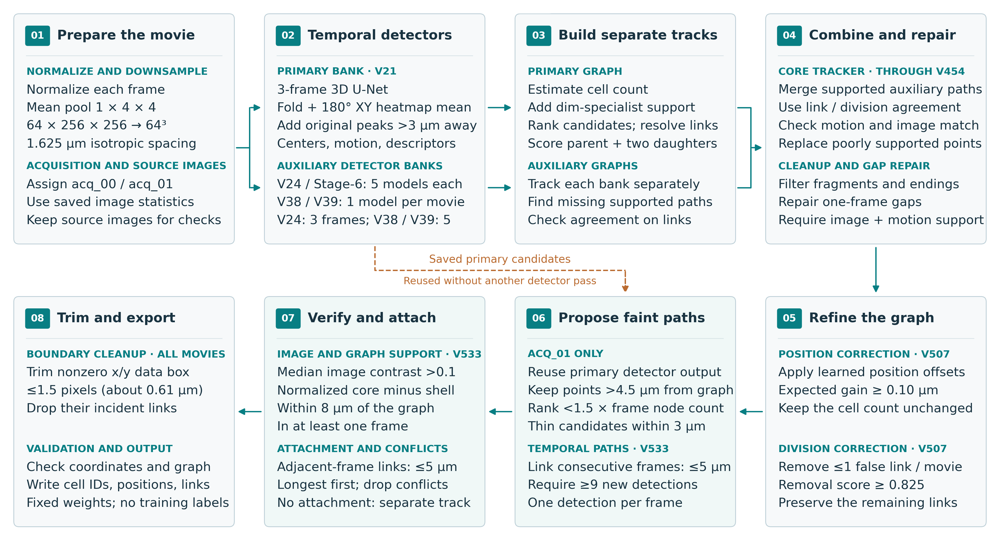
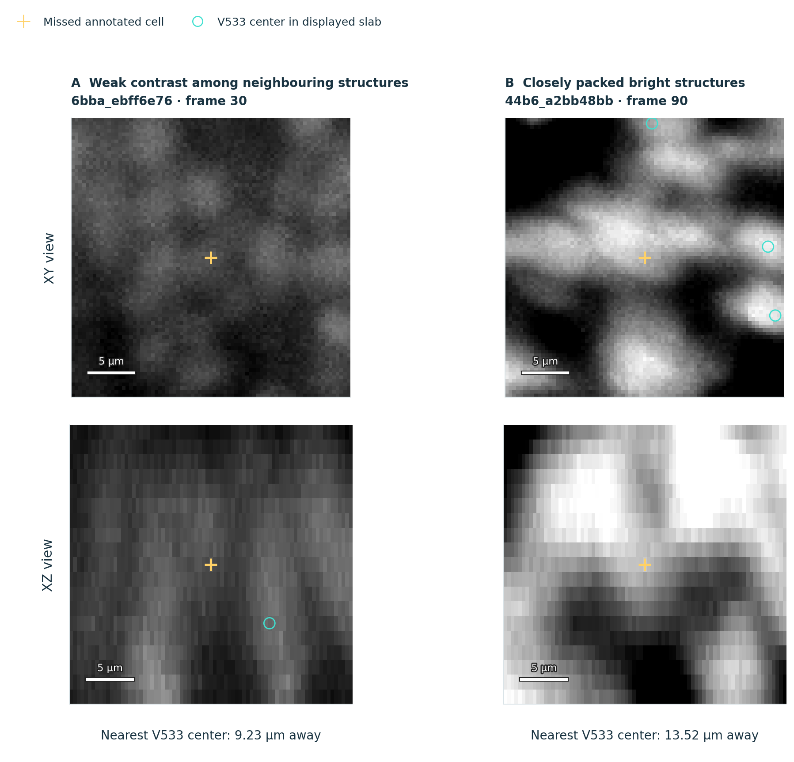

# 2nd place — Soheil Ayati: 2nd Place Solution

> From Microscopy to Lineage Graphs

| | |
|---|---|
| Private | rank 2, 0.97041 (Gold) |
| Public | rank 28, 0.96842 |
| Team | Soheil Ayati (@soheilayati) |
| Writeup by | Soheil Ayati |
| Published | 2026-09-30 (updated 2026-10-05) |
| Source | https://www.kaggle.com/competitions/biohub-cell-tracking-during-development/writeups/2nd-place-solution |
| Comments | 0 |

---
First, I would like to thank the organizers and hosts for creating an opportunity to compete and, more importantly, to learn.

This field is still new to me, and to borrow from the great and mighty Ted Lasso, you could fill two internets with what I still have to learn. That was part of the appeal. I enjoyed exploring unfamiliar approaches, reading related research, and gradually building a small pipeline into a more capable system. Working through what helped and what did not was a large part of that learning.

I hope this writeup is useful to others tackling similar problems, whether through the methods that worked or the experiments that fell short. Above all, I hope it passes on some of the curiosity and enjoyment I found in this challenge.

## 1. Overview

My final solution, **V533**, finished 2nd on the private leaderboard, with **0.970 private** and **0.968 public**. It combines temporal 3D detection with graph-based tracking to follow cells and identify divisions in 3D microscopy movies.

The detectors propose cell centers and estimate motion from neighboring frames. A tracker then selects candidates, links them through time, and evaluates divisions. Synthetic faint-cell examples were included in detector training, while auxiliary detector models supplied alternative tracks.

The central idea was to **preserve weak detection evidence until it could be judged as part of a track**. A faint point may be unconvincing in one frame but useful when it persists along a plausible path. The final recovery stage revisited unused detections and checked the original images, restoring supported paths without another detector pass.

  

The V numbers are internal experiment labels. V454 denotes the core pipeline with one-frame gap repair; V507 adds position refinement and removal of selected false division links; V533 adds missed-track recovery and narrow x/y border cleanup. These versions share the same detectors and core tracker. The detector components are **V21, V24, V38, V39**, and an earlier bank named **Stage-6 strong**.

## 2. Data and validation

The training set contains 199 movies from two embryos, with sparse annotations of cells and temporal links.

I grouped movies by image measurements, including brightness and contrast, using standardized features and K-means clustering. The resulting local labels, **acq_00** and **acq_01**, describe image conditions for whole movies. They were derived without cell annotations or embryo identity; both embryos appear in both groups. In acq_01, elevated background often makes weak cell peaks less distinct. At inference, the saved grouping rule assigns each movie from its image measurements, allowing some corrections to be restricted to the conditions where they helped.

Validation used five folds at the movie level, balanced by annotated edge count within each embryo. **Both embryos occur in training and validation**; this was not an embryo-held-out split. The [hidden test set uses embryos absent from training](https://www.kaggle.com/competitions/biohub-cell-tracking-during-development/data), making embryo transfer a possible source of disagreement between CV and leaderboard results.

The competition score combines a cell-count-adjusted edge Jaccard with **0.1 × division Jaccard**. Because the count adjustment can reward removing cells even when correct tracks are lost, I also inspected raw edge and division counts. Cell-level analysis used the scorer's one-to-one matching within **7 μm**.

## 3. Detection with temporal context

Each frame is intensity-normalized and downsampled by averaging 1 × 4 × 4 voxel blocks in Z × Y × X order. This reduces X and Y by four while retaining all 64 depth planes:

*Table 1. Image dimensions and voxel spacing before and after downsampling.*

| Quantity, Z × Y × X | Source image | Detector input |
|---|---|---|
| Volume shape | 64 × 256 × 256 | 64 × 64 × 64 |
| Voxel spacing | 1.625 × 0.40625 × 0.40625 μm | 1.625 × 1.625 × 1.625 μm |

The detector processes the complete downsampled volume at isotropic spacing. Predicted position offsets refine cell centers within the coarse grid before coordinates are mapped back to the source image. Original-resolution images remain available for later checks.

The primary detector is a residual 3D U-Net receiving **t−1, t, and t+1**, giving an input shape of **3 × 64 × 64 × 64**. It predicts a center heatmap, sub-voxel offsets, backward motion with uncertainty, and image descriptors for linking. V24 also uses three-frame context; V38 and V39 use five frames.

### 3.1. Sparse supervision and synthetic faint cells

Training distinguishes annotated cells, background identified from image evidence, and unknown regions. Unknown regions are excluded from the heatmap loss, so missing annotations do not automatically become negative examples. Cell and background losses are normalized separately. Position and motion losses use available annotated targets. Supervision masks are created before brightness augmentation, preventing artificially darkened, unannotated cells from becoming background targets.

To provide more labeled weak cells, I used synthetic faint-cell augmentation. Short annotated tracks of isolated real cells were extracted from a training movie. Their local background was subtracted, then the cell signal was dimmed, blurred along depth, and blended into another region of that same movie. Each inserted track lasted 5–15 frames, with positions and links added to the labels. Keeping donor and host material within a movie also kept them within its training fold.

The primary V21 bank used two synthetic variants per training sample. Auxiliary V24 used four, followed by two epochs of fine-tuning on real data only. Each bank has one model per fold, five in total, and both remain in the final system. Augmentation was used during training; the later faint-track recovery stage reuses their inference outputs.

In an early experiment, replacing the detector bank with the synthetic-trained models raised the public score from 0.943 to 0.952. The corresponding local CV study showed higher raw edge Jaccard and annotated-cell recall, but lower division quality and a combined score decrease of 0.001147. The stronger V24 recipe later produced the opposite CV/leaderboard pattern, as discussed in Section 7.

### 3.2. Combining predictions

During final inference, primary heatmaps are averaged across the five V21 fold models and the original and 180-degree XY-rotated views. Position offsets, motion, and image descriptors come from the original orientation. Original-view peaks missing from the averaged result are added back into spare candidate slots when they lie more than 3 μm from every averaged peak; nearby additions are also suppressed. This preserves candidates that averaging might otherwise remove, without a separate temporal-support test at this stage.

V24 and Stage-6 strong each combine five fold models. V38 and V39 each use one model per movie, selected by a fixed routing rule from their five fold checkpoints. Each auxiliary bank produces its own candidates and tracks. Stage-6 strong contributes missing paths and, together with V24, agreement on candidate links; the auxiliary graphs also provide evidence for division decisions.

## 4. From candidates to tracks and divisions

Tracking proceeds through candidate selection, temporal linking, division scoring, and graph repair:

1. **Select cells.** A learned count estimator sets the approximate number to keep per frame. Two LightGBM specialists estimate dimness and cell likelihood, using bounded ranking adjustments to add spatially distinct candidates to the primary pool for temporal support while retaining the original pool. The tracker then weighs detector confidence and possible links to earlier and later cells, suppressing nearby duplicates. A dim point on a consistent path can therefore compete with a brighter isolated point.

2. **Follow movement.** Predicted **backward motion** suggests predecessors in the previous frame. Learned link scorers compare distance, motion, detection evidence, and track context. Competing links are resolved so ordinary continuations have at most one predecessor and successor.

3. **Evaluate divisions.** A separate scorer examines a parent and two potential daughters using geometry, appearance, and temporal context, including competition with existing track assignments.

4. **Combine and repair.** Auxiliary tracks provide supported missing paths and agreement on links or divisions. Image and motion checks help replace poor candidates and bridge one-frame gaps. Unreliable fragments and endings are filtered in a fixed order.

V507 then refines positions and removes at most one high-confidence false division link per movie, preserving the predicted cell count. V533 adds a final opportunity to recover cells that were detected but discarded during these earlier decisions.

## 5. Recovering faint tracks without another detector pass

The detector proposes more centers than the tracker keeps. A weak cell can therefore be absent from the graph while its position remains in the saved output. V533 searches these **unused candidates** for persistent paths and checks them against the original images. This final search **is restricted to acq_01**, where validation supported its use.

1. **Find unused candidates.** Revisit reasonably high-ranked detections more than 4.5 μm from an existing prediction in the same frame. Thin nearby candidates to avoid duplicates.

2. **Build a persistent path.** Link candidates in consecutive frames, allowing up to 5 μm of movement per step. Require at least nine consecutive detections, one per frame.

3. **Check the image evidence.** Compare a small central region with its surrounding background in the original images. Require the path's median center-minus-background contrast to exceed 0.1 on the normalized intensity scale.

4. **Resolve attachments.** Require proximity within 8 μm of an existing cell in at least one frame. Where possible, propose an attachment to a track end or start in the adjacent frame, within 5 μm. Qualifying paths are processed longest first. A path is discarded if its proposed attachment would give an existing cell an extra parent or continuation. A qualifying path with no proposed attachment can remain a separate track.

Recovery is limited to candidates already present in the detector output. **No detector is rerun, no annotations are read, and no new model is fitted at inference.** The thresholds were selected using validation results.

A separate cleanup removes predictions within 1.5 source-image pixels, about 0.61 μm, of the x/y bounding box of each frame's nonzero image region, together with their incident links. This runs in all movies. Its contribution is evaluated separately below.

### 5.1. Real recovery examples

The examples below were selected from eight movies with improved edge recovery to illustrate successful cases. They show training-movie crops with saved validation predictions. Yellow crosses mark annotated centers, orange circles show V507 centers, and blue circles show V533 centers.

  

*Figure 1. Movie 44b6_5f15d135, frame 73. The same crop is repeated across columns. V507's nearest prediction is 11.17 μm from the annotation, beyond the 7 μm matching radius. V533 adds a prediction 0.91 μm away using a candidate still available in the detector output. Distances are measured in 3D.*

  

*Figure 2. Movie 6bba_57b7cc1e, frames 45–47. V533 predictions lie 1.86, 2.33, and 2.87 μm from the annotations; both connecting links exist in the saved graph. V507 has no prediction within 7 μm of these annotations. Three frames from a longer recovered chain are shown.*

Frame numbering starts at zero. XY panels project three Z planes around the annotation; XZ panels project five Y rows. Each figure uses a shared linear grayscale range, physical proportions, and 5 μm scale bars, without denoising or retouching. The target and recovered prediction appear in both views even if the prediction falls just outside the thin image slab.

## 6. Results and ablations

V533 was my highest-scoring private submission. The comparison below reports CV results from saved predictions for the same 199 movies.

*Table 2. Validation results for successive pipeline versions.*

| Pipeline | CV | Raw edge Jaccard | Division Jaccard |
|---|---:|---:|---:|
| Core with gap repair, V454 | 0.950602 | 0.909682 | 0.468421 |
| Position and division correction, V507 | 0.951217 | 0.910053 | 0.470899 |
| Faint-track recovery and border trim, V533 | 0.953024 | 0.912380 | 0.470899 |

All three versions had a displayed public score of 0.968. Compared with V507, V533 gained 0.001807 CV, with **360 more correct edges, 54 more false edges, and 360 fewer missed edges**. Division counts were unchanged. Raw edge Jaccard also improved, so the gain was not solely due to the cell-count adjustment.

The ablation separates faint-track recovery, labeled “add-back” below, from border trimming and their combination.

  

*Figure 3. Changes relative to V507. Recovery supplies most of the score gain, while adding false links as well as correct ones. Border trimming alone removes 27 correct edges and nine false edges: its higher combined score comes with a tracking tradeoff.*

The combined V533 pipeline improved every fold, embryo, and acquisition-group breakdown. Evaluating recovery one movie at a time, 20 of the 80 acq_01 movies contributed gains to the overall score and 60 contributed losses. The gains outweighed the losses, with five movies supplying 57% of the positive contributions. Selecting recovery settings on four folds and applying them to the fifth reduced the estimated recovery-only gain from 0.001442 to 0.001048.

## 7. What did not work as reliably

Several plausible improvements failed when evaluated as complete tracking pipelines. Each comparison here uses that experiment's own reference pipeline.

- **Stronger synthetic training as a primary replacement.** V24 improved CV by 0.001306, but public score fell from 0.957 to 0.950. It was later retained as an auxiliary source of tracks. This allowed its alternative candidates to contribute without replacing the primary detector outright.

- **More aggressive division repair.** Models pretrained on external microscopy data could propose alternative parents and daughters. An uncapped repair variant recovered three true divisions but added nine false ones relative to V507, reducing CV by 0.000671. Generating plausible alternatives was easier than selecting safe corrections.

- **A late detector replacement with the existing tracker.** In a comparison of otherwise matched pipelines across 199 movies, the replacement reduced CV by 0.004901, with 72 fewer correct edges and 362 more false edges. Positions, motion, confidence, and image descriptors change together, so downstream models may need recalibration. This comparison used a fresh replay, separate from the table above.

- **Extra pruning of track endings.** CV rose by 0.000351, but 136 correct edges were lost for only 14 false edges removed; public score fell from 0.968 to 0.967. The retained border trim makes the same kind of tradeoff on a smaller scale, losing 27 correct edges rather than 136. Its private effect was not measured separately.

These experiments made complete graph evaluation essential. More sensitive detection, more proposed repairs, or a higher aggregate score did not by themselves establish better tracking.

## 8. Remaining weaknesses

### 8.1. The second daughter can be assigned to another track

V533 recovered 89 of 151 annotated divisions (58.9%), with 62 missed events and 38 scored false divisions. The final recovery stage left these counts unchanged from V507.

An earlier V507 audit found that 30 of its 62 missed divisions had one correctly linked daughter while the second belonged to another predicted track. In a separate 36-conflict audit, daughters averaged 2.33 μm from their assigned predecessor, compared with 10.0 μm from the true parent. A closer neighbor can win a local linking decision even when the more distant parent is correct. These historical categories were not individually reclassified on V533.

I would next compare the parent, both daughters, and the displaced neighboring track jointly over several frames, retaining the option to leave the graph unchanged. The failed repairs suggest that simply expanding distances or permitting more edits is insufficient.

### 8.2. Faint and crowded regions remain difficult

Acq_01 still contributes disproportionately to the errors. In the final V533 validation records:

*Table 3. Remaining errors by acquisition group in V533 validation.*

| Measure | acq_00 | acq_01 |
|---|---:|---:|
| Annotated cells matched | 98.49% | **94.27%** |
| Annotated divisions recovered | 69.2% | **34.1%** |
| Share of scored edge errors | 36.9% | **63.1%** |

These percentages pool counts across movies within each group. Acq_01 accounts for 63.1% of edge errors despite only 32.6% of edge-scoring weight. The examples below show annotations still unmatched after recovery.

  

*Figure 4. A: weak contrast in movie 6bba_ebff6e76, frame 30. B: closely packed bright structures in 44b6_a2bb48bb, frame 90. Yellow crosses are annotations; blue circles are V533 centers within each view's image slab. Nearest predictions are 9.23 and 13.52 μm away in 3D, beyond the 7 μm matching radius.*

Projection thickness and 5 μm scale bars follow the earlier examples. Each example uses its own linear grayscale range, shared between XY and XZ, so brightness is not numerically comparable between columns. These selected crops illustrate difficult conditions without proving the cause of each miss.

## 9. What I would carry forward

Four choices define this solution: training on synthetic faint tracks, preserving weak original-view candidates, using auxiliary models through supported tracks, and checking recovered paths against the original images without another detector pass.

The most useful lesson was to keep detection evidence available long enough to judge it through time. A weak point can become convincing as part of a coherent trajectory. Equally, every added path or repaired division can damage a correct track, so gains need to be examined through the underlying cells, links, and divisions as well as the final score.

## Code and license
Everything is public under the MIT License:
- Submitted notebook (V533): https://www.kaggle.com/code/soheilayati/biohub-2nd-place-notebook
- Complete solution package, with the training and inference code, all trained models, step-by-step instructions and the model documentation (PDF): https://www.kaggle.com/datasets/soheilayati/biohub-2nd-place-solution

---

## Comments (0)

*(none)*
