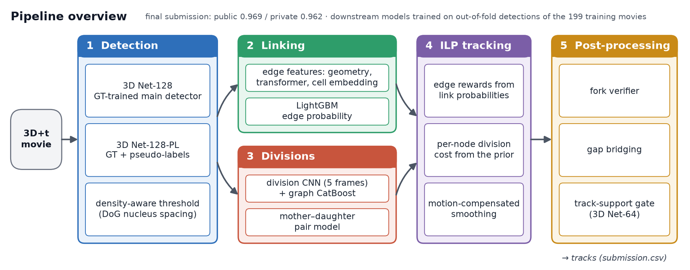
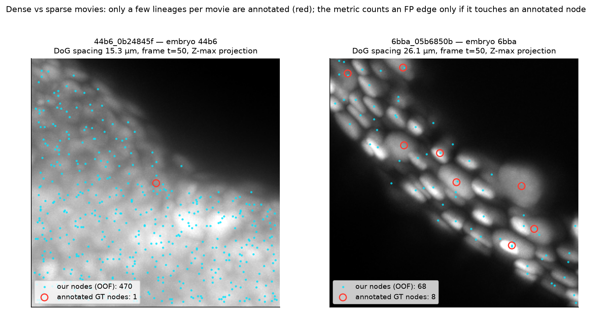
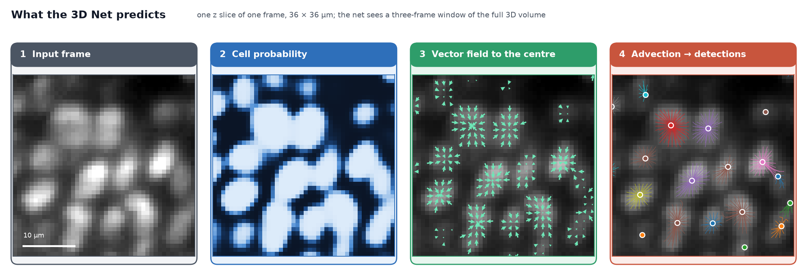
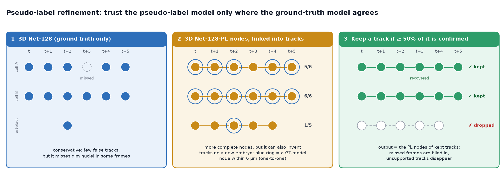
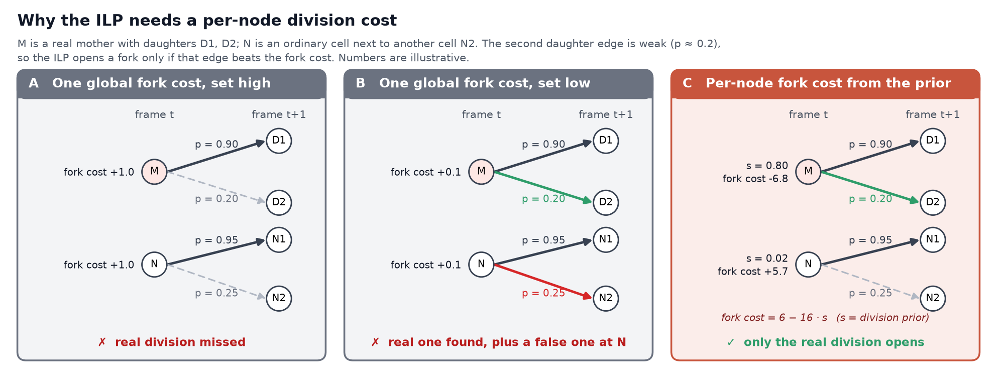
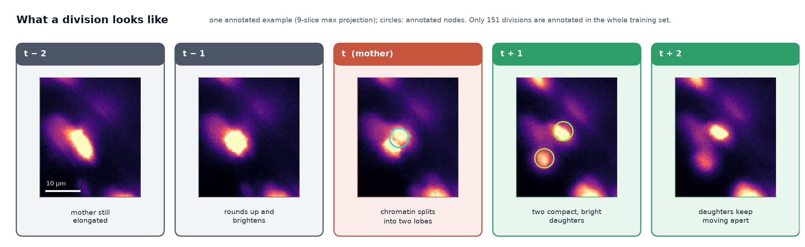
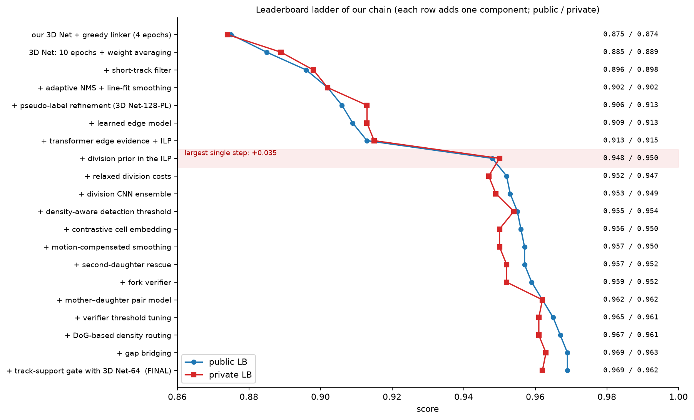
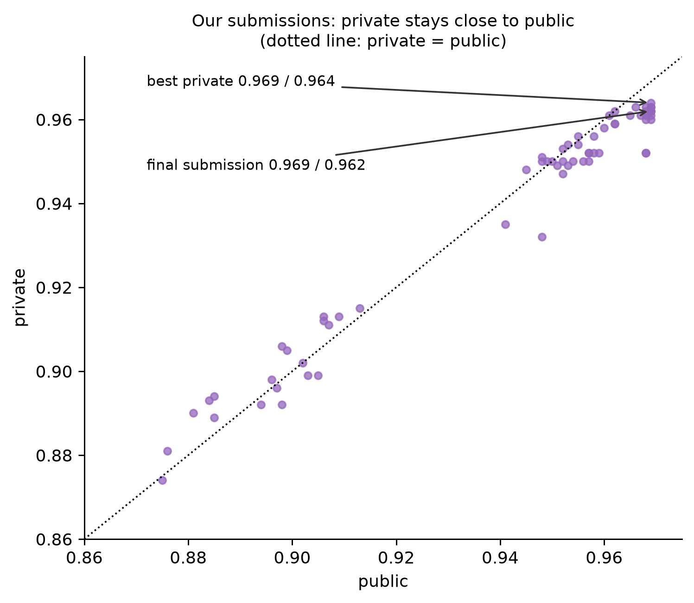

# 4th place — Barry: 4th Place Solution

> 3D Net detection, learned linking, and a division prior inside the ILP

| | |
|---|---|
| Private | rank 4, 0.96234 (Gold) |
| Public | rank 20, 0.96987 |
| Team | BarryZhou (@songqizhou) |
| Writeup by | z7777 |
| Published | 2026-09-30 (updated 2026-09-30) |
| Source | https://www.kaggle.com/competitions/biohub-cell-tracking-during-development/writeups/4th-place-solution |
| Comments | 1 |

---
**Public 0.969 / Private 0.962.** Notebook: [kaggle.com/code/songqizhou/biohub-4th-place-solution](https://www.kaggle.com/code/songqizhou/biohub-4th-place-solution)

Many thanks to the organisers for a challenging and well-designed competition, and to everyone who shared notebooks,
support packs and ideas on the forum.

## Overview

Our tracker has five stages: learned models for detection, links and divisions, a global ILP that puts them
together, and rule-based post-processing.

| stage | what it does | section |
|---|---|---|
| 1. Detection | 3D Net finds nuclei; a pseudo-label model refines them; sparse movies get a stricter threshold | 2 |
| 2. Linking | every candidate link gets a learned probability | 3 |
| 3. Divisions | every node gets a learned division score `s` | 4 |
| 4. ILP | solves the tracks; each node pays its own division cost `6 − 16·s` (base 5 in sparse movies) | 4, 5 |
| 5. Post-processing | fork verifier, smoothing, gap bridging, track-support gate for sparse movies | 4, 5 |

The per-node division cost in the ILP was our largest single gain (+0.035).

## Our approach: model the biology

Our compute was modest. Every network in the pipeline is small (the largest, the 3D Net, has 18 M parameters), and all
the models that combine evidence (the edge model, the division graph and pair models, the fork verifier) are
gradient-boosted trees on CPU. Most of our gains therefore came from looking closely at the biology and at the metric,
and turning each observation into a small, targeted model:

| observation | what we built | section |
|---|---|---|
| Only about 1% of the cells are annotated; most real cells and most real divisions carry no label | a loss with separate tiers for annotated, background and unannotated voxels; division labels only from annotated tracks | 2.1, 4.2 |
| Two touching nuclei form one bright blob, but their centres are distinct | a vector field that points each voxel to its own centre | 2.1 |
| Nucleus size and spacing differ strongly between embryos | a DoG density router that sets the detection threshold per movie | 2.3 |
| A mother rounds up and brightens, its chromatin splits, and two compact daughters appear | a division score built from these cues, used as a per-node division cost in the ILP | 4 |
| Real daughters keep moving apart for several frames | a fork verifier that follows both daughters in the raw images | 4.3 |
| The whole tissue drifts between frames | motion-compensated smoothing of the tracks | 5.2 |
| A model trained on more (pseudo-)labels finds more cells, but also invents some on a new embryo | keep its tracks only where an independent model agrees | 2.2, 5.3 |

## 1. Data, metric and validation

**Data.**
- 199 training movies from two embryos (71 and 128 movies).
- Each movie is 100 frames of 64 × 256 × 256 voxels at 1.625 × 0.406 × 0.406 µm.
- Only a handful of lineages per movie are annotated, about 1% of the cells. The whole training set contains only
  **151 annotated divisions**.
- One embryo is dense with small nuclei (DoG nucleus spacing about 13–19 µm), the other mostly sparse with large
  nuclei (about 17–31 µm).

**Metric.** `adjusted edge Jaccard + 0.1 · division Jaccard`.
- A predicted edge is a false positive only if it touches an annotated node, so most unannotated cells are "free".
- A node-count adjustment penalises predicting more nodes than the estimated number of cells, so the node count
  still matters.

**Validation rules.**
1. Score everything with the official evaluator. An early custom node-level metric reversed two of our conclusions.
2. Out-of-fold everything. Detections for all 199 movies come from 5-fold copies of each detector, and every
   downstream model is trained on these out-of-fold detections. The deployed detectors are trained on all 199 movies.
3. Check detector changes across embryos (train on one embryo, test on the other), not only on random folds.
   Same-embryo validation over-rated changes that fit the seen embryos better.
4. Change one component at a time and compare against the deployed chain's own output.

## 2. Detection

### 2.1 3D Net

**Idea.** For every voxel, predict a cell probability and a unit vector pointing to the centre of its nucleus (the
Cellpose flow idea), then follow the vectors to find the nuclei.

**Network.** Adapted from a dual-encoder 3D U-Net with temporal attention from the literature. One encoder sees the
current frame, the other the difference between the next and the previous frame. Adding the neighbouring frames
clearly helps: removing this input dropped the detection score from 0.93 to 0.73 in cross-embryo validation, while a
wider five-frame window gave no further gain.

**Decoding: our choices.**
- **Strict seeds.** Only voxels with probability > 0.97 are followed (0.99 in sparse movies, section 2.3), so dim
  background rarely turns into a nucleus.
- **Short, binned convergence.** Seeds move 40 steps of 0.5 µm. Seeds whose end points fall into the same 1 µm cell
  form one nucleus; duplicates are left to the NMS.
- **Probability-ranked, adaptive NMS.** Nuclei are ranked by their highest probability, and the NMS radius is set per
  movie: 4 µm, or 7 µm when the median nearest-neighbour distance is ≥ 10 µm (large nuclei).

**Loss: our choices.** The vector field gets an L1 loss and the probability a weighted BCE with three tiers:
annotated nuclei, confident background, and everything else (only a very weak push towards background). What
matters is how the tiers are built:
- **Tier normalisation.** Each tier's weight is divided by its voxel count, so the weights set how much each tier
  counts as a whole. With per-voxel weights the few annotated voxels carried less than 0.5% of the loss, and the
  probability head collapsed towards zero.
- **Where the vectors are supervised.** An annotation owns the voxels that are nearest to it, within 5.5 µm and among
  the brightest 5% of the frame, plus a 2 µm core that is always kept. The cap keeps an unannotated neighbour from
  being pulled into the region.
- **Local background.** A voxel is confident background only if it is darker than 0.4 × the local maximum within
  3.5 µm, so the rim of a real cell in a dense frame is not labelled background.

We trained three 3D Nets:

| model | training data | role |
|---|---|---|
| 3D Net-128 (XY pooled by 2) | ground truth | main detector |
| 3D Net-128-PL | ground truth + pseudo-labels | refines the nodes (2.2) |
| 3D Net-64 (XY pooled by 4) | ground truth | independent check in sparse movies (5.3) |

**Training.** The deployed models are trained on all 199 movies with learning rate 3e-4. Each detector is trained
several times (five folds for the out-of-fold detections plus the final model), so with our limited GPU compute we
kept every run short: 10 epochs for the 128 models, using the **average of the epoch 7–10 weights**, and 50 for the 64
model, which is about four times cheaper per epoch. We do not claim that 10 epochs is optimal: many teams train for
hundreds. In our runs, however, recall on unseen embryos peaked early in training, so our short-trained detector leans
towards recall and predicts somewhat more nodes than there are cells (about 9% more). Much of the rest of the pipeline
is about removing those extra nodes downstream: the strict seed threshold, the pseudo-label check (2.2), the ILP with
its short-track filter and the track-support gate (5.3). In that sense, several of these steps compensate for short
training; with more GPU compute we would rather put that effort into the detector itself, which would be the more
elegant route.

**Resolution.** In a quick check on one random fold with the same simple linker, the 128 × 128 XY grid scored 0.856
against 0.853 for the 64 × 64 grid: at 64 crowded nuclei merge in dense tissue. In sparse movies, however, the 64 grid
did best locally. Rather than switching detectors per movie, which changes the node count, we use 3D Net-64 as an
independent check there (5.3). Full resolution (256 × 256) costs 4.4× the compute of 128 and needs a smaller batch. We
could train it only once, on one fold and for 10 epochs; that single short run showed no clear gain, and whether it
pays off when trained to convergence remains open.

**No heatmap detector.** The public heatmap U-Net needs several hundred epochs to converge, which was beyond our
compute, so we could not train our own folds of it. Its public weights were trained on all 199 training movies, so we
had no way to cross-validate an ensemble with them. Without a reliable local score, the risk outweighed the expected
gain for us, and we left it out.

**No test-time augmentation for the 3D Net.** 4- or 8-view TTA multiplies the cost of every validation run. A quick
test on our chain gave no reliable gain (within noise locally, lower on the leaderboard), so we left it out. Other
teams report gains from TTA, so this may depend on the pipeline.

### 2.2 Pseudo-label refinement

**Problem.** The ground-truth-only model is conservative: few false tracks, but it misses dim nuclei in some frames.
A model trained with pseudo-labels finds more nuclei, but used alone it also invents tracks on a new embryo (−0.003
to −0.004 on the leaderboard).

**Pseudo-labels.** The out-of-fold detections of all 199 movies, plus the detections on one unlabelled external
Zebrahub embryo. 3D Net-128-PL is trained on ground truth plus these pseudo-labels.

**Method.** Use the pseudo-label model's nodes, but only on tracks the ground-truth model agrees with:
1. Run both models on the movie.
2. A pseudo-label node is **confirmed** if it is matched one-to-one to a ground-truth-model node within 6 µm in the
   same frame.
3. Link the pseudo-label nodes frame to frame into tracks (greedy matching, 7 µm gate).
4. Keep a track only if **at least 50% of its nodes are confirmed**. The output is the pseudo-label nodes of the kept
   tracks.

**Effect.** Frames where the ground-truth model missed a nucleus are filled in, and tracks it never saw disappear:
+0.004 on the leaderboard, for the cost of one extra training run rather than an ensemble.

### 2.3 Density-aware threshold (DoG router)

**Problem.** In sparse movies, large nuclei produce extra seeds at the normal threshold.

**Method.**
1. A simple rule-based DoG blob tracker counts nuclei and gives each movie a nucleus spacing.
2. Movies with spacing ≥ 19.7 µm are re-detected with a stricter seed threshold (0.99 instead of 0.97).

**Why DoG.** Our first version used the detector's own node count to decide. But a detector's count drifts on an
unseen embryo, and a router should not depend on the model it routes. The detector-independent DoG router gained
+0.002 on public with no change in local validation.

## 3. Linking

### 3.1 Candidate links

For every node at frame t: all nodes at t+1 within 10 µm and its 5 nearest successors. In addition, every node at
t+1 is linked to its 3 nearest predecessors.

### 3.2 Evidence for each link

- **Geometry (26 features).** Displacement, distance ranks and gaps among competing candidates in both directions,
  nearest-neighbour distances, detection confidence and cluster size, the residual against the node's velocity from
  a first greedy linking pass, the residual against the local tissue flow (median displacement of confident
  neighbouring links), and whether the nodes continue into the past / future.
- **Transformer probability.** We retrained the competition baseline's linker architecture (a temporal U-Net encoder
  plus a node transformer that scores all node pairs of two consecutive frames) on all 199 movies. It is run in both
  directions; the two softmax-normalised probabilities and their weighted harmonic mean are features.
- **Cell embedding.** A small 3D CNN encodes a 16 × 32 × 32 raw patch around each node. It is trained with InfoNCE
  so that the same annotated cell at t and t+1 is closer than its competing candidates. The cosine similarity of the
  two ends of a link is a feature.

### 3.3 Edge model

LightGBM on all of the above (47 features), trained on out-of-fold detections, gives the link probability `p` used
everywhere downstream.

**Lesson.** Out-of-fold stacking under-values evidence from models trained on all data. Locally we could only use fold
versions of the transformer, trained on less data, and its feature looked worth almost nothing. On the leaderboard,
the version trained on all 199 movies was worth +0.005.

## 4. Divisions

### 4.1 Why a per-node division cost

In the ILP a division means that one node keeps two outgoing edges. The second daughter's edge is usually weak:
that daughter is further away and looks different from its mother. With one global division cost, the solver either
never opens forks, or opens false ones wherever two cells sit close together.

We therefore give **each node its own division cost**, `cost = 6 − 16·s` (`5 − 16·s` in sparse movies), where `s` is
the learned probability that the node is a dividing mother. Forks open only where the evidence supports them.

### 4.2 The division score `s`

Divisions are rare and subtle. The mother rounds up and brightens, its chromatin splits, and two compact, bright
daughters appear that keep moving apart for a few frames:

**Labels.** A node with two annotated children is positive, a node with one annotated child is negative.
Unannotated nodes are never used as negatives, because most real divisions are unannotated. For the same reason,
hard-negative mining hurt badly: the "hardest negatives" are mostly real, unannotated divisions.

**Three scorers.**

| scorer | input | model |
|---|---|---|
| Division CNN | 5-frame crop (t−2 … t+2) of 9 × 33 × 33 voxels around the node | 6 CNNs (3 seeds, with and without copy-paste augmentation), 4 flips |
| Graph model | 53 features of the node in the candidate graph: its best links and how contested they are, where its candidate daughters are (distance, opposite sides, symmetry), whether they continue, motion, local density, the CNN score | CatBoost |
| Pair model | candidate (mother, daughter, daughter) triplets with 174 image features, plus graph, embedding and link features of both daughter edges | LightGBM + CatBoost |

How the pair model works:
1. For every node, candidate daughter pairs are taken from the next frame: both within 13.5 µm, sisters 4.5–17 µm
   apart, the mother near their midpoint, the daughters on opposite sides.
2. The 174 image features follow the biology: the mother's brightness, texture, compactness and size over her last 7
   frames, the intensity drop at her position at the split, both daughters over their first 3 frames, sister
   separation and its growth, movement along the division axis.
3. A node's score is its best pair.

The final score is `s = max(pair model, graph model)`, which added +0.003 over the graph model alone.

### 4.3 Divisions inside and after the ILP

- **Relaxed admission.** A link enters the ILP graph if `p > 0.3 − 0.5·s`, so likely mothers keep their weaker
  second link.
- **Second-daughter rescue.** For nodes with `s ≥ 0.2`, links that are not the node's best link take
  `max(p, transformer probability)`, because the transformer is often more confident about the second daughter.
- **Fork verifier.** After the ILP, both daughters of every fork are traced in the raw images from 3 frames before to
  5 frames after the fork (motion-compensated DoG peak search). 157 features describe their separation over time,
  peak quality and displacement. A CatBoost model removes the weaker daughter edge when its score is below 0.25,
  unless the two daughters clearly move apart along the fork axis. +0.002, and +0.003 more from tuning the threshold.
- **Division base cost.** The optimum is broad, around 5–6; dense movies use 6, sparse movies 5.

**Effect.** Turning on the division score took the leaderboard from **0.913 to 0.948 (+0.035 on both public and
private)**.

## 5. Tracking and post-processing

### 5.1 ILP

tracksdata with the SCIP solver, one movie per process:
- edge reward `p`;
- appearance cost 0.5, disappearance cost 3.2;
- per-node division cost `6 − 16·s`, or `5 − 16·s` in sparse movies (section 4).

### 5.2 Cleaning the tracks

- **Short-track filter.** Isolated single nodes are removed.
- **Motion-compensated smoothing.** The per-frame tissue translation is estimated from confident non-division links.
  Coordinates are then smoothed along each track with a local line fit (±3 frames) after removing that translation.
- **Gap bridging.** A track ending at t and a nearby track starting at t+2 or t+3 are joined through linearly
  interpolated nodes (+0.002).

### 5.3 Track-support gate (sparse movies)

**Problem.** In sparse movies the main remaining error is over-counting: long, dim tracks that are not real nuclei.

**Method.** The same principle as in 2.2, now applied to the final tracks with two independent detectors, 3D Net-64
and a sensitive DoG detector:
1. Cut the tracks into division-free segments.
2. A node is confirmed if an independent detection is close by in the same frame.
3. Remove a segment if too few of its nodes are confirmed:

| movie spacing | a node is confirmed if … | remove the segment if confirmed < |
|---|---|---|
| 19.7–25 µm | a DoG detection within 4 µm **or** a 3D Net-64 node within 5 µm | 40% |
| > 25 µm | a DoG detection within 5 µm **and** a 3D Net-64 node within 5 µm | 20% |

Dense movies are not touched.

**Effect.** Positive in local validation and neutral on public (0.969), so it went into the final submission. On
private it cost 0.001, while a more lenient setting gained 0.001: like other changes to the node count, it transferred
to new embryos less predictably than the rest of the pipeline.

### 5.4 Model sizes and cost

| model | size | input |
|---|---|---|
| 3D Net-128 / 3D Net-128-PL / 3D Net-64 | 18 M parameters each (10 / 10 / 50 epochs) | three-frame window of the whole volume |
| Edge transformer | 2.1 M parameters | two consecutive frames, downsampled |
| Division CNN | 1.4 M parameters × 6 | 5-frame patch of 9 × 33 × 33 voxels |
| Cell embedding | 0.24 M parameters | 16 × 32 × 32 patch |
| Edge model, division graph and pair models, fork verifier | gradient-boosted trees (CPU) | tabular features |

The whole chain runs in one Kaggle notebook on 2 × T4, about 31 minutes on the 4 visible movies. The heaviest parts
are the division CNN (split over both GPUs by node count), the transformer link scoring and the ILP.

## 6. Results

- Each row adds one component, and every row is a single submission.
- The detector work (0.875 → 0.906) and the division score (0.913 → 0.948) are the two big blocks. Linking and
  post-processing add the rest.
- The final submission scored **0.969 / 0.962**. Our best private score was **0.969 / 0.964**. It came from a more
  lenient setting of the same track-support gate, which tied on public, so we did not pick it.

Across all submissions of our chain, private stayed close to public:

## 7. What did not help

| idea | effect on the leaderboard |
|---|---|
| The pseudo-label 3D Net as the detector itself | −0.003 to −0.004 |
| Registering frames before computing link geometry | −0.003 |
| A DoG-only support gate (without 3D Net-64) | −0.001 public, −0.011 private |
| TensorRT FP16 for all networks | 42% faster, −0.001; we kept fp32 |
| Hard-negative mining for division models, re-admitting nodes the ILP dropped, constant coordinate offsets | negative in local validation |

## 8. Takeaways

1. **Look at the biology first.** The biggest gains came from turning simple
   observations (how a division looks, how nuclei scale with density, how tissue drifts) into small, targeted models.
2. **Validate the way the test set differs.** New embryos meant cross-embryo splits for the detector and
   out-of-fold stacking for everything downstream.
3. **The division term is worth fighting for.** A learned, per-node division cost inside the ILP was the largest
   single gain, and it only works with labels taken strictly from annotated tracks.
4. **Use a second model as a check, not as a replacement.** Both the pseudo-label refinement and the track-support
   gate keep a track only when an independent model agrees with it.
5. **Be careful with changes that alter how many nodes you output.** They transferred worst from local validation to
   the leaderboard, especially on sparse movies (the track-support gates in 5.3 and section 7).

---

## Comments (1)

### riri (CONTRIBUTOR) — 2026-10-06

感谢 Barry 哥的思路，已严肃学习
