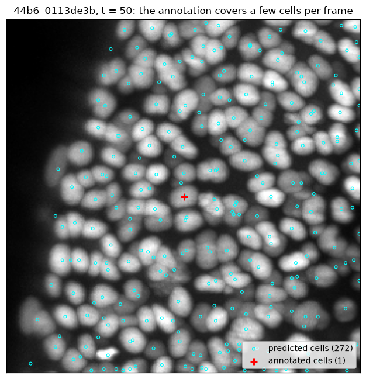
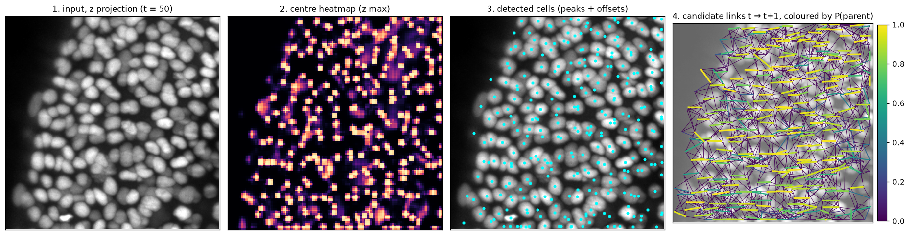
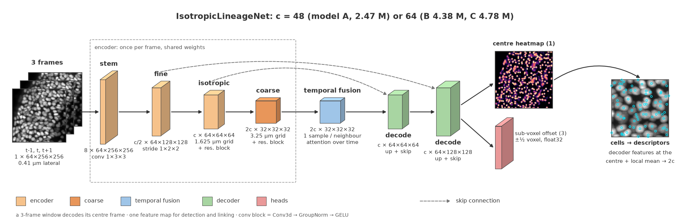
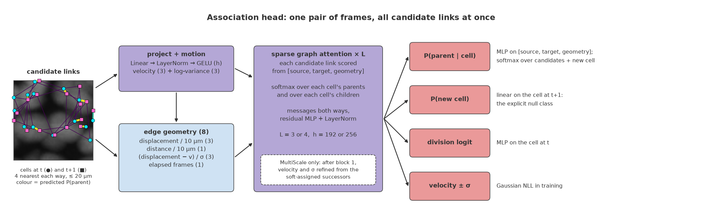
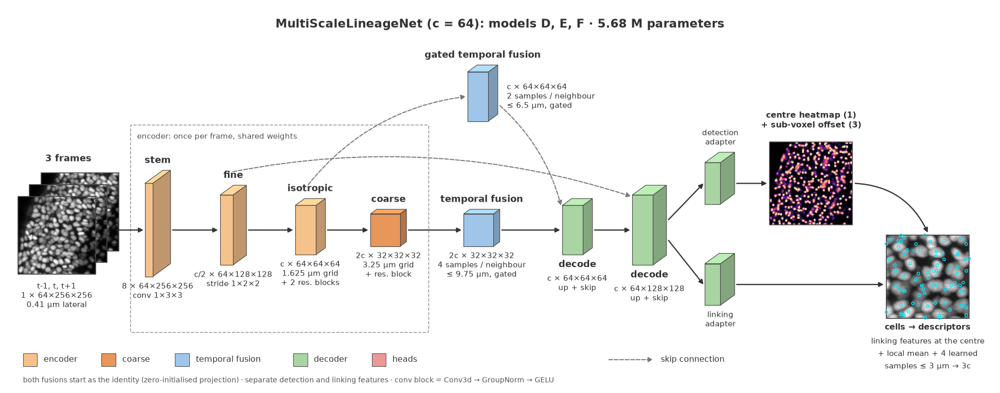
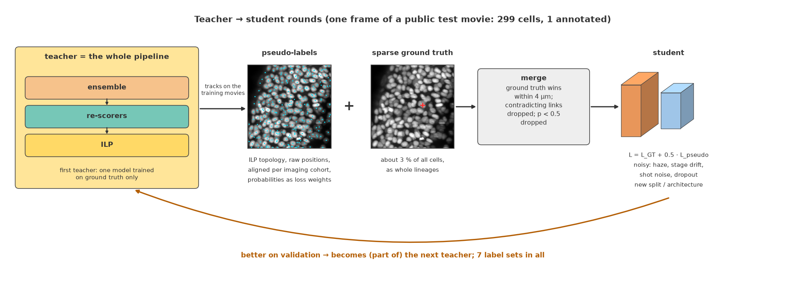
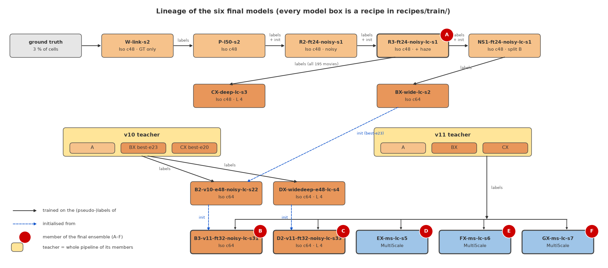
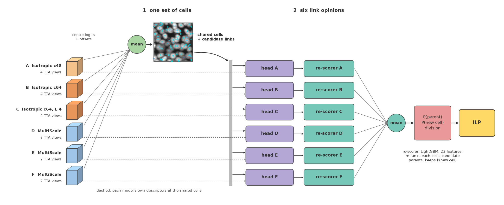
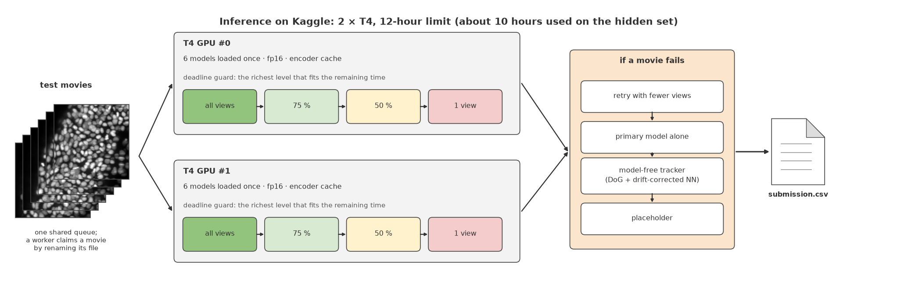

# 6th place — Cyrus: 6th Place: Detect, Link, Solve, Repeat

> One network that detects and links cells, a global ILP, and teacher ? student rounds on 3 % annotation

| | |
|---|---|
| Private | rank 6, 0.95398 (Gold) |
| Public | rank 94, 0.96285 |
| Team | Cyrus (@jamalsaeedi) |
| Writeup by | Cyrus |
| Published | 2026-09-30 (updated 2026-10-03) |
| Source | https://www.kaggle.com/competitions/biohub-cell-tracking-during-development/writeups/6th-place-solution |
| Comments | 1 |

---
# Biohub Cell Tracking During Development: 6th place solution

**Private 0.953 (6th place)**, public 0.961. A second submission with the same
pipeline and best-validation checkpoints scored private 0.955.

| | |
|---|---|
| Code (GitHub) | <https://github.com/jamal-saeedi/biohub_cell_tracking_kaggle> |
| Models (Kaggle Models, MIT) | <https://www.kaggle.com/models/jamalsaeedi/biohub-cell-tracking> |
| Code dataset (package + pinned wheels) | <https://www.kaggle.com/datasets/jamalsaeedi/biohub-cell-tracking-kaggle> |
| Inference notebook (Kaggle) | <https://www.kaggle.com/code/jamalsaeedi/biohub-cell-tracking-inference> |
| Competition | <https://www.kaggle.com/competitions/biohub-cell-tracking-during-development> |


*Predicted tracks on public test movie `44b6_0113de3b` (z projection, every second
frame). Each colour is one track; a red ring marks a division.*

Two observations shaped the design. First, only about 3 % of the cells are annotated,
so most of the image is neither a known cell nor known background, and a model trained
on the annotation alone is never told when it links a cell to the wrong, unannotated
neighbour. Second, the hard part of linking is telling apart neighbours that look
alike, and a linker that sees only coordinates cannot do that. So:

- **one network detects and links.** It reads three frames at native resolution, and
  its linker scores candidate links from features sampled out of the same image
  features that found the cells;
- **the network outputs probabilities a solver can use directly**, including an
  explicit "new cell" class, so a global ILP needs no hand-tuned repair rules;
- **the whole pipeline teaches the next model.** Its tracks on the training movies
  become pseudo-labels for the 97 % of cells nobody annotated.


## 1. The task

**Input.** 3D time-lapse movies of developing embryos: 100 frames of 64 × 256 × 256
voxels, anisotropic spacing 1.625 µm in z and 0.406 µm in y and x, with up to about
400 cells per frame.

**Output.** Every cell centre in every frame, and the links from each cell at *t* to
its successor(s) at *t + 1*. A cell with two successors divided. This is the Cell
Tracking Challenge setting [2], run as a Kaggle competition [1].

**Metric.** Per movie, an edge Jaccard index with a penalty on the node count, then a
weighted mean over movies, plus a division term:

$$J_{adj} = \max\left(0,\; J_{edge} \cdot \left(1 - 0.1\,\frac{N_{pred} - N_{est}}{N_{est}}\right)\right) \qquad \text{score} = \overline{J_{adj}} + 0.1 \cdot J_{div}$$

$N_{est}$ is the organisers' estimate of the number of cells in the movie.

**The annotation is extremely sparse.** The 199 training movies carry 133k annotated
cells, about **3 %** of the cells present, as whole lineages, and only 151 divisions.



*One frame of a public test movie: the cells the final pipeline found (cyan) and the
annotated cells (red).*

Two consequences shaped everything:

1. Most of the image is neither a known positive nor a known negative, so ordinary
   dense detection targets would teach the detector to suppress real cells.
2. Most linking errors are identity swaps with unannotated neighbours, which ground
   truth alone never penalises.

---

## 2. The pipeline at a glance


- **Six networks of two architectures.** Each detects cells *and* scores their links
  to the previous frame, in one model.
- **One shared cell set.** The six centre maps are averaged; each network then scores
  the same candidate links with its own head and its own gradient-boosted re-scorer;
  the six link distributions are averaged.
- **A global integer linear program** turns cells and link probabilities into tracks
  and divisions; a drift-compensated smoother refines positions.
- **Training** went through several teacher → student rounds in which the teacher is
  the whole pipeline above.

---

## 3. Models

### 3.1 Common design



*One frame through the first stages: input, centre heatmap, detected cells and the
candidate links to the next frame coloured by the predicted parent probability. This
frame pair spans a stage jump, so most links are long and parallel.*

Both architectures read a **3-frame window** (t − 1, t, t + 1) at native resolution:
no resampling, no cropping at inference. Each frame is min–max scaled and z-scored on
its own. A network has two parts: a **detector** (a 3D U-Net-like [3, 4] encoder–decoder with
temporal fusion) and an **association head** that links the detected cells of two
consecutive frames.





1. **Encoder (per frame).** A 3D convolutional stack (Conv3d → GroupNorm [5] → GELU [6]) that
   handles the 4:1 anisotropy in two steps: two lateral-only reductions reach a
   near-isotropic 1.625 µm grid, then a 3D reduction reaches a coarse 3.25 µm grid.
   Frames are encoded independently, so at inference each frame is encoded once and
   reused by the three windows that contain it.
2. **Temporal fusion.** On the coarse grid each voxel of frame *t* predicts a bounded
   displacement into each neighbouring frame, samples the neighbour's features there
   and attention-weights them against its own. This aligns moving cells before they
   are compared. At initialisation the displacements are zero and the attention is
   uniform.
3. **Detection.** The decoder returns to a 64 × 128 × 128 grid with skip connections
   and predicts a centre heatmap (cells = non-maximum-suppressed peaks above 0.5)
   and a sub-voxel offset per cell. The two heads run in float32.
4. **Association head (tracking).** For each pair of consecutive frames:
   - each cell descriptor (features sampled at the cell's continuous centre) predicts
     a velocity and a per-axis uncertainty;
   - each candidate link gets the displacement and the uncertainty-normalised
     residual displacement − velocity as geometric features;
   - several layers of bidirectional sparse graph attention [7, 8] run over the candidate
     links, so cells at *t* and *t + 1* update each other;
   - the head outputs, per cell, a softmax over its candidate parents **plus a
     "new cell" class**, a division score per parent, a score per daughter pair, and
     the velocity.

The explicit "new cell" probability is well calibrated, and becomes the solver's
appearance cost (§6.5). Scoring links with attention over cell descriptors is related
to Trackastra [9]; ours is sparse, runs on a k-NN candidate graph, and is trained
jointly with the detector.

### 3.2 The two architectures



| | IsotropicLineageNet | MultiScaleLineageNet |
|---|---|---|
| Temporal fusion | one learned sample per neighbour frame, coarse grid | fusion at two scales (coarse + isotropic), several learned samples per neighbour and a per-voxel gate; starts as the identity (zero-initialised projection) |
| Detection vs linking features | shared | separate residual task adapters |
| Cell descriptor | centre sample + local mean | + attention-pooled samples at learned offsets (within ± 3 µm per axis), as in deformable sampling [10] |
| Association head | attention blocks | + in-graph motion refinement: a soft assignment to candidate successors updates velocity and uncertainty midway |
| Linker training input | annotated positions with 0.5 µm jitter | 75 % of matched annotated cells moved onto the detector's own detections |
| Parameters | 2.5–4.8 M | 5.7 M |

### 3.3 The six models of the ensemble

| | model | architecture | channels / linker | params | training | TTA views |
|---|---|---|---|---:|---|---:|
| A | R3-ft24-noisy-lc-s1 | Isotropic | 48 / 192 × 3 | 2.5 M | third teacher → student round | 4 |
| B | B3-v11-ft32-noisy-lc-s31 | Isotropic, wide | 64 / 256 × 3 | 4.4 M | fine-tuned twice on ensemble labels | 4 |
| C | D2-v11-ft32-noisy-lc-s33 | Isotropic, wide + deep | 64 / 256 × 4 | 4.8 M | trained on v10 labels, fine-tuned on v11 | 4 |
| D | EX-ms-lc-s5 | MultiScale | 64 / 256 × 4 | 5.7 M | from scratch on ensemble labels | 3 |
| E | FX-ms-lc-s6 | MultiScale | 64 / 256 × 4 | 5.7 M | from scratch on ensemble labels | 2 |
| F | GX-ms-lc-s7 | MultiScale | 64 / 256 × 4 | 5.7 M | from scratch on ensemble labels | 2 |

Every model has its **own random, movie-disjoint train/validation split**, so the
members make different mistakes. The full per-model table is in §10.

### 3.4 Parameters per component

| component | A (Iso, c 48, h 192, L 3) | B (Iso, c 64, h 256, L 3) | C (Iso, c 64, h 256, L 4) | D–F (MultiScale) |
|---|---:|---:|---:|---:|
| encoder (stem → coarse) | 0.78 M | 1.39 M | 1.39 M | 1.61 M |
| temporal fusion | 0.51 M | 0.91 M | 0.91 M | 1.13 M (coarse 0.90 + isotropic 0.23) |
| decoder, adapters, centre / offset heads | 0.28 M | 0.50 M | 0.50 M | 0.72 M |
| association head | 0.90 M | 1.59 M | 1.99 M | 2.22 M |
| of which the daughter-pair head (training only) | 0.11 M | 0.20 M | 0.20 M | 0.20 M |
| **total** | **2.47 M** | **4.38 M** | **4.78 M** | **5.68 M** |

c = feature channels, h = association width, L = graph-attention blocks.

---

## 4. Training on 3 % annotation

### 4.1 Three-state detection targets


*A training crop: the annotated cell gets a Gaussian target (middle). Only the red
(positive) and green (verified background) voxels carry loss; the grey region, where
the unannotated cells are, is ignored.*

| state | definition | loss weight |
|---|---|---|
| positive | within 3 µm of an annotated centre; Gaussian target (σ 1.5 µm), 1.0 at the nearest grid cell | full |
| verified background | darker than the frame median and more than 6 µm from every annotation | full |
| unknown | everything else | 0 |

A **count prior** supplies what the unknown region lacks: the summed heatmap mass of
each crop-frame is pulled towards the organisers' per-movie cell-count estimate,
scaled to the crop. Without it the detector over-fires in the unknown region.

### 4.2 Linking samples

- The linker trains on k-NN candidate graphs (k = 4 both ways, ≤ 20 µm), the same
  graphs as at inference, plus any annotated parent link the k-NN graph missed.
- **Distractors:** bright intensity peaks without an annotation (up to 256 per frame;
  64 in the last fine-tunes, B and C) are added as nodes. As a source a distractor is a verified wrong parent; as a target
  its parent is unknown.
- **15 % of annotated parents are removed** from the source set and labelled
  "new cell", which teaches the explicit null class.
- Losses are computed per frame pair, unbatched.

### 4.3 Losses

The centre and parent losses are computed separately on ground truth and on
pseudo-labels (§5) and combined as **L = L_GT + 0.5 · L_pseudo**, so the sparse ground
truth is never drowned out. The sub-voxel offset, division, daughter-pair and velocity
terms use ground truth only; the count prior uses the organisers' cell-count estimate.

| loss | weight |
|---|---:|
| penalty-reduced focal loss on centres [11, 12] | 1.0 |
| sub-voxel offset (smooth L1, annotated cells only) | 1.0 |
| parent cross-entropy over candidates + "new cell" | 1.0 |
| division BCE (positive weight 20, ground truth only) | 0.5 |
| daughter-pair BCE | 0.25 |
| velocity Gaussian NLL (ground truth only) | 0.1 |
| count prior | 1.0 |

The four association losses are off for the first 300 optimizer steps and ramp in
over the next 300 (from-scratch runs), so the linker never trains on features that
cannot localise anything yet.

### 4.4 Samples and augmentation

- **Samples:** full-frame 3-frame crops (64 × 256 × 256). 15 % are placed uniformly;
  of the others, 25 % are centred on a division and the rest on an annotated cell.
- **Augmentation:**
  - lateral D4 only (z is never flipped: light attenuation makes it directional);
  - gamma and Gaussian noise;
  - synthetic stage drift: frames shifted laterally as a random walk, up to 6 µm per
    step (most models);
  - noisy-student noise [13]: shot noise, a mean-preserving depth gain, and for the
    fine-tuned isotropic models channel dropout 0.2 and weight decay 0.01;
  - **low-contrast haze:** each frame blended with a 17 µm box blur of itself at a
    random contrast, mimicking hazy, deep movies (+0.005 on validation).

### 4.5 Optimisation

AdamW [14], linear warm-up and cosine decay [15], gradient clipping at 1, and an EMA of
the weights [16] (decay 0.999) that is the model used at inference. bf16 mixed
precision [17] on RTX 3090/4090. From scratch: learning rate 1e-4, 32 epochs of 2,048
crops (48 for DX; F stopped after 24). Fine-tuning: 3e-5, 24–48 epochs. Checkpoints are selected on
validation loss (B2 and DX: validation parent loss, with early stopping).

---

## 5. Pseudo-labels and teacher → student rounds

With 3 % of cells annotated, a model trained on ground truth alone never learns to
separate touching cells and is never penalised for linking to an unannotated
neighbour. Offline noisy-student self-training [13, 18] fixed both. **The teacher is the whole
pipeline, not one network.**



### 5.1 How a label set is made (`biohub-pseudo-labels`)

1. **Run the teacher pipeline** on every training movie: decode, link, re-score and
   solve the ILP exactly as at inference.
2. **Topology from the ILP solution.** Its links are far more precise than the
   network's per-cell argmax (0.949 vs 0.885 on annotated lineages).
3. **Positions from the raw detections**, not the smoothed tracks: the smoother helps
   the metric but moves points away from the true centres.
4. **Align positions per imaging cohort.** The teacher's cells sit at a small
   systematic offset from where the annotators put the same cells (up to 0.5 µm in z,
   cohort-dependent). It is measured on validation movies and subtracted.
5. **Keep the teacher's probabilities** (centre probability per cell, parent
   probability per link) as loss weights.

### 5.2 How labels are merged in training

- A pseudo cell within 4 µm of an annotated cell in the same frame *is* that cell.
- Pseudo links that contradict an annotated parent or child are dropped.
- Pseudo cells and links below probability 0.5 are dropped.
- Divisions, velocities and sub-voxel offsets are supervised by ground truth only.
- The 4 public test movies are never labelled.

The final label set holds about 5.0 M cells and 4.9 M links over 195 movies, about
38 × the annotated cells.

### 5.3 The lineage of the final models



- The first round gave the largest single gain: +0.008 on validation over the
  ground-truth-only model. Plain self-distillation then flattened; later gains came
  from new architectures, new splits and **ensemble teachers**.
- The two ensemble teachers (v10, v11) are 3-model pipelines with member-own
  re-scorers; they scored 0.958 and 0.959 on the public leaderboard when submitted.

Every step has a recipe in `recipes/` and `tools/reproduce_training.sh` runs the
lineage in order.

---

## 6. Inference, step by step

### 6.1 Decoding and test-time augmentation

- Each frame is decoded from the 3-frame window centred on it.
- Each model runs 2–4 lateral views (90° rotations). Outputs, including the
  offset vectors, are mapped back and averaged in logit space. Descriptors are
  sampled from the view-averaged features, so linking benefits from TTA too. Going
  from 1 to 4 views on an early single model was worth +0.05 score.
- The per-frame encoder output is cached (in fp16 under fp16 autocast, as on the T4) and reused across windows and views
  (1.4–1.9 × faster decoding).

### 6.2 One set of cells, six link opinions



- **Cells:** the six models' centre logits and offsets are averaged and peaks are
  extracted once.
- **Links:** each model samples its own descriptors at the shared cells, scores the
  same candidate links with its own head, and its own re-scorer re-ranks them. The six
  parent distributions (including "new cell") are averaged in probability space.

### 6.3 Candidate links

The union of the 4 nearest cells at *t* for each cell at *t + 1* and the 4 nearest at
*t + 1* for each cell at *t*, within 20 µm. The true parent is a candidate for about
99.4 % of annotated links. Candidates are not pruned by probability: the softmax
already has a "new cell" option.

### 6.4 Member-own edge re-scorers

Identity swaps between neighbours are the largest error class (51–57 % of edge
errors on validation). Each model has a LightGBM [19] re-ranker of each cell's candidate
parents (300 trees, 31 leaves, binary objective) with 23 features per candidate link:

| dims | feature |
|---:|---|
| 5 | the model's log-probability, its rank among the cell's candidates, the margin to the best rival, the number of candidates, the "new cell" log-probability |
| 2 | distance, raw and drift-corrected |
| 4 | z and lateral displacement, raw and after removing the frame's stage drift |
| 2 | velocity residual, total and in z |
| 3 | centre logit of both cells, division logit of the parent |
| 3 | competition for the parent: its best score to another cell, how many cells rank it first, its number of candidate children |
| 2 | local density (cells within 10 µm) around both cells |
| 2 | depth (z) of the cell and relative time in the movie |

The re-ranked distribution keeps the "new cell" probability untouched:

$$\log P'(\text{parent}) = \log(1 - P_{new}) + \text{log-softmax}(\text{tree scores over the candidates})$$

**Training (`biohub-train-rescorer`).** Each member has its own trees, fitted on that
member's own scores on the ensemble's shared cells, over its own held-out validation
movies. A row is a candidate parent of a cell whose annotated cell and annotated
parent both match decoded cells within 7 µm; the true parent is the positive. During
validation the trees are applied out-of-fold (5 folds by movie), so no movie is
scored by trees that saw it. Worth +0.004 to +0.007 per model on validation. At
inference the trees are evaluated from flat arrays with a compiled tree walk [20], so no
gradient-boosting library is needed.

### 6.5 Global ILP


*Cyan dots: cells at t; orange crosses: cells at t + 1. Left: candidate links and
their probabilities. Right: the submitted links after the ILP and smoothing (no
division in this window).*

Each cell has binary variables *exists*, *appears*, *disappears*, *divides*; each
candidate link one variable. This is the conservation-tracking family of models
[21, 22]. Flow conservation:

$$\text{appear}_j + \sum_i \text{edge}_{ij} = \text{node}_j \qquad \text{disappear}_i + \sum_j \text{edge}_{ij} = \text{node}_i + \text{div}_i \qquad \text{div}_i \le \text{node}_i$$

| term | cost |
|---|---|
| cell | − centre logit (break-even at p = 0.5) |
| appearance | − log P_T(new cell) + 0.5 (first-frame cells appear for free) |
| disappearance | 12 |
| division | max(0, − division logit) |
| link | − log P_T(parent) + 0.2 · drift-corrected distance (µm) |

P_T is the re-scored, ensemble-averaged distribution with temperature T = 0.9.

**Drift-corrected distance.** The microscope stage drifts between frames (median
1.3 µm, 99th percentile 7.3 µm), and identity swaps concentrate on those frames. For
each pair of frames the global shift is estimated as the median displacement of the
confident links (P ≥ 0.7); each link pays for its distance after that shift is
removed (+0.009 on validation).


*Whole-field displacement between consecutive frames on the four public test movies.*

**LP-first solving.** Apart from the division rows the constraint matrix is a network
matrix, so the LP relaxation is almost integral. The LP is solved with HiGHS [23], every
integral variable is fixed, and a small MILP over the fractional variables and their
neighbourhood finishes the job: 38–166 × faster than branch-and-bound with SCIP [24], and
within 0.5 % of the LP bound (otherwise SCIP runs). A greedy solver is the last
resort. Because every cell and every appearance has a price, the ILP leaves no
dangling fragments and no repair heuristics are needed.

### 6.6 Drift-compensated smoothing

z is quantised at 1.625 µm and carries most of the localisation error, so positions
are smoothed along tracks: for each cell, up to 2 neighbours each way along its track
(stopping at divisions), a straight-line fit per axis, and the cell moves to
0.2 · original + 0.8 · fit. Smoothing is done after removing the cumulative stage
drift and the drift is added back afterwards (+0.005 over plain smoothing). Positions
are clamped to the volume and rounded.

---

## 7. Running in 12 hours on two T4s



- **One worker per GPU, one shared queue.** Each worker loads the six models once and
  claims movies by atomically renaming a per-movie file.
- **fp16, not bf16, on the T4** (no native bf16) [17]: 3.5 × faster prediction than
  emulated bf16.
- **Deadline guard.** Before each movie a worker estimates its cost from its recent
  history and picks the richest setting that fits: all views, 75 %, 50 %, then one
  view.
- **Every movie gets a prediction.** A failed movie is retried at the next cheaper
  level, then re-run with one view, then with the primary model alone, then with a model-free tracker (difference-of-Gaussians
  detection [25] and drift-corrected nearest-neighbour links), and finally a placeholder.
- The 4 public test movies take about 15 minutes; the hidden set ran in about
  10 hours.

---

## 8. Validation and results

- **Local metric:** our re-implementation of the official metric, including the
  per-movie weighting (not part of this repository). The CSV our Kaggle notebook writes for the 4 public test
  movies scores exactly the same locally.
- **Splits:** each model trains on 165 movies and validates on 30 of its own; the
  4 public test movies are held out from every model. Model A's 30 validation movies
  rank every change, including ensembles.
- **Tuning:** each model or inference change gets a small solver grid (disappearance,
  appearance bias, distance weight, temperature, smoothing), compared with 2-fold
  cross-validation over the validation movies and a paired bootstrap over movies.

| submission | validation (adj. J) | 4 public test movies | public LB | private LB |
|---|---:|---:|---:|---:|
| `fin` (selected) | 0.940 | 0.928 | 0.961 | **0.953** |
| `best` | 0.939 | 0.933 | 0.958 | 0.955 |

The division term is left out of the local numbers: with 151 divisions in the whole
corpus it is too noisy to rank changes by.

---

## 9. What mattered

| change | measured gain |
|---|---|
| test-time augmentation, 1 → 4 views (single model) | +0.05 score |
| first teacher → student round | +0.008 validation |
| drift-corrected link distance | +0.009 validation |
| member-own edge re-scorer | +0.004 to +0.007 per model |
| drift-compensated smoothing (over plain smoothing) | +0.005 |
| low-contrast haze augmentation | +0.005 |
| ensembles of models on different splits and architectures | 0.954 → 0.959 public (1 → 3 models) |
| fp16 instead of emulated bf16 on the T4 | 3.5 × faster prediction |

Key takeaways:

1. **Let the network output probabilities the solver can use.** An explicit
   "new cell" class gives calibrated appearance and link costs and makes repair
   heuristics unnecessary.
2. **Take pseudo-labels from the whole pipeline** (ILP topology, raw positions,
   ground truth authoritative) and regenerate them from the current best pipeline.
3. **Diversify splits as well as architectures.**
4. **Model the camera, not only the cells:** stage drift in the solver, the smoother
   and the augmentation.
5. **Engineer the time budget:** fp16, the encoder cache, two-GPU sharding and a
   graded deadline guard made a six-model ensemble with TTA fit in 12 hours.

---

## 10. Model summary

All runs: 3-frame full-frame crops (64 × 256 × 256), 2,048 crops per epoch, effective
batch 8, AdamW, EMA 0.999, count prior weight 1.0, pseudo-label weight 0.5, low-contrast
haze 0.3 (from R3 on), shot noise 0.2 and depth gain 0.15 (from R2 on).

| run | arch | ch / linker | params | split seed | init | labels | epochs | lr | dropout | drift | linker on detections | used as |
|---|---|---|---:|---:|---|---|---:|---:|---:|---:|---:|---|
| W-link-s2 | Iso | 48 / 192×3 | 2.47 M | 314159 | – | ground truth | 32 | 1e-4 | 0 | 0.5 | – | round-0 teacher |
| P-l50-s2 | Iso | 48 / 192×3 | 2.47 M | 314159 | – | W-link-s2 | 32 | 1e-4 | 0 | 0.5 | – | teacher |
| R2-ft24-noisy-s1 | Iso | 48 / 192×3 | 2.47 M | 314159 | P-l50-s2 | P-l50-s2 | 24 | 3e-5 | 0.2 | 0.5 | – | teacher |
| **R3-ft24-noisy-lc-s1** | Iso | 48 / 192×3 | 2.47 M | 314159 | R2 | R2 | 24 | 3e-5 | 0.2 | 0.5 | – | **A**, teacher |
| NS1-ft24-noisy-lc-s1 | Iso | 48 / 192×3 | 2.47 M | 271828 | R3 | R3 (195 movies) | 24 | 3e-5 | 0.2 | 0.5 | – | teacher |
| BX-wide-lc-s2 | Iso | 64 / 256×3 | 4.38 M | 271828 | – | NS1 | 32 | 1e-4 | 0 | 0.5 | – | v10/v11 teacher member |
| CX-deep-lc-s3 | Iso | 48 / 256×4 | 3.55 M | 898 | – | R3 (195 movies) | 32 | 1e-4 | 0 | 0.5 | – | v10/v11 teacher member |
| B2-v10-e48-noisy-lc-s22 | Iso | 64 / 256×3 | 4.38 M | 271828 | BX (best-e23) | v10 | ≤ 48* | 3e-5 | 0.2 | 0.5 | – | init of B |
| DX-widedeep-e48-lc-s4 | Iso | 64 / 256×4 | 4.78 M | 816 | – | v10 | ≤ 48* | 1e-4 | 0 | 0.5 | – | init of C |
| **B3-v11-ft32-noisy-lc-s31** | Iso | 64 / 256×3 | 4.38 M | 271828 | B2 | v11 | 32 | 3e-5 | 0.2 | 0 | – | **B** |
| **D2-v11-ft32-noisy-lc-s33** | Iso | 64 / 256×4 | 4.78 M | 816 | DX | v11 | 32 | 3e-5 | 0.2 | 0 | – | **C** |
| **EX-ms-lc-s5** | MS | 64 / 256×4 | 5.68 M | 1895 | – | v11 | 32 | 1e-4 | 0 | 0.5 | 0.75 | **D** |
| **FX-ms-lc-s6** | MS | 64 / 256×4 | 5.68 M | 2693 | – | v11 | 32 | 1e-4 | 0 | 0.5 | 0.75 | **E** |
| **GX-ms-lc-s7** | MS | 64 / 256×4 | 5.68 M | 756 | – | v11 | 24 of 32 | 1e-4 | 0 | 0.5 | 0.75 | **F** |

\* early stopping on validation parent loss (patience 10).

**Checkpoints of the two submissions:** `fin` uses the last checkpoint of B–E, `best`
their best-validation-loss checkpoints. A and F are the same in both: F's run stopped
after 24 of its 32 scheduled epochs, and its last checkpoint was also its best. Each
submission has its own six re-scorers. `best-e23` / `best-e20` are the best checkpoints
up to the 24th / 21st epoch of BX / CX, kept as snapshots for the v10 teacher.

**Compute:** one RTX 3090/4090 per run: 4–10 h per isotropic run, about 17 h per
MultiScale run (15 GiB at batch 1). Inference: about 7 minutes per movie per T4 for the
six-model ensemble.

---

## 11. Code

| step | command | code |
|---|---|---|
| predict (`fin` / `best`, or your own models) | `biohub-predict` | [`cli.py`](https://github.com/jamal-saeedi/biohub_cell_tracking_kaggle/blob/main/src/biohub_tracking/cli.py), [`isotropic/`](https://github.com/jamal-saeedi/biohub_cell_tracking_kaggle/tree/main/src/biohub_tracking/isotropic) |
| train one model from a recipe | `biohub-train --recipe recipes/train/<run>.json` | [`training/`](https://github.com/jamal-saeedi/biohub_cell_tracking_kaggle/tree/main/src/biohub_tracking/training) |
| pseudo-labels from a teacher ensemble | `biohub-pseudo-labels --ensemble recipes/ensembles/<set>-teacher.json` | [`labels.py`](https://github.com/jamal-saeedi/biohub_cell_tracking_kaggle/blob/main/src/biohub_tracking/labels.py) |
| member-own re-scorers | `biohub-train-rescorer --ensemble recipes/ensembles/<spec>.json --names ...` (one name per model; see `tools/reproduce_training.sh`) | [`training/rescorer.py`](https://github.com/jamal-saeedi/biohub_cell_tracking_kaggle/blob/main/src/biohub_tracking/training/rescorer.py) |
| the whole training lineage | `bash tools/reproduce_training.sh` | [`recipes/`](https://github.com/jamal-saeedi/biohub_cell_tracking_kaggle/tree/main/recipes) |
| every stage on synthetic data, CPU | `python tools/smoke_test.py` | [`notebooks/training.ipynb`](https://github.com/jamal-saeedi/biohub_cell_tracking_kaggle/blob/main/notebooks/training.ipynb) |

The models are on [Kaggle Models](https://www.kaggle.com/models/jamalsaeedi/biohub-cell-tracking)
and the inference notebook on [Kaggle](https://www.kaggle.com/code/jamalsaeedi/biohub-cell-tracking-inference).

---

## References

1. Biohub. *Biohub - Cell Tracking During Development.* Kaggle competition, 2026.
   <https://www.kaggle.com/competitions/biohub-cell-tracking-during-development>
2. M. Maška et al. *The Cell Tracking Challenge: 10 years of objective benchmarking.* Nature Methods 20,
   1010–1020, 2023.
3. O. Ronneberger, P. Fischer, T. Brox. *U-Net: Convolutional Networks for Biomedical Image Segmentation.* MICCAI 2015.
4. Ö. Çiçek, A. Abdulkadir, S. S. Lienkamp, T. Brox, O. Ronneberger. *3D U-Net: Learning Dense Volumetric
   Segmentation from Sparse Annotation.* MICCAI 2016.
5. Y. Wu, K. He. *Group Normalization.* ECCV 2018.
6. D. Hendrycks, K. Gimpel. *Gaussian Error Linear Units (GELUs).* arXiv:1606.08415, 2016.
7. P. Veličković, G. Cucurull, A. Casanova, A. Romero, P. Liò, Y. Bengio. *Graph Attention Networks.* ICLR 2018.
8. A. Vaswani et al. *Attention Is All You Need.* NeurIPS 2017.
9. B. Gallusser, M. Weigert. *Trackastra: Transformer-based cell tracking for live-cell microscopy.* ECCV 2024.
    arXiv:2405.15700.
10. J. Dai, H. Qi, Y. Xiong, Y. Li, G. Zhang, H. Hu, Y. Wei. *Deformable Convolutional Networks.* ICCV 2017.
11. H. Law, J. Deng. *CornerNet: Detecting Objects as Paired Keypoints.* ECCV 2018.
12. X. Zhou, D. Wang, P. Krähenbühl. *Objects as Points.* arXiv:1904.07850, 2019.
13. Q. Xie, M.-T. Luong, E. Hovy, Q. V. Le. *Self-training with Noisy Student improves ImageNet classification.*
    CVPR 2020.
14. I. Loshchilov, F. Hutter. *Decoupled Weight Decay Regularization.* ICLR 2019.
15. I. Loshchilov, F. Hutter. *SGDR: Stochastic Gradient Descent with Warm Restarts.* ICLR 2017.
16. B. T. Polyak, A. B. Juditsky. *Acceleration of Stochastic Approximation by Averaging.* SIAM Journal on Control
    and Optimization 30(4), 838–855, 1992.
17. P. Micikevicius et al. *Mixed Precision Training.* ICLR 2018.
18. D.-H. Lee. *Pseudo-Label: The Simple and Efficient Semi-Supervised Learning Method for Deep Neural Networks.*
    ICML 2013 Workshop on Challenges in Representation Learning.
19. G. Ke, Q. Meng, T. Finley, T. Wang, W. Chen, W. Ma, Q. Ye, T.-Y. Liu. *LightGBM: A Highly Efficient Gradient
    Boosting Decision Tree.* NeurIPS 2017.
20. S. K. Lam, A. Pitrou, S. Seibert. *Numba: A LLVM-based Python JIT Compiler.* LLVM-HPC 2015.
21. B. X. Kausler, M. Schiegg, B. Andres, M. Lindner, U. Köthe, H. Leitte, J. Wittbrodt, L. Hufnagel,
    F. A. Hamprecht. *A Discrete Chain Graph Model for 3d+t Cell Tracking with High Misdetection Robustness.*
    ECCV 2012.
22. M. Schiegg, P. Hanslovsky, B. X. Kausler, L. Hufnagel, F. A. Hamprecht. *Conservation Tracking.* ICCV 2013,
    2928–2935.
23. Q. Huangfu, J. A. J. Hall. *Parallelizing the dual revised simplex method.* Mathematical Programming
    Computation 10, 119–142, 2018.
24. S. Bolusani et al. *The SCIP Optimization Suite 9.0.* arXiv:2402.17702, 2024.
25. D. G. Lowe. *Distinctive Image Features from Scale-Invariant Keypoints.* IJCV 60(2), 91–110, 2004.

## How to cite

```bibtex
@misc{saeedi2026biohubtracking,
  author       = {Saeedi, Jamal},
  title        = {Biohub - Cell Tracking During Development: 6th Place Solution},
  year         = {2026},
  howpublished = {Kaggle competition write-up},
  url          = {https://www.kaggle.com/competitions/biohub-cell-tracking-during-development}
}

@software{saeedi2026biohubtrackingcode,
  author       = {Saeedi, Jamal},
  title        = {biohub\_cell\_tracking\_kaggle: 6th place solution to Biohub - Cell Tracking
                  During Development},
  year         = {2026},
  license      = {MIT},
  url          = {https://github.com/jamal-saeedi/biohub_cell_tracking_kaggle}
}
```

---

## Comments (1)


### Asan Ashirov (CONTRIBUTOR) — 2026-09-30 — 1 votes

Thanks, good job
