# 7th place — tatsutaka: 7th Place Solution

> 3D Cell Tracking with Joint Detection and Motion Prediction, Dedicated Division Models, and Lineage Optimization

| | |
|---|---|
| Private | rank 7, 0.95273 (Gold) |
| Public | rank 7, 0.97195 |
| Team | tatsutaka (@tatsutaka) |
| Writeup by | tatsutaka |
| Published | 2026-10-01 (updated 2026-10-01) |
| Source | https://www.kaggle.com/competitions/biohub-cell-tracking-during-development/writeups/7th-place-solution |
| Comments | 1 |

---
I placed 7th in Biohub Cell Tracking During Development. Thank you to the organizers, the data contributors, and everyone who shared discussions and code during the competition.

My approach used **a single 3D nnU-Net (ResEncM) to predict cell locations and motion, dedicated models to evaluate cell division, and integer linear programming to construct a globally consistent lineage graph**. I then applied postprocessing to address missing detections, short spurious tracks, and position jitter.

Rather than building a larger detection ensemble, I focused on improving a single detector and the steps that turn its predictions into correct connections.

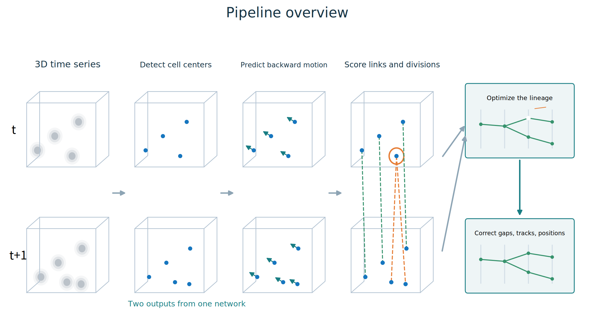

*Figure 1: Pipeline overview. Volumetric images from multiple time points are used to predict cell centers and motion, then construct candidate continuation and division links. After optimizing lineage consistency, postprocessing addresses gaps, short spurious tracks, and coordinates. The cells and lineages are schematic.*

## 1. Cell Detection and Motion Prediction

### 1.1 Joint Learning with 3D nnU-Net (ResEncM)

The backbone was [nnU-Net](https://github.com/MIC-DKFZ/nnUNet), using the 3D ResEncM configuration from the [residual encoder presets](https://arxiv.org/abs/2404.09556). It takes three 3D images, including the preceding and following time points, plus a channel encoding the frame interval. It predicts a cell-center heatmap and a 3D backward displacement toward the preceding time point.

Cell-center candidates are extracted from the heatmap, and motion predictions guide the links between frames. Sharing a feature extractor between detection and motion allows the network to learn cell appearance together with temporal changes.

The training patch size was **48 × 128 × 128 (Z, Y, X)**. I omitted the highest-resolution decoder stage, produced detection and motion outputs at half the XY resolution, and interpolated them back to the original resolution. This reduced computation and was also intended to avoid excessive sensitivity to small annotation offsets.

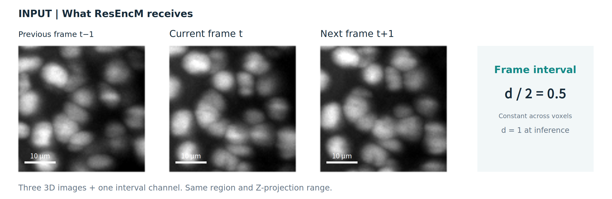

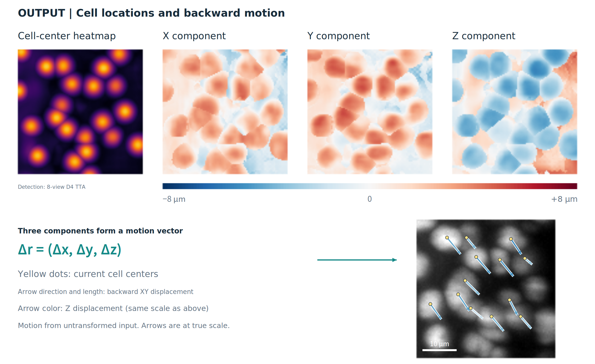

*Figure 2: An actual inference example, with inputs and outputs shown separately. Inputs are the previous, current, and next 3D images and the frame interval. Outputs are the cell-center heatmap, X/Y/Z motion components, and the resulting vectors. Images and heatmaps are maximum-intensity projections over the same Z range. At each pixel, the motion components are taken from the Z position with the highest detection probability. Arrows show current-to-past XY displacement at true scale, with color indicating the Z component. Detection uses eight-view TTA; motion uses the untransformed input.*

### 1.2 Target Heatmaps and Sparse Annotations

The detection target is a Gaussian heatmap around each annotated cell center. However, treating every unannotated region as negative could train the detector to suppress real cells that simply lack annotations.

I therefore restricted the regions contributing to the loss based on the annotations, rather than strongly supervising unannotated cells as background.

I also tuned the heatmap width. An overly broad Gaussian makes neighboring peaks overlap and cells harder to separate. An overly narrow one is less tolerant of positional offsets and more sensitive to annotation variability, which I expected could make training less stable. Based on validation, I used **a Gaussian standard deviation of σ = 2 µm, truncated at 3σ = 6 µm**.

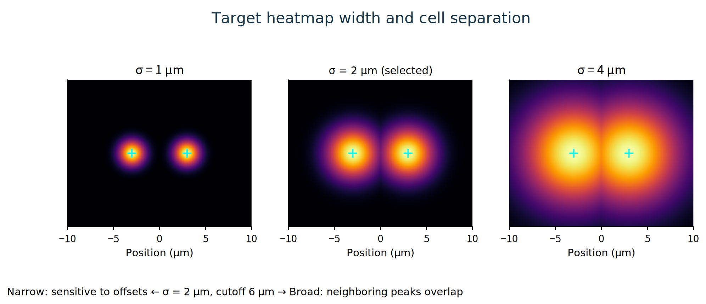

*Figure 3: Schematic heatmaps for the same two cell centers with different Gaussian widths. The middle panel uses the selected σ = 2 µm. Narrow targets increase sensitivity to annotation offsets, while broad targets make neighboring cells harder to separate.*

### 1.3 Motion Targets and Loss

Motion supervision uses the locations of a current cell and its parent or ancestor at an earlier time point, where their correspondence is known from the ground-truth lineage. With frame interval d and physical coordinates p, the backward-motion target is **v = (p[t−d] − p[t]) / d**. Dividing by d keeps the target in displacement per frame even when training with more widely separated images. I then divided by 8 µm for numerical scaling and trained the network to regress this normalized value. At inference, I multiply by 8 µm and use a frame interval of one to predict the location in the preceding frame.

The motion loss is computed **within 2 µm of a cell center with a known correspondence**. A Gaussian weight with σ = 1 µm emphasizes positions near the center. The weighted **Smooth L1 loss on the XYZ components, with β = 0.25 in normalized units**, is added to the detection loss. Where supervision regions overlap, the target from the nearer center is used.

Correspondence points receive the same rotations and reflections as the images, and motion targets are constructed from the transformed coordinates. Cells with unknown correspondences, or correspondences that are no longer available after cropping or transformation, are excluded from the motion loss rather than assigned zero motion. For division, the representation preserves the correspondence of two daughters to their shared parent. **Motion prediction helps construct candidate links; it does not determine whether a division occurred on its own.**

### 1.4 Augmentation

Spatial augmentation included rotation, scaling, and reflection in the XY plane. Because Z resolution is coarser than XY resolution, rotations requiring interpolation were confined to the XY plane, while reflections were also used along Z. Spatial transformations were applied consistently across time points.

As noted in the competition discussions, some sequences contained **freeze intervals**, during which images changed very little, followed by large cell movements. To address this, I used temporal augmentation with frames farther apart than consecutive frames. The aim was to expose the model to larger displacements and improve its ability to associate cells after a freeze interval.

For interval d, the inputs at time t are t−d, t, and t+d. Training starts with d = 1, then introduces d = 2 and later d = 3. The interval is also provided as an input channel so that the model can distinguish identical apparent displacements observed over different time intervals.

### 1.5 Pretraining on Synthetic Data

I generated synthetic data using **code shared by José Freitas ([josefreitasalvesneto](https://www.kaggle.com/josefreitasalvesneto))**, from his [discussion on synthetic 3D microscopy data](https://www.kaggle.com/competitions/biohub-cell-tracking-during-development/discussion/732103) and [Biohub Synthetic Dataset notebook](https://www.kaggle.com/code/josefreitasalvesneto/biohub-synthetic-dataset). I am grateful for this contribution of labeled synthetic data, including divisions.

In the pretrained configuration, the detector was pretrained for 1,000 epochs on synthetic data and then trained for 1,500 epochs on real data.

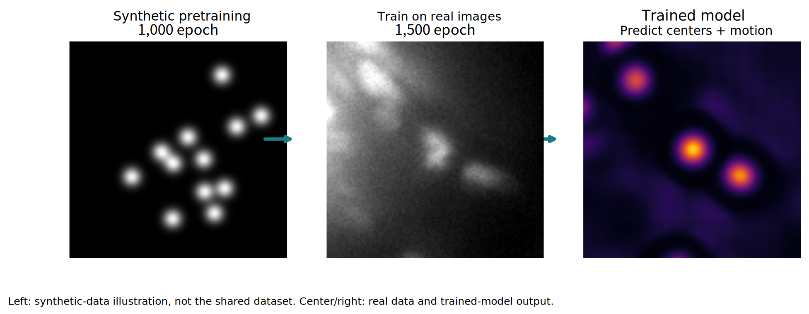

*Figure 4: Synthetic pretraining followed by training on real images. The left image is a schematic illustration of the training process, the middle image is real data, and the right image is a heatmap produced by the trained model. Synthetic-data generation was based on José Freitas's shared code.*

The public and private leaderboards did not lead to the same conclusion about pretraining. In a comparison with division modeling, graph optimization, and postprocessing held fixed, the public score increased from **0.960 to 0.966**, while the private score decreased from **0.956 to 0.947**. This was not a fully controlled comparison of all factors, including total training effort, but it did not establish improved generalization to unseen data from pretraining.

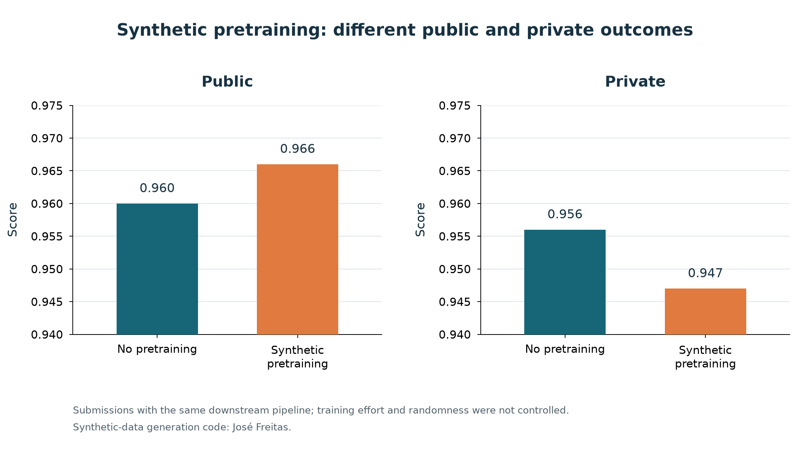

*Figure 5: Comparison of models trained with and without synthetic pretraining. Conditions outside the detection and motion model were held fixed, but total training effort, including pretraining, differed.*

### 1.6 Inference

For detection, I used eight views formed by rotations and reflections in the XY plane. After transforming predictions back to the original coordinate system, I averaged the heatmap logits—the values before conversion to probabilities. This test-time augmentation (TTA) of a single detector was more useful than adding detection models.

Applying the same averaging strategy to motion vectors did not improve the results. For motion, I used the prediction from the untransformed input.

Each frame is Z-score normalized, and the temporal interval is fixed to one at inference. Cell centers are extracted from local heatmap maxima, followed by non-maximum suppression with a physical distance of **2 µm**. Motion outputs are converted back to displacements in µm and used to associate detections with candidates in the previous frame.

Based on validation and public leaderboard results, I used **0.30 as the baseline detection threshold**. I later tested lower values, including 0.28, and used 0.28 with the additional postprocessing. Looking back after the competition, lower thresholds tended to perform better on the private leaderboard. One possibility is that harder cells shifted the heatmap outputs toward lower confidence, but this remains a hypothesis: I could not inspect the private images or prediction distributions.

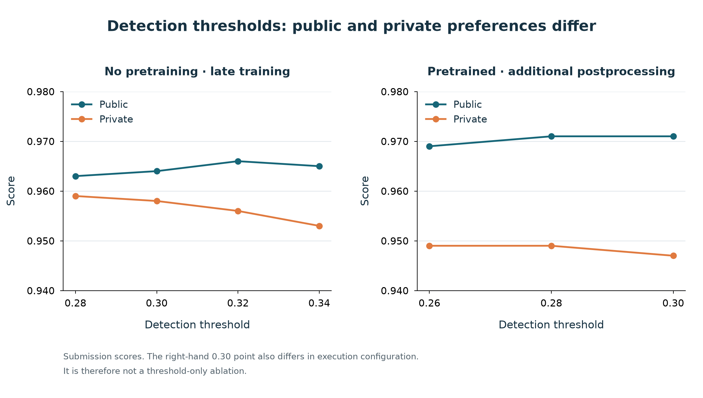

*Figure 6: Submission scores at different detection thresholds. The left panel uses a late-training model without pretraining; the right panel uses a pretrained model with additional postprocessing. The 0.30 point in the right panel also differs in execution configuration, so it is not a threshold-only comparison. The settings preferred by the public and private leaderboards did not always agree.*

### 1.7 Building Temporal Link Candidates from Motion Predictions

After detecting cells in each frame, the next question is which cell in the previous frame corresponds to each current cell. Choosing the nearest cell to the current location can fail under large motion or in crowded regions. Instead, I used **the distance between the motion-projected location and the cells actually detected in the previous frame**.

The model predicts a backward 3D displacement from the current frame toward the previous one. I sample the motion field around each detection center with Gaussian weighting and add the resulting vector to the current location. This gives a predicted correspondence location in the previous frame. Distances are computed in µm, accounting for the different Z, Y, and X voxel spacings.

I retain **up to the five nearest detections within 7 µm of the projected location**. This 7 µm gate applies to the **residual distance from the prediction**, not to the total distance a cell is allowed to move.

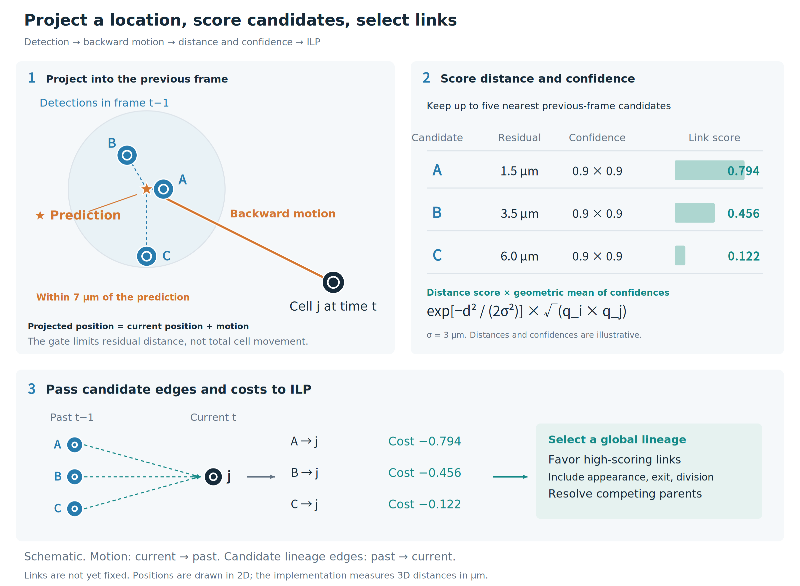

*Figure 7: Project a current cell into the previous frame and evaluate residual distances to nearby detections. Multiple candidate edges and scores are retained, leaving the final selection to ILP. Motion arrows point from current to past, while lineage edges point from past to current. Distances, confidence values, and scores in the figure are illustrative examples, not measurements. The implementation uses 3D distances.*

The link score is a Gaussian function of residual distance, multiplied by the geometric mean of the detection confidences at the two endpoints. For previous-frame candidate i and current cell j, with residual distance d_ij and detection confidences q_i and q_j, the score is:

`s_ij = exp[−d_ij² / (2 × (3 µm)²)] × √(q_i × q_j)`

The nearest candidate is not selected immediately. I keep the candidate edge i→j and its score in the graph, and pass **−s_ij as its link cost** to the ILP objective. Higher-scoring links are favored, while appearance, disappearance, and division costs and constraints against multiple parents are considered jointly across the lineage. The following sections describe division evaluation and graph optimization in more detail.

## 2. A Dedicated Pipeline for Cell Division

Solving division entirely within the detection network would simplify the system. However, division examples were limited, and I felt they were difficult to emphasize sufficiently while learning ordinary cells and motion. I therefore built **a separate pipeline focused on learning division**.

It has three main roles:

1. Assess whether the local images around a candidate parent suggest division.
2. Rank pairs of candidate daughters.
3. Use trajectory and geometric information to assess whether division or ordinary continuation is the more plausible explanation.

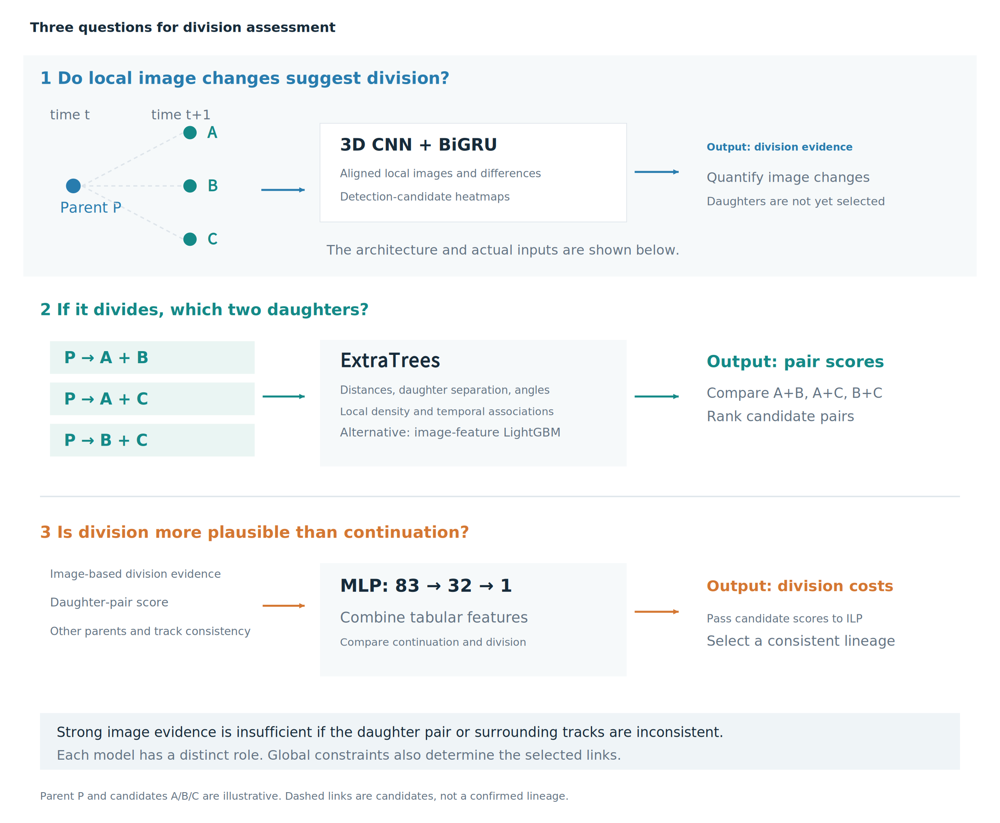

*Figure 8: A schematic example with parent P and daughter candidates A, B, and C. Local images provide division evidence, daughter combinations are evaluated separately, and an MLP combines image, pair, and trajectory features. These outputs evaluate candidates; the final connections are chosen under ILP constraints.*

### 2.1 Align Motion Before Taking Image Differences

Inspection of images around divisions revealed characteristic changes in brightness and shape. However, raw temporal differences also contained strong signals from ordinary cell motion.

For image-based division classification, I first estimate local motion from surrounding cells and align the preceding and following 3D images. Taking differences after alignment suppresses signals caused by ordinary translation and makes division-related changes in shape and brightness easier to see.

Inputs include **aligned images at multiple time points, signed temporal differences, their absolute values, and heatmaps reconstructed from detection candidates**. Raw images describe shape, signed differences show where intensity increases or decreases, and absolute differences describe the magnitude of change. The heatmaps are Gaussians reconstructed from detected centers and their confidence scores; they provide information about the candidate location and the surrounding cell arrangement.

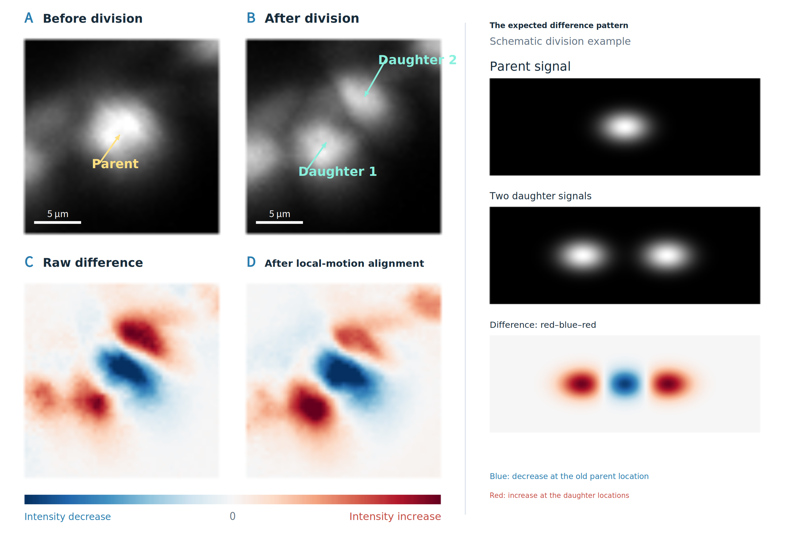

*Figure 9: Top left: actual images before and after division. Yellow arrows identify the parent and cyan arrows identify the daughters. Bottom left: raw differences and differences after the same 3D local-motion estimation used in the submitted pipeline, using saved detection candidates. For display, differences are computed from Z maximum-intensity projections, with a common color scale. The Gaussian schematic on the right illustrates a negative signal at the old parent location and positive signals at the two daughter locations. Actual patterns depend on division orientation and intensity changes.*

### 2.2 Division Image Classifier and Auxiliary Supervision

The image classifier is a **small 3D CNN followed by a bidirectional GRU (BiGRU)**. It takes **12 × 48 × 48 (Z, Y, X)** crops around a candidate parent. Five time points, t−2 through t+2, form three overlapping three-frame windows. The aim is to capture the transition from one cell to two rather than a single static shape.

Each window contains seven image channels—three images, two signed differences, and two absolute differences—plus seven channels constructed in the same way from detection heatmaps, for **14 channels** in total. The heatmap channels use t−1, t, and t+1 and are shared across the three image windows.

A shared 3D CNN maps each window to a 128-dimensional feature vector. The BiGRU combines temporal information, which is added residually to the central window's features. The CNN consists of four blocks with 24→48→96→128 channels, spatial pooling, and global average pooling.

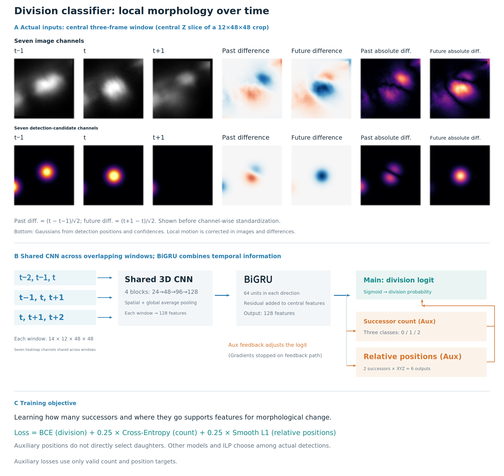

*Figure 10: The upper panel shows 14 actual input channels reconstructed from saved detections and real images using the submitted preprocessing code. It shows a Z slice from the central three-frame window, before channel-wise standardization. The lower panel shows one model's architecture. Its main output is a division logit; auxiliary outputs predict the number and relative positions of successor cells. Outputs marked “(Aux)” receive auxiliary supervision.*

To encourage features that capture morphological change, I supervised not only division but also **the number of successor cells in the next frame (0, 1, or 2)** and **the relative XYZ positions of up to two successors**. The loss adds count cross-entropy and position Smooth L1, each weighted by 0.25, to the division BCE loss. With sparse annotations, auxiliary losses are computed only where valid targets are available.

I also fed count and position predictions back into the main classifier to adjust its division logit. Gradients into the auxiliary predictions are stopped along this feedback path. **The auxiliary outputs support division classification; their predicted positions are not directly adopted as the final daughters or edges.** Actual daughters are selected from detected candidates.

### 2.3 Identifying a Dividing Parent and Choosing Two Daughters Are Different Problems

A correct division decision is still wrong as a lineage event if one daughter is misidentified. I therefore used the image classifier to assess the parent and an **ExtraTrees classifier to rank daughter pairs**. Pairs are formed from detections in the next frame around the same candidate parent.

Important features include parent-to-daughter distances, daughter separation, the angle between the two parent-to-daughter directions, the offset between the parent and the daughters' midpoint, nearby cell counts, and detection confidence. Features derived from neighboring time points describe whether the daughters plausibly share a parent or are better explained by separate tracks. There are 73 geometric and temporal features in total.

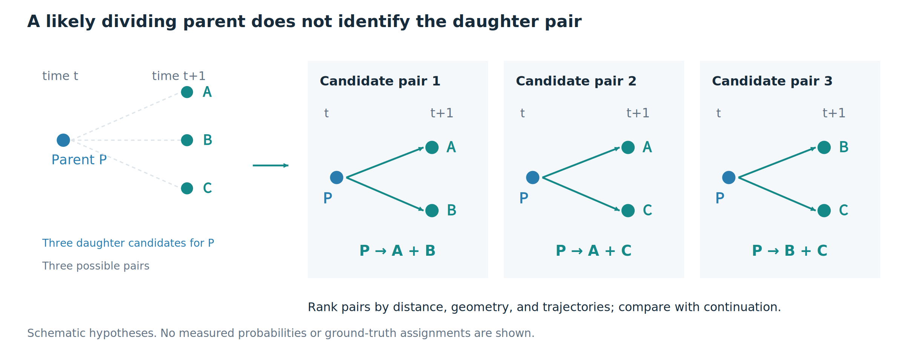

*Figure 11: A schematic with three daughter candidates. Even with high confidence that the parent divides, the correct daughter pair must be evaluated separately.*

Restricting division assessment to branches already selected in an initial tracking graph cannot recover events that were missed there. I therefore expanded assessment to existing link candidates as well. This change increased the public score from 0.969 to 0.971, while both private scores in that comparison were 0.947.

### 2.4 Combining Local Images with Trajectory and Geometric Information

Local images alone cannot fully assess consistency with surrounding cells or the plausibility of a trajectory. I therefore used **a small MLP with 83 inputs, 32 hidden units, SiLU activation, and one output** to further evaluate division hypotheses involving daughter pairs.

Its 83 inputs consist of 73 geometric and temporal features; seven additional features such as distance to another candidate parent and the cost of an ordinary-continuation explanation; the parent's detection confidence; the image classifier's division logit; and the ExtraTrees pair score. For example, if the two proposed daughters are each close to a different parent, an apparent division may actually be two ordinary tracks. These alternative explanations are assessed together with image-based division evidence. Features are standardized and extreme values are clipped.

The MLP output is converted into costs for division hypotheses and passed to ILP. A high score for an individual hypothesis does not determine the links by itself: the selected graph must also satisfy global constraints, such as not assigning multiple parents to one daughter.

In another configuration, I replaced the daughter-pair ranker with LightGBM using the 73 geometric and temporal features plus **18 image features describing brightness and contrast near the daughters**, for 91 features in total.

The image features include each daughter's center intensity, the mean, maximum, and standard deviation in a small neighborhood, the mean in a surrounding region, and local-to-surrounding contrast. Taking the minimum, maximum, and absolute difference across the two daughters makes these features independent of daughter ordering. The MLP evaluates the division event, while the image-feature LightGBM ranks daughter pairs.

This configuration achieved a public score of 0.970 and a private score of 0.952. However, it also differed in other model and optimization choices, so this submission alone does not isolate the contribution of any individual component.

## 3. Selecting a Consistent Lineage with Integer Linear Programming

Selecting candidates independently can produce inconsistent graphs, such as assigning multiple parents to one daughter. I converted candidate evaluations into costs and used integer linear programming (ILP) to select connections jointly.

### 3.1 The First ILP Produces a Provisional Lineage

The first ILP combines candidate edges from detection and motion with image-based division scores and daughter-pair scores. **Division is already included at this stage**, alongside ordinary continuation. Appearance, disappearance, and division costs are combined with constraints such as no multiple parents per cell to produce a provisional lineage that is consistent across the video.

### 3.2 Re-evaluating Division Hypotheses

Starting from branches in the provisional lineage, I evaluate alternative daughter pairs. For example, P may appear to divide into A and B, but if another parent Q is close to B, ordinary links P→A and Q→B may be a more natural explanation. The MLP re-evaluates the division hypothesis using image evidence, daughter-pair geometry, distances to alternative parents, and the cost of an ordinary-continuation explanation.

Evaluating only selected branches would prevent recovery of divisions missed by the first ILP. I therefore also include existing division candidates that have not yet been re-evaluated. These additional hypotheses must still use parent–daughter combinations consistent with the candidate edges constructed from detection and motion.

### 3.3 Updating the Costs and Optimizing Again

The MLP output is converted into rewards or penalties for daughter pairs and added to the cost of selecting both parent–daughter edges together. Plausible divisions are encouraged, while hypotheses better explained by ordinary continuation are penalized. I then solve ILP again on the original candidate graph, reconsidering competing links. The key is **global re-optimization with updated scores, rather than freezing the first lineage and locally editing its branches**.

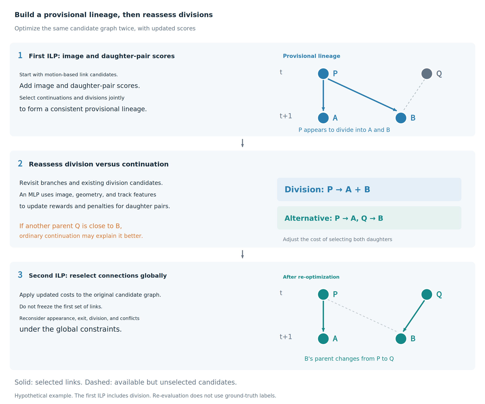

*Figure 12: Two-stage ILP. The first solve already includes division and produces a provisional lineage. Division hypotheses and alternatives are then re-evaluated, and links are selected again on the same candidate graph. In the example on the right, an apparent division by P is reinterpreted as a continuation from another parent Q. This is a hypothetical illustration, not a measured result.*

Another configuration used a single optimization stage with division candidates included. Switching to one stage can change the selected graph; it is not merely a change in execution order. Score differences between configurations therefore include differences in optimization as well as division models.

## 4. Errors Addressed by Postprocessing

I added postprocessing in response to observed errors, also drawing on public notebooks. The main targets were brief detection gaps, weak short tracks, tracks near divisions or video boundaries, and coordinate jitter, including during freeze intervals.

### 4.1 Gap Filling, Short-Component Selection, and Coordinate Correction

The configuration with additional postprocessing used the following operations. Short-track decisions consider the number of nodes in a connected component, not just the length of an individual branch.

| Target | Decision and correction | Safeguards |
|---|---|---|
| One missing frame | Match track ends at t to track starts at t+2 one-to-one, within 9 µm between endpoints. Reuse an isolated node within 3.2 µm of the interpolated midpoint if one exists; otherwise insert a node whose position is refined using the image near that midpoint. | Do not reuse a start or intermediate node more than once. Limit new nodes to approximately 2% of the original node count and at most 2,000. |
| Short isolated components | By default, remove connected components with fewer than nine nodes. | Protect components containing division. An eight-node component can be retained if its mean link score is at least 0.5. |
| Restoring short boundary and interior components | Restore components of three to eight nodes touching the first or last frame when their confidence is high relative to nearby detections. Interior components of five to seven consecutive nodes are also considered when link scores and relative detection confidence are high. | Require a mean confidence ratio of at least one, with a ratio of at least one for a majority of nodes. Interior restoration is limited to components sharing no nodes with the existing graph. |
| Excessive restoration | For boundary and eight-node restoration candidates, remove a component if a majority of its nodes lie within 7 µm of baseline-graph nodes at the same time points. | If there are at least eight interior eight-node components, also remove those whose mean detection confidence falls below the 25th-percentile threshold. |
| Coordinate jitter along a track | Fit a line to the uniquely traceable neighborhood, up to four steps in each direction, and blend 40% of the original coordinate with 60% of the fitted coordinate. | Cap each node's correction at 2 µm to avoid excessive displacement. |

Removing every short track would also discard real cells just after division or near video boundaries. I therefore **combined removal of spurious components with protection and restoration of short components supported by evidence**. The table describes this additional-postprocessing configuration; these settings were not shared by every experiment.

### 4.2 Aligning Coordinates During Freezes Without Changing Connections

A freeze is detected when adjacent 3D images are exactly equal at the pixel level. Within such intervals, one-to-one chains are aligned to the coordinate of their first actual detection, excluding branch points and their immediate neighbors. Node counts, timestamps, and edges remain unchanged, and nodes inserted by gap filling are not used as coordinate anchors.

Even correct connections can exhibit coordinate jitter during a freeze. Correcting coordinates without adding graph links was useful in this case. On the same 40 development videos, the overall score improved from 0.960897 to 0.962707 without changing node or division counts. Coordinate correction also changed matching to ground truth: Edge TP increased by 17 and FP decreased by 34. This was a comparison on a set used during development, not an independent evaluation on unseen data.

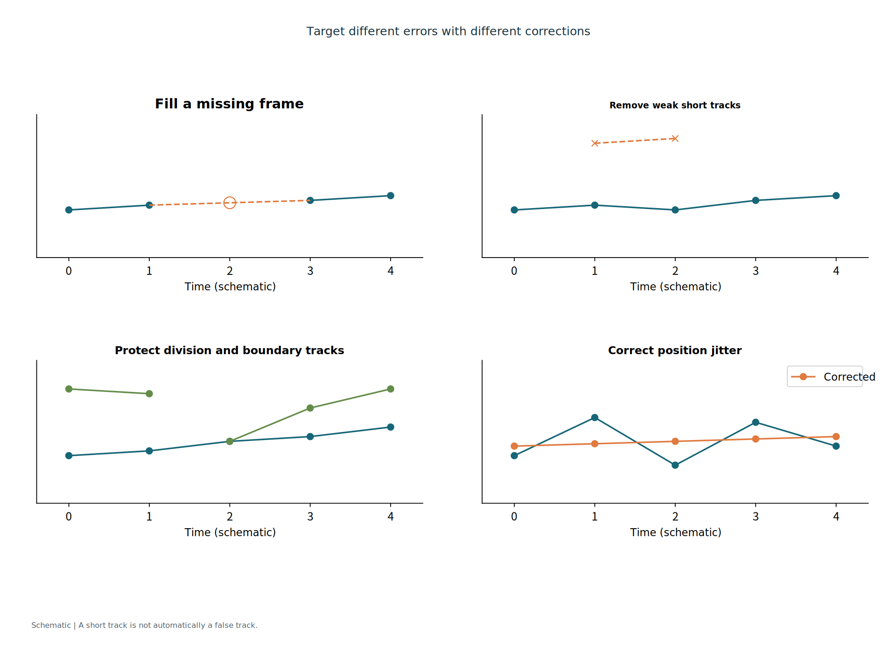

*Figure 13: A schematic of postprocessing objectives. It does not show actual before-and-after predictions or the exact selected parameters.*

Two submissions at threshold 0.28 both scored 0.971 on the public leaderboard. The private score was 0.949 with additional postprocessing and 0.947 without it. However, the same postprocessing did not necessarily help after changing the detector. Missing-detection and false-positive patterns can change, making end-to-end evaluation important.

## 5. Why Averaging Motion Predictions Did Not Help

I tested motion TTA as well as detection TTA. In addition to averaging vectors after transforming them back to the original coordinate system, I tried voting for the parent candidate indicated by each transformed prediction and weighting those votes by distance.

When different views point toward different parents, their average vector can point between the candidates. **If another cell lies near that average endpoint, averaging can favor a connection that the original predictions did not support.** Reducing vector variance is not the same as identifying the correct parent. The final connection also depends on other costs and ILP constraints, so the cell near the average endpoint is not necessarily selected.

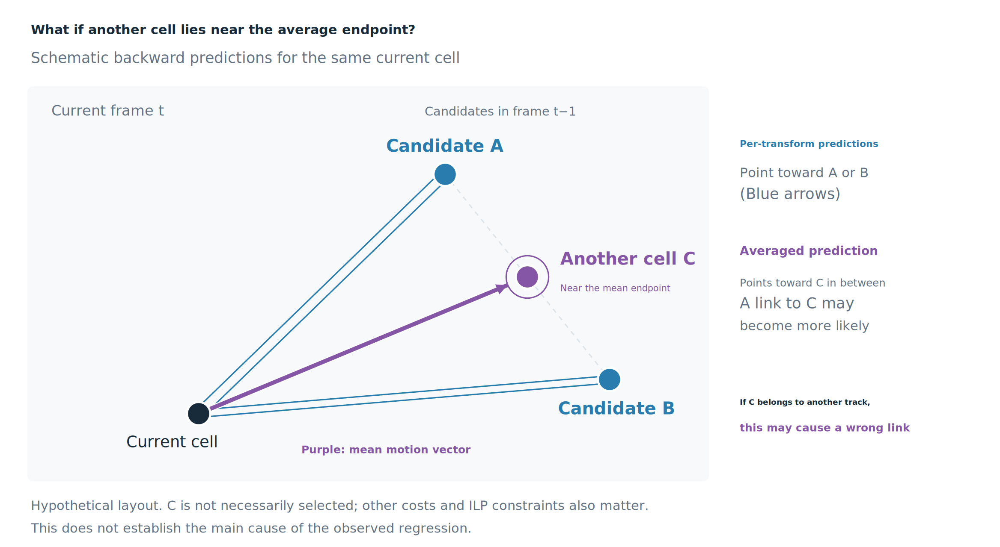

*Figure 14: Predictions from individual transforms point toward A or B, while another cell C lies near their average endpoint. The purple arrow is an averaged motion prediction, not a confirmed link. If C belongs to a different trajectory, averaging could increase the risk of a wrong connection. The layout is illustrative and does not establish the main cause of the measured regression.*

I compared these methods on 12 development videos, using 100 frames per video and fixed division-candidate scores. Mean Edge Jaccard across videos, including the node-count correction, was 0.91931 for the untransformed prediction, 0.91619 for vector averaging, 0.90218 for parent voting, and 0.91433 for distance-weighted voting. The untransformed motion prediction performed best. This was a diagnostic comparison on development data, not an unseen-data evaluation.

Since these methods did not improve the result, I used untransformed motion predictions. Detection and temporal association responded differently to prediction averaging.

## 6. Differences Between Public and Private Results

Reviewing the submission history after the competition showed that improvements on the public leaderboard did not always translate into private improvements.

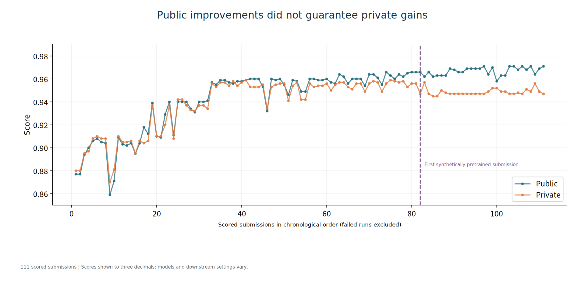

*Figure 15: The 111 scored submissions in chronological order. Submissions without scores, such as failed runs, are excluded. These are repeated submissions to the same evaluation sets, not independent experiments.*

The development process can be roughly divided into the periods below. Dates are UTC. Scores are public/private pairs from representative configurations, not combinations of separate best scores within each period.

| Period | Main focus | Representative public/private scores | Observed pattern |
|---|---|---|---|
| Late July–August | Detection and motion, eight-view detection TTA, gap filling, coordinate correction | .877/.880 → .909/.910 | Both improved, with a small gap. |
| September 7–12 | Division costs, image-based division classification, daughter-pair selection, two-stage optimization | .939/.937 → .957/.956 → .959/.959 | Better handling of division coincided with large improvements on both. |
| September 13–16 | Comparing division classifiers, rejecting incorrect pairs, boundary handling and postprocessing | .960/.956 | Some public gains did not carry over to private. |
| September 17–21 | Late-training adjustments without pretraining, detection-threshold search | .964/.957 → .966/.956 | Public improved while private remained roughly flat. |
| September 21–22 | Switching to a synthetically pretrained detection and motion model | Paired comparison: .960/.956 → .966/.947 | The gap widened substantially. |
| September 23–24 | Retraining division classifiers, expanding the set of assessed division candidates | .969/.947 → .971/.947 | Public improved; private did not change. |
| September 26–29 | Division and daughter-pair refinements, optimization and runtime changes, additional postprocessing | Examples: .970/.952 and .971/.949 | Some configurations recovered part of the private score. |

For a late-training model without pretraining, threshold 0.28 gave **.963/.959**, compared with **.966/.956** at threshold 0.32. There were therefore signs that public and private preferred different settings even before the switch to pretraining. This timeline is descriptive; it does not attribute each period's changes to a single factor.

Early changes associated with large private improvements included adjusting division costs and explicitly modeling daughter pairs in graph selection. In contrast, later changes that increased public scores, such as pretraining and expanded division assessment, did not produce corresponding private gains in the paired comparisons.

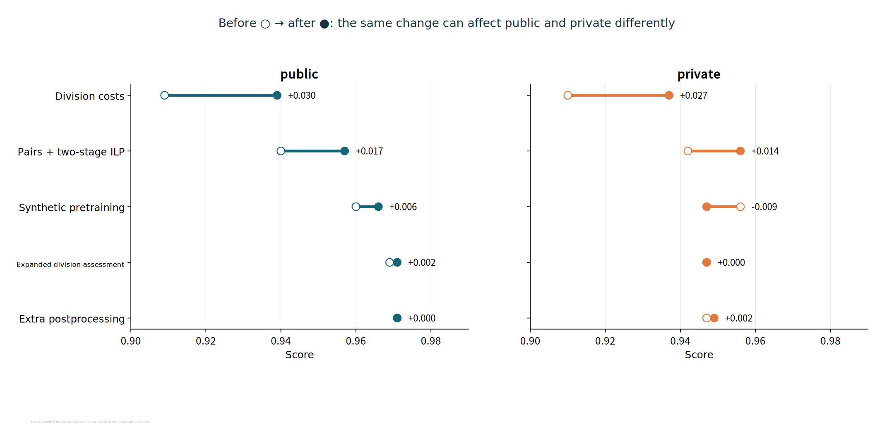

*Figure 16: Comparisons between submissions before and after changes. Adjusting division costs increased private from 0.910 to 0.937; a change including daughter-pair modeling and two-stage optimization increased it from 0.942 to 0.956. Comparisons changing multiple components, including the latter, cannot isolate the contribution of a single component.*

## 7. Closing Remarks

The main focus of this solution was how individual cell and division candidates are selected within a complete lineage. I combined detection training that accounts for sparse annotations, temporal-interval augmentation, dedicated division models, globally consistent graph selection, and postprocessing tailored to observed errors.

I also found that adding models, averaging predictions, and improving the public score did not necessarily improve performance on unseen data. It was important to inspect detection, continuation, and division separately, then evaluate the actual output graph end to end.

### References

- Isensee et al. (2021). **nnU-Net: a self-configuring method for deep learning-based biomedical image segmentation.** Nature Methods, 18, 203–211. [Paper](https://doi.org/10.1038/s41592-020-01008-z) · [Code](https://github.com/MIC-DKFZ/nnUNet)

- Isensee et al. (2024). **nnU-Net Revisited: A Call for Rigorous Validation in 3D Medical Image Segmentation.** [Paper](https://arxiv.org/abs/2404.09556). This work introduces the residual encoder presets, including ResEncM used in this solution.

- José Freitas's [synthetic-data discussion](https://www.kaggle.com/competitions/biohub-cell-tracking-during-development/discussion/732103) and [generation notebook](https://www.kaggle.com/code/josefreitasalvesneto/biohub-synthetic-dataset).

Figures labeled “schematic” illustrate the underlying ideas. Figures showing actual images or evaluation results specify the corresponding data and comparison conditions in their captions.

---

## Comments (1)

### Tom (MASTER) — 2026-10-01

@tatsutaka  nice approach and great to see another team use red-blue-red pattern!
