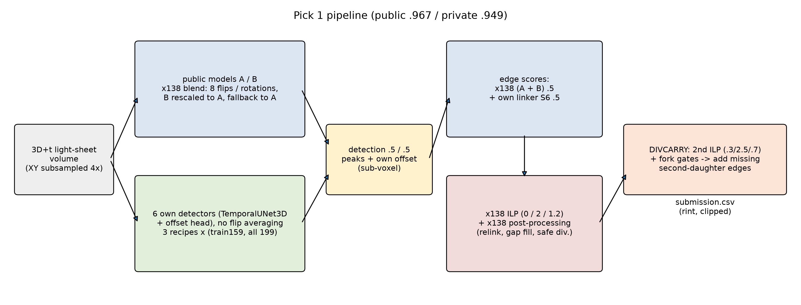
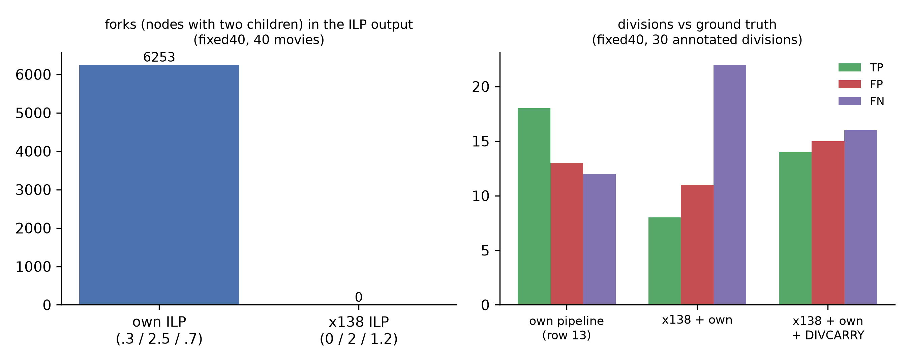
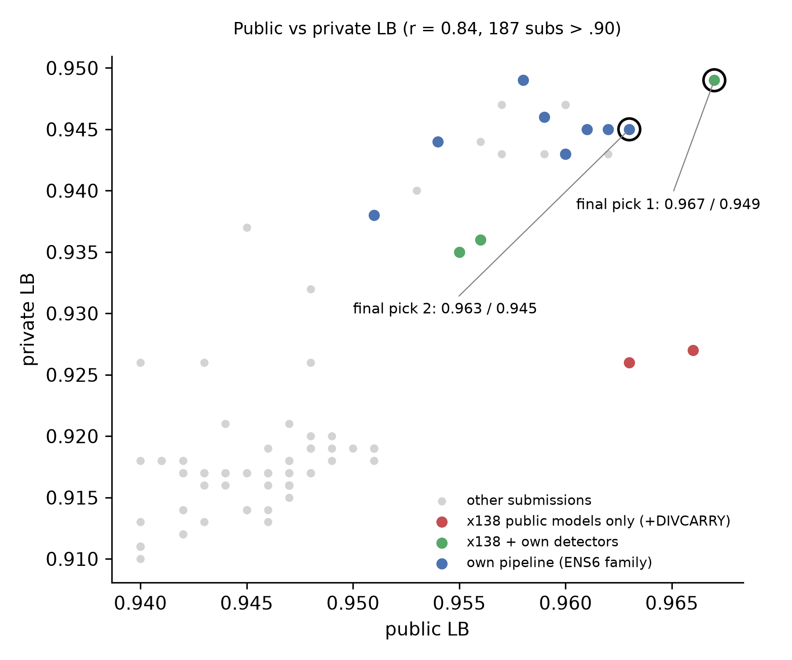

# 9th place — yuto083: 9th Place Solution: Own Detectors + Public Tracker + Restored Divisions

| | |
|---|---|
| Private | rank 9, 0.94981 (Gold) |
| Public | rank 30, 0.96799 |
| Team | yuto083 (@yuto0712) |
| Writeup by | yuto083 |
| Published | 2026-10-01 (updated 2026-10-01) |
| Source | https://www.kaggle.com/competitions/biohub-cell-tracking-during-development/writeups/9th-place-solution-own-detectors-public-tracker |
| Comments | 0 |

---
Thanks to the organizers and to the authors of the public notebooks, checkpoints and discussions this solution builds on (listed at the end).

**Final pick: Public 0.967 / Private 0.949 (9th, solo).** Second pick: Public 0.963 / Private 0.945.

## TL;DR

- We kept two public checkpoints of the host's detection-and-linking model frozen (called **A** and **B** below) and blended in our own models: six detectors that place nucleus centres more precisely than the voxel grid, and a linker trained on their features (**S6**). Each is mixed 1:1 with the public models' outputs.
- Apart from building the ensemble itself, the biggest gains came from fixes rather than training changes: rounding coordinates instead of truncating them (+.009 public / +.013 private), and **DIVCARRY**, a final step that adds back divisions that the best public notebook pipeline (**x138**) never produces (+.011 / +.013).
- On private, our own models mattered most. Inside x138 + DIVCARRY they were worth +.004 public but **+.023 private**.
- Final picks: x138 + our models + DIVCARRY (**Pick 1**), and our own pipeline **ENS6** (**Pick 2**), whose post-processing is different.

## 0. Task, validation data and names

**Task and metric.** Detect every nucleus in 3D+t light-sheet movies of zebrafish embryos (100 frames × 64 × 256 × 256) and link the detections over time, including divisions, into a lineage graph. Score = adjusted edge Jaccard + 0.1 × division Jaccard, with nodes matched within 7 µm. The edge term is penalised when more nodes are predicted than the estimated total. The ground truth is sparse: only a few tracks per movie are annotated. Train has 199 movies from two embryos. The hidden test uses other embryos and is split 29 % public / 71 % private.

**Our hold-out.** We held out 40 train movies (**fixed40**) and trained some of our models on the other 159 (**train159**). fixed40 is unseen only by these train159 models. A, B and our all-199 models were trained on it.

**Names used below.**

| name | meaning |
|---|---|
| A, B | public checkpoints of the host baseline (TemporalUNet3D + node transformer, which both detects and links): `biohub-tracking-support-pack-50ep-v1` (A) and `biohub-temporal-unet3d-seed314159-v1` (B). Both were trained on all 199 movies. |
| own detectors | our detection-only models (section 1); the final picks use six |
| S6 | our linker: the host baseline's linker architecture, fed with our detectors' features, trained on train159 |
| x138 | the best public notebook pipeline ("Biohub 0.953 LB \| ORIGINAL", public 0.953), built on A and B only |
| ENS6 | our own pipeline, used as Pick 2 |
| DIVCARRY | our final step that adds missing division edges to x138's output (section 1) |
| ILP | the global linking step (integer linear programming with tracksdata + SCIP). It chooses edges, track starts and ends, and divisions, each with a cost. |
| fork | a node with two children, i.e. a division candidate |

## 1. Pipeline

| stage | Pick 1: x138 + own + DIVCARRY | Pick 2: ENS6 |
|---|---|---|
| detection | .5 × x138's A/B blend + .5 × mean of 6 own detectors | .25 A + .25 B + .5 × mean of 6 own detectors; A and B averaged over the 8 XY flips / rotations |
| coordinates | peak (3×3×3 max-pool) + mean own offset | same |
| linking | .5 × x138's edge scores + .5 × S6 | .25 A + .25 B + .5 × S6 (see below) |
| ILP costs: appearance / disappearance / division | 0 / 2 / 1.2 | .3 / 2.5 / .7 |
| post-processing | x138's (below) | fork gates (below), capped safe divisions, gap closing ≤ 2.5 µm, min track length 5, line-fit smoothing of positions, no motion relink |
| divisions | DIVCARRY | from the ILP, filtered by the fork gates |
| writer | coordinates rounded (`rint`) and clipped to the volume | same |

**x138's components** (from the public notebook; we kept them unchanged):

- *A/B blend:* detection averaged over the 8 XY flips / rotations; B's scores are rescaled to A's statistics before mixing; in frames where the blend would keep fewer than 90 % of A's candidates, A's detections are used instead.
- *edge scores:* edge features averaged over flipped views; forward and backward edge probabilities combined by a harmonic mean; B's score mixed in only where A's best two candidates are close.
- *motion relink:* re-links detections frame to frame with a flow-guided one-to-one matching, replacing the ILP's edges.
- *readmit and gap fill:* put back peaks just below the detection threshold, and insert nodes where a track misses frames.
- *DeepCenter veto:* a separate public centre-prior model rejects gap fills and divisions it does not support.
- *safe divisions:* divisions added from geometry alone.
- In Pick 1, our offsets replace x138's own coordinate-refinement head (V1284).

**ENS6 linking.** For each candidate edge, the softmax is taken in both directions: over a node's previous-frame candidates and over its next-frame candidates. A pair becomes a candidate if either value exceeds .48.

**Own detectors.** A TemporalUNet3D with a 1×1 conv head that regresses the offset from the integer peak to the nucleus centre. The input is subsampled 4× in XY, so this offset reaches 0.8 µm. We trained three recipes from scratch, differing in the temporal window (the number of input frames): W2, W2 without z-flip augmentation, and W3. Each was trained on train159 and on all 199 movies, giving six members. We use the raw epoch-60 weights of a 100-epoch cosine schedule (lr 1.41e-4, batch 12, flips + XY rotations + brightness). A single member gave about .930 on its own. The members rarely make large z-errors on the same nucleus, so the gain came from diversity rather than size.

**Fork gates (Pick 2, reused by DIVCARRY).** The pre-gate on the ILP output keeps a fork if the two daughters are ≥ 11 µm apart two frames later, both branches last ≥ 2 frames, the daughters are ≥ 0.8 × as far apart as the nearest other node, and the parent–daughter distance is ≤ 0.97 × the embryo's median node spacing. The post-gate on the final graph requires daughters ≥ 9.5 µm apart.

**DIVCARRY.** With appearance 0 and division 1.2, starting a new track is always cheaper than branching, so **x138's ILP produced zero forks on all 40 fixed40 movies**. Motion relink then replaces the ILP edges, so divisions come only from the safe-division step. Switching x138's ILP to our costs alone left the divisions unchanged (8 / 11 / 22 TP / FP / FN), because the relink discards the ILP edges. So DIVCARRY writes the edges into the finished CSV, as the last notebook cell:

1. Re-solve the ILP on x138's own pre-ILP candidate graph with ENS6's costs (.3 / 2.5 / .7).
2. Keep the forks (parent p → daughters a, b) that pass the pre-gate.
3. If p has exactly one child in the final graph, that child is a or b, and the other daughter has no parent, add the edge from p to the other daughter. Cap the additions at 1 % of a movie's edges.
4. Apply the 9.5 µm post-gate.

On fixed40 this moved x138 + own from 8 / 11 / 22 to 14 / 15 / 16 (total .9431 → .9547, edge term unchanged); our own pipeline (row 13 below) has 18 / 13 / 12. Nodes never change, and any failure restores the original CSV. The worker pool must use `spawn`: forking after polars / tracksdata threads have started deadlocks inside the Kaggle notebook. Our members make the run about 1.24× longer than x138 alone. x138 silently skips its repair steps in post-processing once the run passes a time limit, so we raised that limit from 7.5 h to 9.2 h.

**Validation.** All four submissions that raised the A/B influence lost on the LB (−.002 to −.008), while fixed40 tended to reward more A/B weight, because A and B had been trained on those movies. So anything touching A/B was decided on the LB. For train159 models, the fixed40 edge term tracked the LB (Spearman 0.90, but only n = 9). The total did not, because about 30 annotated divisions decide the division term. The LB shows three decimals, so differences of ≤ .002 are within rounding. A local runner executes a submission notebook verbatim on fixed40 and reproduces the Kaggle output byte-for-byte. Every runtime change was checked this way before spending a slot.

## 2. Changes and their Public / Private scores

Main submissions in order. "vs" gives the comparison base of each Δ. Rows marked † change more than one thing.

| # | change | vs | Public | Private | Δ Public | Δ Private |
|---|---|---|---|---|---|---|
| | **August – mid-September: pipeline on public models only** | | | | | |
| 1 | control: ILP division cost 1.0, no fork filter | | .867 | .858 | | |
| 2 | + post-processing of a public LB-0.897 notebook | 1 | .889 | .882 | +.022 | +.024 |
| 3 | † blend the logits of A and B, with ILP appearance 0 / disappearance 1.5 | .887 / .872 variant | .901 | .886 | +.014 | +.014 |
| 4 | motion relink **off**: relink was destroying ILP divisions | relink on, .911 / .901 | .933 | .906 | +.022 | +.005 |
| 4b | † softmax in both directions, fork gates relative to neighbour distance and embryo spacing, 9.5 µm post-gate, re-tuned post-processing thresholds | 4 | .943 | .917 | +.010 | +.011 |
| 5 | ILP disappearance 1.5 → 2.5 | 4b | .947 | .918 | +.004 | +.001 |
| 6 | min track length 8 → 5 | .947 / .916 | .949 | .919 | +.002 | +.003 |
| | **September: own detectors** | | | | | |
| 7 | new base: one own detector + S6, no A/B, no flip / rotation averaging | | .921 | .903 | | |
| 8 | float coordinates were truncated by an int16 cast → rounded | 7 | .930 | .916 | +.009 | +.013 |
| 9 | 3 own detectors averaged (still no A/B) | 8 | .945 | .937 | +.015 | +.021 |
| 10 | † + A/B, 1:1 in detection and linking; all detectors averaged over 8 flips / rotations | 9 | .953 | .940 | +.008 | +.003 |
| 11 | † flip / rotation averaging kept for A/B only; coordinates clipped to the volume | 10 | .956 | .944 | +.003 | +.004 |
| 12 | † own offset was multiplied by the mixture weight .5 → × 1; upper clip in the writer | 11 | .960 | .947 | +.004 | +.003 |
| 13 | A/B linker features read at the rounded corrected position | 12 | .962 | .945 | +.002 | −.002 |
| 14 | 6 own detectors (train159 + all-199 versions) = **Pick 2 (ENS6)** | 13 | .963 | .945 | +.001 | ±0 |
| | **Final day: x138 as the base** | | | | | |
| 15 | † base switched from ENS6 to x138 (public .953), our detectors / offsets / S6 blended in | 14 | .956 | .936 | −.007 | −.009 |
| 16 | + DIVCARRY = **Pick 1** | 15 | **.967** | **.949** | +.011 | +.013 |
| 17 | † Pick 1 without our models (detectors, offsets, S6; coordinates from x138's own head) | 16 | .963 | .926 | −.004 | **−.023** |
| 18 | DIVCARRY "steal" mode: also re-parents a daughter that already has a parent | 17 | .966 | .927 | +.003 | +.001 |
| 19 | *late:* Pick 1 with steal mode | 16 | .966 | .950 | −.001 | +.001 |

The same rounding fix in an A/B + own ensemble gave .937 / .924 → .948 / .932 (+.011 / +.008). Turning off line-fit smoothing cost −.005 / −.007 (on row 8).

## 3. What did not work

Compared with row 13 (.962 / .945) unless noted.

| idea | Public | Private | Δ Public | Δ Private |
|---|---|---|---|---|
| A fine-tuned on all 199 movies, replacing A in detection | .960 | .943 | −.002 | −.002 |
| B fine-tuned on all 199 movies, replacing B in detection and linking | .958 | .949 | −.004 | +.004 |
| A and B in detection replaced by all-199 fine-tunes that also predict offsets (offsets mixed .75 own + .25 A/B) | .954 | .944 | −.008 | −.001 |
| more A/B weight in linking (A / B / S6 = .3 / .3 / .4) | .960 | .943 | −.002 | −.002 |
| less A/B weight in detection (A / B / own = .15 / .15 / .7) | .960 | .947 | −.002 | +.002 |
| linker trained on all 199 movies instead of S6 | .957 | .943 | −.005 | −.002 |
| two own detectors (W2 without z-flip, W3) averaged over epochs 50 / 60 / 70, batch-norm statistics re-estimated | .957 | .947 | −.005 | +.002 |
| † an extra own detector (W3, epoch 100), and linking A / B / S6 / a retrained linker at .25 each | .959 | .946 | −.003 | +.001 |
| a 2.5D detector (resnet34d) as a 4th own detector | .961 | .945 | −.001 | ±0 |
| averaging positions over duplicated frames (7.5 % of one embryo's frames are byte-identical) | .962 | .945 | ±0 | ±0 |
| float coordinates in the CSV | .951 | .938 | −.011 | −.007 |
| motion relink and readmit off inside x138 + own (vs row 15) | .955 | .935 | −.001 | −.001 |
| † S6 replaced by a linker retrained on the 3-detector mix, plus writer clip (vs row 9) | .939 | .935 | −.006 | −.002 |
| † detector trained with unannotated background as negatives, plus a retrained linker (vs row 7) | .923 | .884 | +.002 | −.019 |

Only the background-as-negative detector was positive on public, and it was the worst on private. Seed replicas, EMA checkpoints, a partial-label loss, more linking candidates and anti-aliased or full-resolution input did not help in local tests either.

## 4. Public vs Private

Over the 187 submissions with public > .90, public and private correlated well (r = 0.84). **Across pipeline families, however, the public ranking flipped on private.** The x138 variants built on public models only lost .037–.039 from public to private (rows 17–18). The 41 submissions from 9/21 to 9/30 (JST) that contain our detectors lost a median .013 (range .002–.020, excluding one outlier at .039, the background-as-negative detector above).

To choose the final pair, we split fixed40 movies at random into 29 % / 71 % halves, mimicking public / private, and bootstrapped how much the score difference between two pipelines moves from one half to the other. The SD was .006–.010, so Pick 1's +.004 lead over ENS6 would survive on private with probability ≈ .6–.7. We therefore paired the best submission with the best one from a different post-processing family (ENS6), instead of the second-best x138 variant (row 18). Row 18 was +.003 over ENS6 on public and −.018 on private, a shift of about .02, or 2–3.5 SDs. We believe fixed40 underestimated this because A and B were trained on its movies, so it cannot show how much they degrade on unseen embryos. Before the deadline, the best private score was .949, shared by Pick 1 and the B fine-tune (section 3), so the hedge did not change the final rank.

## 5. Takeaways

1. If public weights were trained on all of train, train-based CV over-rates them. Judge your own models on movies they did not see, and judge anything involving the public models on the LB.
2. Audit how the final writer handles intermediate values (rounding, offsets, read positions) before changing models. Three such fixes gave +.009, +.004 and +.002 public.
3. When you build on a public pipeline, count divisions at every stage. x138's ILP never branched, and restoring that alone gave +.011 / +.013.
4. Keep a different family among the final two. Our own models looked worth +.004 on public and turned out to be worth +.023 on private, and the public ranking between families flipped on private.

## Acknowledgements and sources

- Official baseline and metric: https://github.com/royerlab/kaggle-cell-tracking-competition
- x138 / "Biohub 0.953 LB | ORIGINAL" (anvithpothula), built on the Harmonic Fusion (flexonafft) and frontier947 (thtennant) notebooks
- pilkwang: two-seeds logit blend notebook, `biohub-tracking-support-pack-50ep-v1` (A), `biohub-temporal-unet3d-seed314159-v1` (B), `biohub-deepcenter-unet3d-center-prior-v1`
- anvithpothula: `biohub-v1284-head-s075` (replaced by our offsets in Pick 1)
- tracksdata (royerlab) and SCIP for the ILP
- Discussion threads on the 0.953 → 0.959 board tuning (743929) and on shake-up statistics (735352)

---

## Comments (0)

*(none)*
