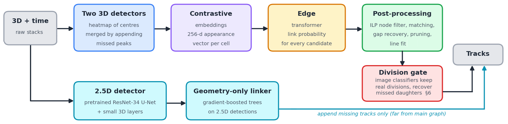
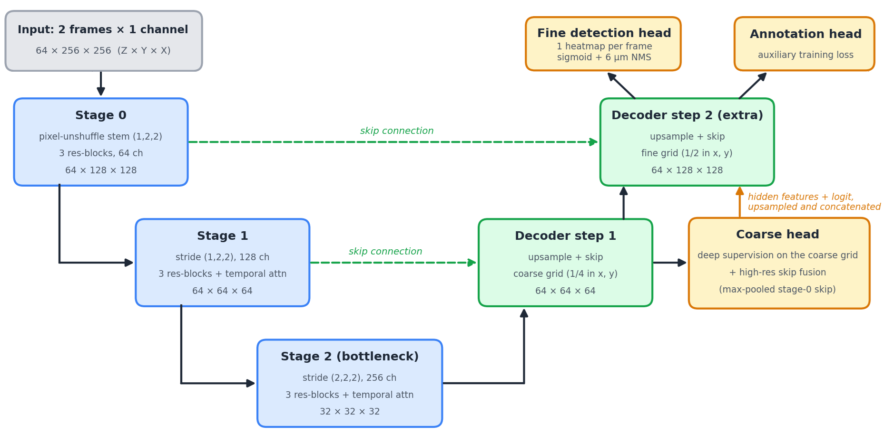
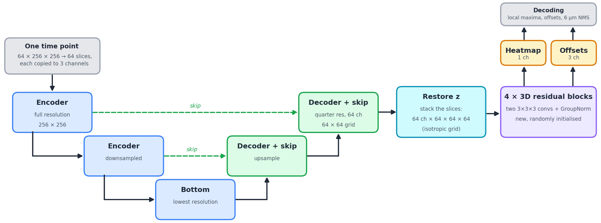
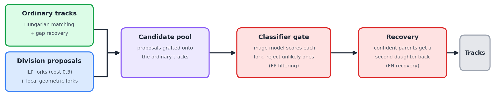
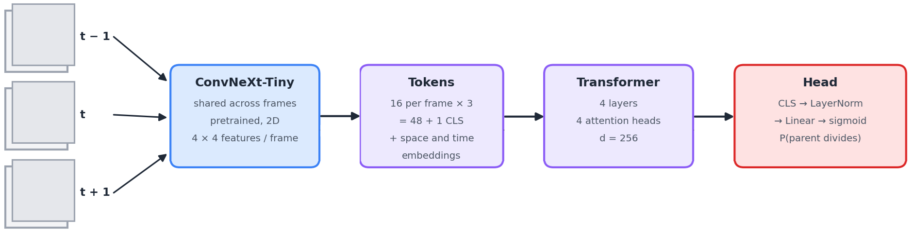

# 10th place — Kaggle Gentlemen: 10th place solution: Grandmaster Powered Agentic Approach

| | |
|---|---|
| Private | rank 10, 0.94884 (Gold) |
| Public | rank 191, 0.95809 |
| Team | dott (@dott1718), Jiwei Liu (@jiweiliu), Max Jeblick (@maxjeblick), Eduardo Rocha de Andrade (@arc144), Theo Viel (@theoviel) |
| Writeup by | Jiwei Liu, Eduardo Rocha de Andrade, Max Jeblick, dott, Theo Viel |
| Published | 2026-10-01 (updated 2026-10-01) |
| Source | https://www.kaggle.com/competitions/biohub-cell-tracking-during-development/writeups/10th-place-solution-grandmaster-powered-agentic-a |
| Comments | 0 |

---
Thanks to Biohub and Kaggle for the competition. Our solution is a modular pipeline: two 3D detectors provide the main set of nodes, a contrastive model gives each node an appearance embedding, a transformer scores candidate links, a post-processing chain builds the tracks, and a small image classifier ensemble cleans up and recovers divisions. A separate 2.5D detector adds missing tracks at the end.

The work was split between Claude, Codex, our Kaggle Agent, all steered by our Kaggling experience. We tried to keep the write-up as concise as possible, do not hesitate to ask questions in the comment if something is not clear.

## Results

| 6bba   | 44b6   |  **CV**   | Public LB      | **Private LB**   |
|--------|--------|-----------|----------------|------------------|
| 0.8824 | 0.9241 | **0.903** | 0.937 (1838th) | **0.948 (10th)** |

The public and private sets are two separate embryos, which is easy to confirm by probing. Given this information, the correct way to train and validate models is to use a leave-one-embryo-out setup with two folds. We report the macro average over the two embryos. For submission, we used separate full-fit models trained on both training embryos. 

Our public rank was nowhere near the top, but we expected teams built on the publicly available models to drop on private. The open question was whether our approach would hold up under a possible domain shift. It did :)

## 1a. 3D detectors

#### Architecture

Our 1st model is a 3D U-Net with temporal attention across a 2-frame window, similar to the public notebook's, with these changes:

- **Full-resolution input.** The z axis is much coarser than x and y, so the first two stages downscale by (1, 2, 2) only, which makes the grid closer to isotropic.
- **Unshuffle stem.** The first downsample folds each 2×2 block of x/y pixels into channels (pixel-unshuffle) instead of striding or pooling, so fine x/y detail is kept rather than discarded.
- **High-res skip fusion.** Skip connections finer than the head's grid are also fed into the head, so the detection map benefits from the finest features.
- **Extra decoding step with deep supervision.** A finer detection map is produced on top of the node grid, and the coarser head supervises it.
- **Bigger model.** 3 blocks per stage and twice as many features.

Inference volume sizes are shown; training uses smaller spatial crops.

#### Training strategy

- **Data.** We train on (32 x 128 x 128) crops with heavy augmentations, first on synthetic data, then on a mix of real and synthetic data.
- **Target and loss.** The target is a small gaussian blob around the cell centers, which the model learns using a focal loss.
- **Pseudo-labels for sparse annotations.** An unannotated cell is not background. We ran 3 rounds of pseudo-labeling: the previous model's detections are added as low-weight positives and are excluded from the negatives near real cells.
- **A small transformer is plugged on top of the detector.** It is trained with the Unet frozen and only uses position information, and only used to get an early validation score using the competition metric. The real linker is trained later, with additional cell features.

#### Decoding

Greedy non-maximum suppression at a fixed physical radius (6 µm), not max-pooling, so the radius means the same thing at any stride. We use detection thresholds of 0.45 for the first model and 0.40 for the second.

#### Merging the node sets

We keep the first 3D model's detections as the base and append only the detections from the second model that have no base detection within 7 µm in the same frame. The second detector only fills gaps and never moves or replaces a base detection. This required tweaking the thresholds on the 2 validation embryos, with no guarantee that these will be optimal on the hidden embryo.

This approach did better than logits averaging or averaging the two node sets into consensus centroids in the end-to-end pipeline. 

## 1b. 2.5D detector (late fusion for missing tracks)

#### Architecture

With only two sparsely annotated embryos, training a 3D detector from scratch leaves a lot for the model to learn. We instead reuse a [ResNet-34 U-Net pretrained on nuclei segmentation in the 2018 Data Science Bowl](https://github.com/selimsef/dsb2018_topcoders), and learn a small 3D extension on top of its 2D features.

The model sees one time point at a time, with a volume of 64×256×256 voxels. Each z-slice is copied into three channels and passed through the same pretrained 2D network. We keep the encoder and decoder up to the quarter-resolution feature map, including its encoder skip fusion. Each slice produces 64 channels on a 64×64 grid.

We then put z back into the spatial dimensions. Since the original voxel spacing is 1.625 µm in z and 0.40625 µm in x/y, this quarter-resolution grid is isotropic. Four newly initialised 3D residual blocks mix information across slices. Each block has two 3×3×3 convolutions with GroupNorm. Two 1×1×1 heads predict the cell-center heatmap and the three coordinate offsets.

#### Training strategy

- **Sparse supervision.** We use soft Gaussian targets and a weighted BCE loss, rather than the 3D models' focal loss. A Smooth L1 loss supervises offsets around official annotated centers.
- **Pseudo-labels.** We use pseudo-labels from 3D detectors as weak detection positives, with an auxiliary loss weight of 0.2.
- **Fine-tuning.** We first freeze the entire pretrained 2D trunk, including its decoder, and train the new 3D layers and heads. We then unfreeze the trunk at a 10× lower learning rate, keeping its BatchNorm statistics frozen.

#### Decoding

We take 3×3×3 local maxima of the heatmap, apply the coordinate offsets, and run greedy physical NMS at 6 µm. Unlike the two 3D models, this detector therefore has a local-maxima step before physical NMS. We explored an ensemble of three 2.5D detectors, but the selected submission uses only the single main model. Its nodes do not enter the main contrastive model or edge transformer: they are linked separately and only added as missing tracks in section 6.

## 2. Contrastive appearance embeddings

Public kernels used feature maps to feed cell geometry into a node transformer. However the UNet is trained to differentiate cells from background, not from each other, which is not necessarily the best representation for linking. What's more suitable for this is contrastive learning. We tried several approaches, including fine-tuning the 3D-Unet with a contrastive loss, but in the end using an independent 2D model worked best. We adopt ASCENT's ([link](https://www.biorxiv.org/content/10.1101/2025.07.23.666425v1)) strategy shared by Heng in the discussions.

Each detected cell gets a 256-d L2-normalised embedding. The model is a DINO ViT-B/16 backbone on a small patch around the cell (3 z-slices as channels, 48×48 pixels, about 20 µm), followed by a 4-layer transformer that attends over all the cells of the same frame. No coordinates are given to the model.

It is trained fully self-supervised, with no GT links, on the detections of our own detector. Each frame is augmented twice (position jitter, rotation, elastic deformation, scaling, intensity changes) and the model must match every cell in one view to the same cell in the other view, with all other cells of the frame as negatives (NT-Xent loss).

## 3. Edge transformer

The linker is a HOCT-style transformer that takes as input the merged node set.

For every node we generate candidate links to its nearest neighbours in the next frame (5 in each direction, within 20 µm). A transformer first runs self-attention over the nodes, then over the candidate edges (the "higher-order" part), and outputs one link probability per candidate. Its inputs are:
- the cell position, after a global drift correction so that embryo motion does not penalize good links, with a rotary multi-scale positional encoding,
- the contrastive embedding,
- the detector confidence,
- edge features: distance, cosine similarity of the embeddings, and how each candidate ranks among the other candidates of its two cells (by distance and by appearance).

## 4. Post-processing

1. **ILP node filter.** A global linking ILP is solved over consecutive-frame candidates found by the edge transformer (with p > 0.4). We only keep the detections that end up linked, and throw the edges away.
2. **Assignment.** Links are re-selected frame pair by frame pair with a Hungarian matching on the link probabilities, with a per-track momentum term so that a link that abruptly changes a track's direction is penalized.
3. **Gap recovery.** Tracks that stop and restart a few frames later are bridged with interpolated nodes when the motion is plausible and no detection already sits there, then the assignment is re-run.
4. **Pruning.** Tracks shorter than 5 nodes are dropped before and after division verification. The separate auxiliary-track branch uses its own minimum length of 3.
5. **Line fitting.** Each node is moved toward a line fitted along its own track, which smooths jitter in the coordinates.

## 5. Division classifier gate and recovery

#### Proposals

We let the linking ILP propose its own forks in a second solve with a lower division cost, and graft their extra child links onto the assignment-and-recovery tracks. A local geometric proposer can also give a parent with one child a second, unclaimed child in the next frame. On their own these proposals bring many false divisions, so the classifier supplies the image evidence needed to reject them.

#### Classifier

A pure image model: for each proposed division it sees a 32×32 crop over 3 frames centered on the parent. Each frame has 3 neighbouring z-slices as channels. A pretrained ConvNeXt-Tiny encodes each frame, and a small transformer runs over the spatial tokens of the 3 frames, and predicts whether the parent is dividing.

#### Training and use

- **Official division labels.** Positives are annotated dividing parents and negatives are annotated linear continuations. We rebalance them to 40% positives and train with binary cross-entropy.
- **Train around detector centers.** Half of the training crops are centered on the annotation, the others on a matched detection from the 3D or 2.5D detectors. This exposes the model to detector localisation errors without changing the division label.
- **Ensemble and verification.** We average four independently trained seeds, and keep a proposed division only when the mean probability is high. Otherwise, we delete the lower-confidence child edge and keep the stronger connection.
- **Re-pruning.** After the gate we prune short tracks again, since a fragment that only existed because of a now-deleted fork would otherwise be left with false edges.
- **Recovering missed daughters.** When the classifier is very confident that a parent divides but it only has one child, we search for an unclaimed second daughter among the existing detections, with a more permissive link probability. This adds links between existing detections, not new cells.

The final division Jaccard is 0.4444 on 44b6 and 0.3117 on 6bba, or **0.3781 macro**.

## 6. Adding missing tracks

More detector recall was not automatically better end to end: additional nearby nodes gave the linker more alternatives, and some of those became wrong links. The 2.5D detector is therefore used conservatively. It is linked on its own, and only fills gaps in the finished main graph, without changing its existing nodes or links.

- **A geometry-only linker.** A small gradient-boosted tree scores candidate links between the 2.5D detections, using distances, neighbour ranks and detector confidences. It uses neither the contrastive embeddings nor the edge transformer.
- **Only confident, new chains.** We append linear chains of at least 3 frames whose links are all confident, and whose nodes are far from anything already in the main graph. Shorter fragments are discarded.
- **Bridging.** Appended chains can also connect to free track endpoints of the main graph, without overwriting any existing link.

The boost on CV is small though (+0.002)

---

*Thanks for reading !*

---

## Comments (0)

*(none)*
