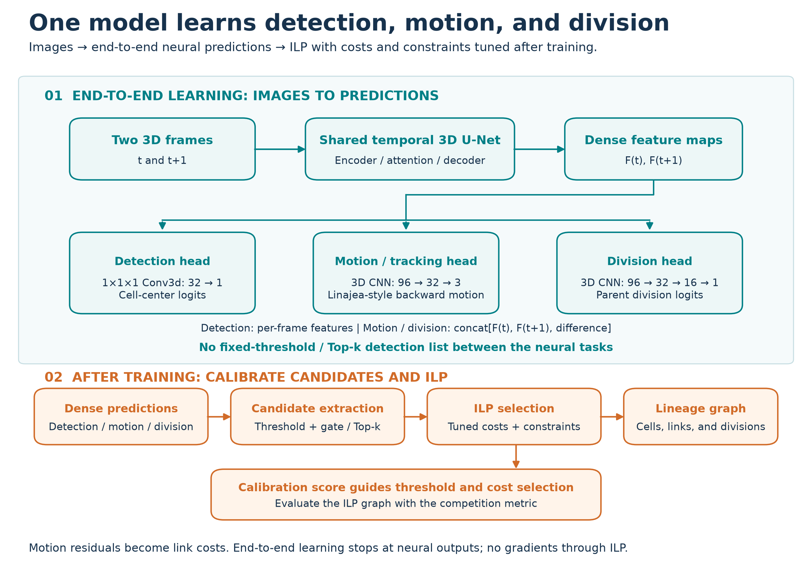
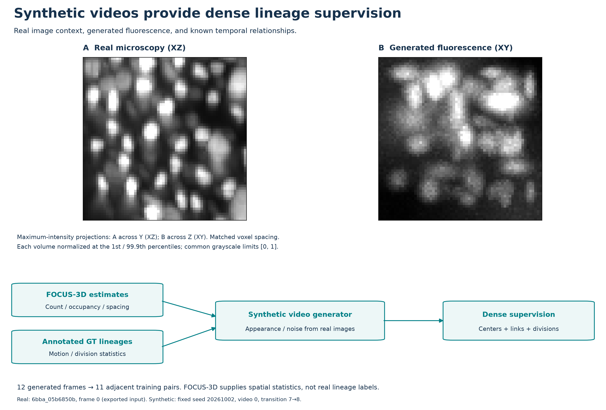

# 11th place — tanbo: 11th Place Solution

| | |
|---|---|
| Private | rank 11, 0.94743 (Gold) |
| Public | rank 1087, 0.94905 |
| Team | tanbo (@ikaku24) |
| Writeup by | tanbo |
| Published | 2026-10-02 (updated 2026-10-05) |
| Source | https://www.kaggle.com/competitions/biohub-cell-tracking-during-development/writeups/11th-place-solution |
| Comments | 0 |

---
First of all, I would like to thank the Biohub organizers for sharing the official implementation, and the participants who shared code, papers, and discussions.

My solution finished **11th and earned a gold medal**, with **0.94905 Public / 0.94743 Private** for the better of my two selected submissions. I focused on transfer to unseen embryos, preserving dense detection features for tracking during training, and calibrating lineage selection after training.

## 1. Overview

**I trained a single model end to end from 3D images to detection, motion, and division predictions, then passed scores derived from those predictions to an ILP whose costs and constraints were tuned after training.** The backbone was a two-frame Temporal 3D U-Net, with three heads operating on its shared dense features:

- **Detection head:** a 1×1×1 3D convolution predicted cell-center scores from each frame's features.
- **Motion head:** a small 3D CNN received the concatenation of the earlier features, later features, and their difference. Following Linajea, it predicted where each later-frame cell came from in the earlier frame.
- **Division head:** another small 3D CNN received the same concatenated features and predicted whether a parent would divide in the next frame.

I chose this architecture to avoid losing information during training by thresholding detections and passing only the extracted cell nodes to tracking and division models. By feeding the shared U-Net's dense feature maps, also used for detection, directly to the motion and division heads, I aimed to retain access to weak cell signals and surrounding image context. I therefore used no fixed-threshold or Top-k candidate selection between the neural tasks during training.

Their combined loss updated the shared U-Net and all three heads. Detector pretraining provided the initialization; all components remained trainable during joint learning and real-data fine-tuning. After training, I fixed the model and calibrated candidate extraction and ILP to select links and mother–daughter relationships.

The pipeline consisted of three learning stages followed by score-based calibration and graph optimization:

1. Train the detector using real annotations and synthetic data.
2. Add motion and division heads, and jointly train the detection, motion, and division components using real and synthetic supervision.
3. Fine-tune on sparsely annotated real data.
4. Fix the trained model and tune detection thresholds, candidate settings, and ILP costs and constraints to maximize the calibration score.
5. Reconstruct lineages with ILP and apply graph and coordinate post-processing.



*Figure 1. End-to-end learning from images to detection, motion, and division predictions, followed by an ILP tuned after training. Three heads share Temporal 3D U-Net features; the numbers in their boxes are channel counts. Motion vectors become link costs through candidate-position residuals. Candidate extraction and ILP run after training, with no gradients through the solver.*

## 2. Validation: prioritize transfer to another embryo

The labeled training data came from only two embryos, while the hidden test data came from different embryos. When comparing architectures, synthetic data, and augmentation, I assessed generalization to another embryo by examining the performance gap between the embryo used for training and the embryo excluded from training.

I tuned detection thresholds and graph parameters on calibration data after training. With those settings fixed, I then evaluated the resulting pipeline on validation data to assess its final performance.

In the final experiment, I kept the training, calibration, and validation split fixed while using both embryos. Given the dataset size and available compute, I considered five-fold cross-validation too costly and used a hold-out split: 199 videos were divided into 159 training, 20 calibration, and 20 validation videos, with both embryos represented in each split.

## 3. Detection and temporal prediction

The **two-frame temporal 3D U-Net** predicted cell-center scores. Following Linajea, the motion head estimated where each later-frame cell came from in the earlier frame. The residual between this predicted position and a candidate predecessor provided association evidence.

I deliberately avoided fixed-threshold or Top-k detection selection between the neural tasks during training. The motion and division heads received **dense shared features**, rather than a filtered detection list or the final detection scores. This preserved evidence that would otherwise be discarded before tracking could use it.

Motion and division losses updated the shared U-Net feature extractor; the final detection head received the detection loss. All three tasks remained trainable. Hard peak extraction and calibrated thresholds were applied after training to create graph candidates. ILP was a separate optimization step, with no gradients through the solver.

For sparse real annotations, I downweighted unannotated locations instead of treating them as reliable background. One training configuration used positive/background/unannotated detection weights of 4/1/0.03. Synthetic examples supplied dense supervision from known rendered cells and lineages.

## 4. Synthetic data and the role of FOCUS-3D

Sparse annotations do not describe every cell in a volume. I used **FOCUS-3D** center estimates from training images to inform synthetic scenes, with statistics from the following sources:

| Synthetic property | Source |
|---|---|
| Cell counts, spatial occupancy, and nearest-neighbor spacing | FOCUS-3D center estimates on training videos |
| Movement speed and directional persistence | Annotated training trajectories |
| Division frequency and daughter separation | Annotated training divisions |
| Approximate cell appearance, background, and noise | Training-image measurements |

FOCUS-3D center estimates were not used as ground-truth real temporal links or division events. They informed spatial statistics; motion and division statistics came from the annotated graphs.

The generator rendered videos with known centers, links, and divisions. The twelve-frame version supplied eleven adjacent two-frame training pairs per video, adding dense lineage supervision alongside sparse real annotations.

When training on real data alone, I observed a tendency to overfit early. Combining real and synthetic data helped reduce this tendency while providing dense supervision for detection, motion, and division that was unavailable from the sparse real annotations alone.



*Figure 2. A: real microscopy, XZ maximum-intensity projection across Y. B: synthetic fluorescence, XY projection across Z. The projection directions differ. Both volumes use matched voxel spacing and separate intensity normalization. The synthetic panel was regenerated from saved training statistics for illustration; this is not an accuracy comparison.*

I also used a FOCUS-derived affine stream: an image and its affine warp formed a two-frame sample, with correspondences obtained from the transformed center identities. This stream supplied synthetic correspondences, but not positive division labels.

The synthetic renderer approximated real appearance. It was not an exact reconstruction of instance masks, so I judged its usefulness using real-video tracking evaluation, including transfer to another embryo.

## 5. A learned division prior

The dense division head predicted whether a parent would produce two daughters in the next frame.

For the two frame feature maps, the head used the concatenation of the earlier features, later features, and their difference. The division target was derived from the annotated graph:

- Two outgoing annotated edges: division-positive.
- One outgoing annotated edge: division-negative.
- No outgoing annotated edge: excluded from this loss.

I evaluated the division loss at annotated parent positions. One joint-training configuration used:

```text
loss = detection_loss + motion_loss + 2 × division_loss
```

The overall division-loss weight was 2, as shown above. This was an experimental choice.

The head supplied a **parent-specific division prior**. It did not identify the daughters by itself. Candidate daughter edges and graph constraints were still required to form a division.

## 6. Real-data fine-tuning

After learning with mixed supervision, I fine-tuned on the sparse real data. This stage kept detection, motion, and division trainable, while removing the rendered synthetic and FOCUS-derived training streams.

One real-only fine-tuning run resumed from joint-training epoch 30, inherited the optimizer state, and started at a learning rate of 1e-4 with cosine decay. Its repair submission used the cumulative epoch-40 checkpoint. After fine-tuning, I fixed the model for inference calibration.

## 7. After training: tune selection and ILP for the score

I felt that the official implementation's default ILP costs did not produce the best competition score for my model. The solver minimizes a graph cost, while the competition evaluates the resulting lineage with a different metric.

I fixed the model trained end to end from images to predictions, then tuned ILP costs and constraints to match its outputs. To make ILP optimization improve the final evaluation score, I adjusted link, appearance, disappearance, and division costs, detection thresholds, and candidate settings on calibration data. With those settings fixed, I evaluated performance on validation data.

**My score started improving as soon as I began tuning the ILP costs this way.** Changing lineage selection without retraining the model was a major turning point.

For example, one repair configuration used the backward-motion residual between a predicted previous position and a candidate predecessor:

```text
edge cost = 0.1 × backward-motion residual in µm − 0.25
appearance cost = 0.2
disappearance cost = 0.2
division cost = 0.5 − predicted division probability
```

This configuration used a 13 µm candidate gate and at most five candidate parents. These limits applied to the inference graph, not the neural training interface. A division required two selected daughter edges; the learned parent prior reduced the division cost at likely mothers.

I searched combinations of costs and constraints, solved each ILP, and evaluated its lineage using the competition metric. The metric selected the parameters; it did not replace the ILP objective.

## 8. Submission results

| Stage | Public | Private | Absolute Public–Private gap |
|---|---:|---:|---:|
| Baseline | 0.82022 | 0.79007 | 0.03015 |
| Completed architecture before real-data fine-tuning | 0.89618 | 0.89609 | 0.00009 |
| Fine-tuned model with tuned ILP | **0.94905** | **0.94743** | 0.00162 |
| Additional post-processing | 0.94846 | 0.94703 | 0.00143 |

From the completed architecture to fine-tuning plus ILP tuning, Public improved by **0.05287** and Private by **0.05134**. This measures the two changes together and does not isolate their individual contributions.

I also tuned post-processing with Optuna, but the submitted version scored **0.00059 lower on Public and 0.00040 lower on Private** than the fine-tuned model with tuned ILP. No improvement was observed in this submission comparison.

My interpretation is that emphasizing transfer to another embryo helped keep Public and Private scores close, while calibrating ILP costs helped exploit the model's predictions. The submission history supports the combined improvement, without establishing a separate causal gain for each component.

## 9. Working with AI coding agents

I used AI coding agents, keeping relevant papers, the official implementation, and discussion copies in the repository for them to consult before implementing changes.

This made implementation decisions easier to inspect. Its score contribution was not measured.

## 10. What I would improve

**Train with both embryos earlier.** Transfer experiments were useful, but prolonged one-embryo development delayed broader training and left less time for completed submissions.

**Try GPU-enabled libraries for finer ILP tuning.** Libraries such as [NVIDIA cuOpt](https://docs.nvidia.com/cuopt/user-guide/latest/introduction.html) use GPUs in mixed-integer optimization. I would have liked to test whether one could accelerate this pipeline's ILP. If it reduced solve time, I could explore cost weights and constraint parameters at finer increments within the available compute budget.

## References

- [Biohub — Cell Tracking During Development](https://www.kaggle.com/competitions/biohub-cell-tracking-during-development)
- [Official U-Net baseline inference notebook](https://www.kaggle.com/code/thibautgoldsborough/unet-baseline-inference-submission)
- [Linajea: Automated reconstruction of whole-embryo cell lineages by learning from sparse annotations](https://www.nature.com/articles/s41587-022-01427-7)

---

## Comments (0)

*(none)*
