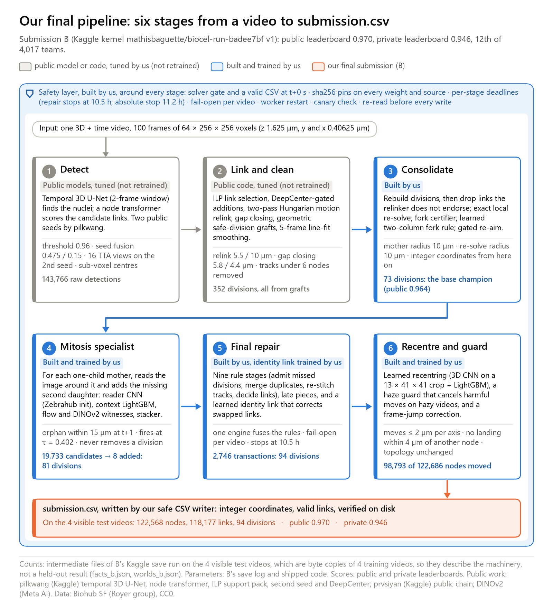
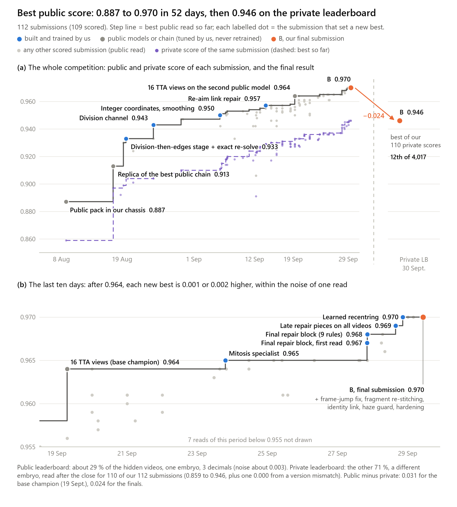
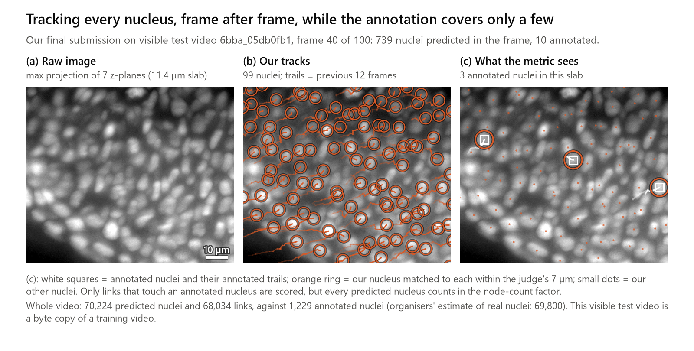
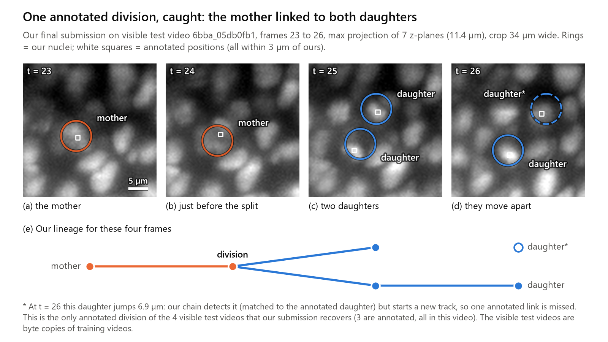
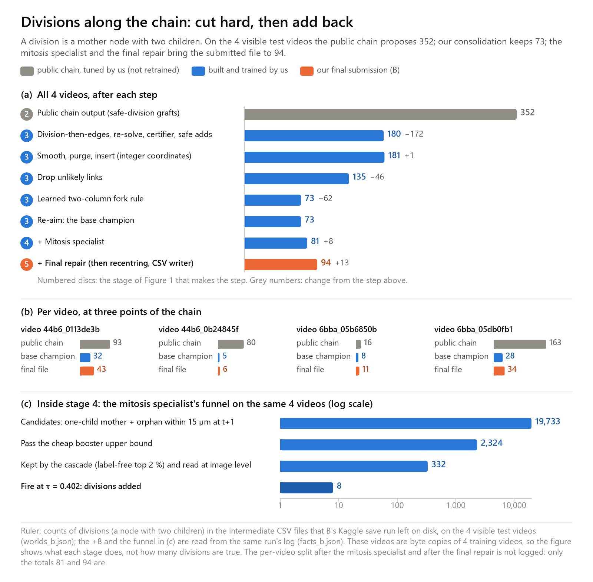
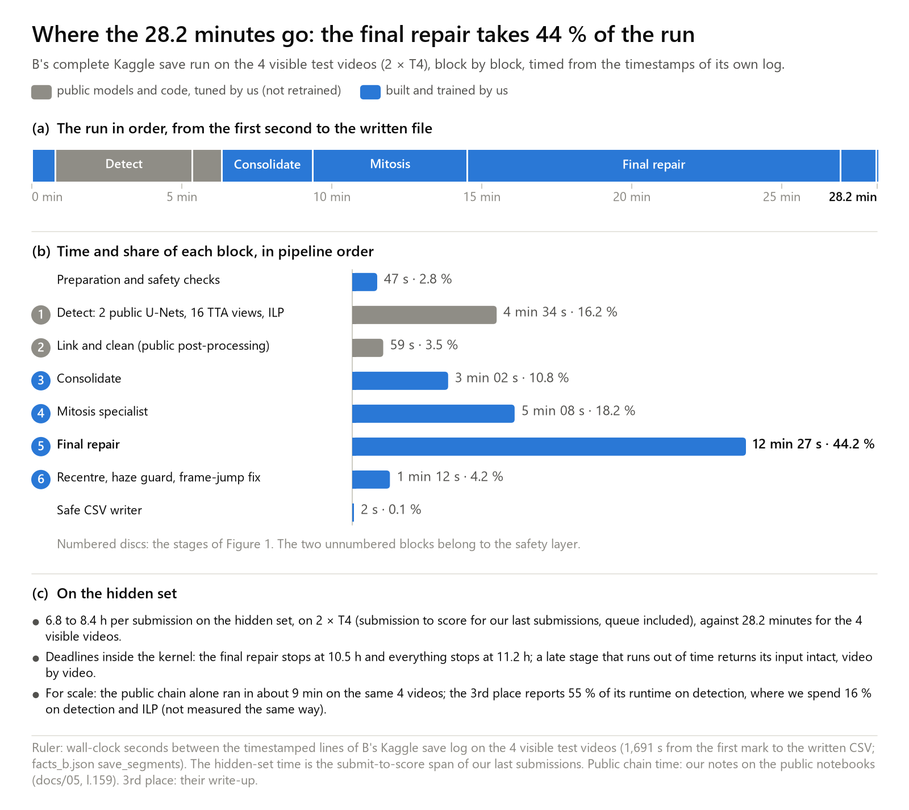
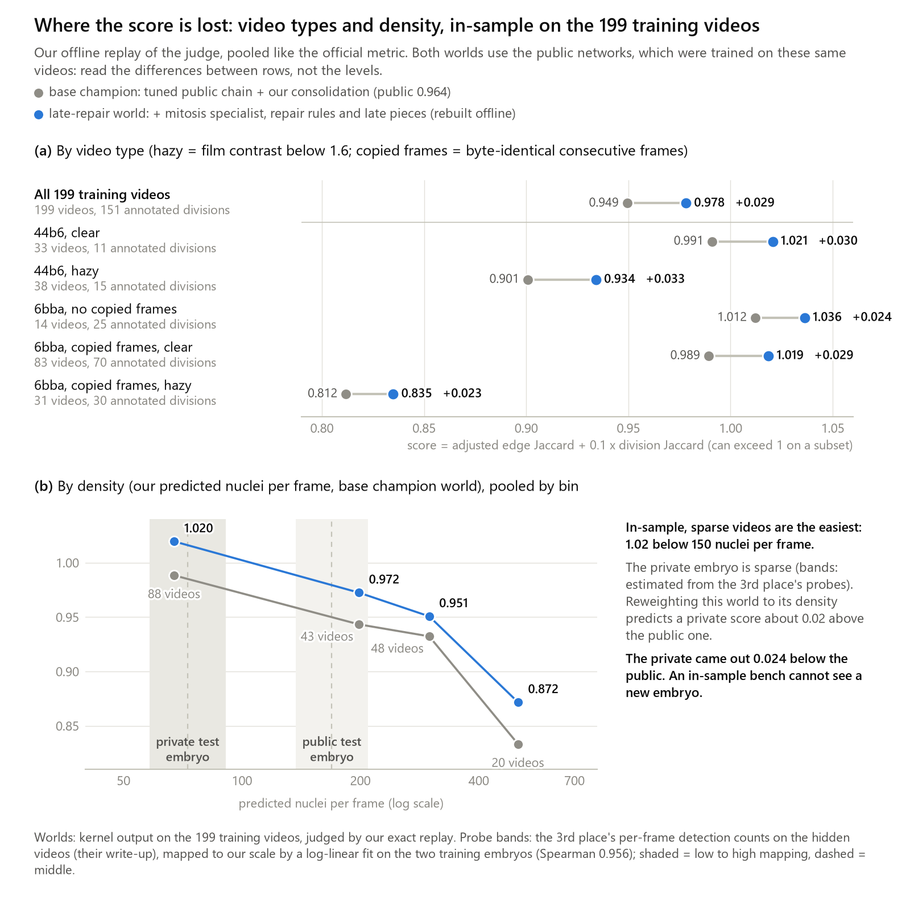
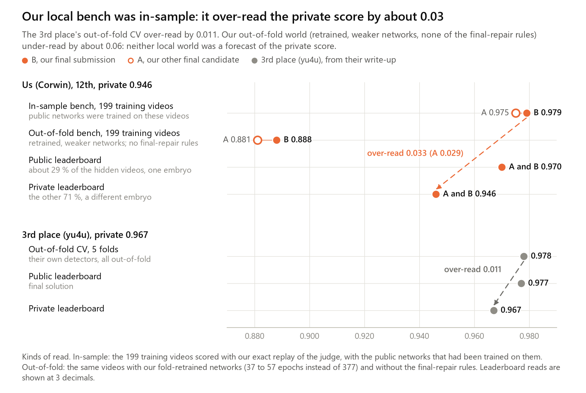

# 12th place — Corwin: 12th Place Solution

> A tuned public 3D U-Net + ILP tracker, extended by measured, fail-safe repair stages

| | |
|---|---|
| Private | rank 12, 0.94664 (Gold) |
| Public | rank 14, 0.97091 |
| Team | Corwin (@corwin1979), Mathis CLEMENT (@mathisbaguette) |
| Writeup by | Corwin, Mathis CLEMENT |
| Published | 2026-09-30 (updated 2026-09-30) |
| Source | https://www.kaggle.com/competitions/biohub-cell-tracking-during-development/writeups/12th-place-solution |
| Comments | 1 |

---
# 12th Place Solution: a tuned public tracker, extended by measured, fail-safe repair stages

**Team Corwin** (corwin1979, mathisbaguette) · Biohub Cell Tracking During Development

| Private LB | Public LB | Final rank | Submissions | Final kernel |
|---|---|---|---|---|
| **0.946** (best of our 110 private scores) | **0.970** | **12th of 4,017**, gold medal (14th on the public board at the close) | 112 in 52 days (109 scored) | 2 x T4, 6.8 to 8.4 h from submission to score |

**TL;DR.** We tuned (not retrained) pilkwang's public detection-and-linking models and prvsiyan's public chain, then built four stages and a writer of our own, each measured and fail-safe: a graph consolidation, a mitosis specialist, a final repair block with a learned identity link, a learned recentring with two guards, and a safe CSV writer. Public 0.887 (8 Aug.) became 0.970 (28 Sept.); the private gave 0.946. Our largest error was validation: our full-chain bench was in-sample and over-read the private by about 0.03. Yet the private scores of all our submissions, read after the close, show that the stages we added after our base champion were worth twice as much on the private as on the public (+0.013 vs +0.006).

**Rulers.** Every number names its ruler. **public** / **private**: leaderboard reads, 3 decimals, noise about 0.003 (private scores read after the close, for 110 of our 112 submissions). **in-sample**: our replay of the official metric on the 199 training videos with the public networks, which were trained on those videos. **OOF**: the same replay with our own fold-retrained, weaker networks. **cf**: the 85 training videos without copied frames (neither hidden split has any, section 2.1). **visible**: the 4 visible test videos, byte copies of training videos. **GT**: the annotation. A **world**: the predictions of one pipeline configuration on the 199 videos.

---

## 1. Overview

*Figure 1. Our final submission B: six stages, then a safe CSV writer, inside a safety layer. Grey: public models and code (pilkwang, prvsiyan), tuned by us, not retrained. Blue: built and trained by us. Counts come from B's Kaggle save run on the 4 visible videos, so they describe the machinery, not a held-out result.*

Every stage reads the previous stage's graph. Stages 1 and 2 are public; stages 3 to 6 and the writer are ours.

| # | Stage | Origin | Role |
|---|---|---|---|
| 1 | Detection: temporal 3D U-Net + node transformer, 2 seeds, 16-view TTA, sub-voxel centres | Public (pilkwang), tuned (not retrained) | find nuclei, score candidate links |
| 2 | Linking and post-processing: ILP, motion relink, gap closing, safe divisions, short-track filter, smoothing | Public (pilkwang / prvsiyan), tuned | build tracks |
| 3 | Consolidation (output = our base champion, public 0.964) | Built by us | rebuild divisions, re-solve ambiguous links, certify forks, integer coordinates |
| 4 | Mitosis specialist | Built and trained by us | give a mother with a single child its second daughter |
| 5 | Final repair: 9 rules, late repair passes, identity link | Built by us; identity link trained by us | admit missed divisions, merge duplicates, re-stitch tracks, re-decide links |
| 6 | Learned recentring, haze guard, frame-jump correction | Built and trained by us | move node centres, revert harmful moves, undo smoother drag |
| then | Safe CSV writer | Built by us | integer coordinates, valid links, verified write |

Our two final submissions are called A and B; B is A plus the learned identity link. Both scored 0.970 public and 0.946 private. On the visible videos, divisions go 352 (public chain) → 73 (base champion) → 81 (specialist) → 94 (final file), and `submission.csv` holds 122,568 nodes and 118,177 links. Most of our score belongs to the public work: stages 1 and 2 alone replicated at public 0.913 (private 0.897).

---

## 2. Data, metric and validation

### 2.1 The data, as we measured it

| | 44b6 | 6bba | all |
|---|---|---|---|
| training videos | 71 | 128 | 199 |
| annotated nodes / edges | 20,197 / 19,826 | 113,121 / 109,057 | 133,318 / 128,883 |
| annotated divisions | 26 | 125 | 151 |
| annotated share of the host's nucleus estimate | 0.77 % | 5.37 % | 2.82 % |
| videos with byte-identical copied frames | 0 | 114 | 114 (947 frames) |
| hazy videos (median contrast < 1.6) | 38 | 35 | 73 |

Videos are (T, Z, Y, X) = (100, 64, 256, 256), voxel 1.625 x 0.40625 x 0.40625 µm, a cube of about 104 µm.

> **The thing that shapes everything.** Annotations are sparse (2.82 %), while our base chain predicted a median of 256 nuclei per frame on a 44b6 video and 97 on a 6bba video. An edge that touches one annotated nucleus is scored, so a link from an annotated nucleus to the wrong neighbour is a false positive. An edge between two unannotated nuclei is invisible, but every predicted nucleus counts in the node-count factor. An unannotated division is not a false one.

*Figure 2. Visible video 6bba_05db0fb1, frame 40: raw image (a), our 99 nuclei in this crop (739 in the whole frame) and their tracks over the previous 12 frames (b), and the 3 annotated nuclei the metric sees in this slab (c). The whole video has 70,224 predicted and 1,229 annotated nuclei (host estimate 69,800).*

What we found:
- **Copied frames.** 947 frames in 114 6bba videos are byte-identical to their predecessor, an acquisition artefact; these videos carry 100 of the 151 divisions. A probe that stripped our copy handling read 0.965 / 0.936, equal to its parent on both boards: neither hidden split holds a copy video (our reading). The 14th place reports the same 947 frames.
- **Whole-stack frame jumps.** The volume jumps for one frame, mostly 3.3 to 8.1 µm in z, and comes back: 52 GT jump frames in 36 6bba videos, 11 in 44b6; consecutive large jumps are 54 or 55 frames apart in 12 of 23 cases. There our base champion's nodes sit a median 2.63 µm from GT, against 1.86 µm at t±1.
- **Overlapping crops.** 80 pairs of 44b6 crops are byte-identical, in 6 voxel-sharing components; 2 of the 26 44b6 divisions are one event counted twice. Video-level folds can leak.
- **Annotation z convention.** 6bba GT sits +0.675 plane above each nucleus's z centre, 44b6 +0.115. A one-plane z lift of about 23 % of nodes, rejected on its public read (-0.001), scored +0.004 on the private (confounded with run coverage; +0.002 to +0.004 from z itself, an estimate). The convention depends on the embryo: hedge it, do not tune it on the public.
- **Integer coordinates.** GT coordinates are integer voxel indices. The same world scored **0.950 with integers and 0.942 with floats** (public; private 0.911 vs 0.906).

### 2.2 The metric, replayed

We restored the host's scorer and pinned it by sha256. Our replay agrees with it to 1e-12 on the base champion (0.949472029742 on the 199 videos) and on each video, with identical counts. Score = node-adjusted edge Jaccard + 0.1 x division Jaccard (maximum 1.1, so some subset scores exceed 1). No term is clipped on our predictions, so the deficit splits exactly:

`1.1 - score = FN_e/E_tot + FP_e/E_tot + node term + 0.1 FN_d/D_tot + 0.1 FP_d/D_tot`

with E_tot = matched + missed + false edges (133,795 for the base champion) and D_tot the same for divisions (181). In-sample, the base champion's 0.1505 deficit splits into edges 0.0759, divisions 0.0768 (51 %) and a node-term bonus of -0.0022. Three mechanisms make 83 % of the edge deficit: a neighbour within 7 µm takes the link (0.0295), a GT endpoint has no node within 7 µm (0.0211), link swaps (0.0122).

| Event | Value | Ruler |
|---|---|---|
| one missed or false edge | 7.47e-6 (1 / 133,795) | exact split, in-sample |
| one missed division | 5.5e-4 (0.1 / 181), as much as 74 edges | exact split, in-sample |
| division Jaccard J, public / private | about 0.47 / at most about 0.33 | estimates: a submission with every fork cut read 0.906 vs 0.954 public, 0.891 vs 0.924 private, and the cut costs 0.1 x J |
| one true division on the public | about +0.002 | estimate, assuming about 42 annotated divisions on about 58 public videos |
| break-even precision of added divisions, J / (1 + J) | 32 % public, about 25 % private | derived from the estimates above |

The 14th place measured one division TP at +0.000585 on their harness, the same order as our 5.5e-4. These rates gave two shipping rules: no division that the base champion got right on the 199 videos may be lost (an audit before every submission), and a division change ships only as a final pass on the base graph, with an expected public value of at least +0.002 computed with a planning prior (a transport discount of 0.65). None of 8 submissions that lost a true base division rose on the public (6 below, 2 equal).

### 2.3 Validation, and where it failed

*Figure 3. Our full-chain bench was in-sample (0.975 / 0.979) and over-read the private (0.946) by about 0.03; the 3rd place's OOF CV over-read theirs by 0.011. Our OOF world (weaker networks, no final-repair rules) read about 0.06 under the private.*

> **Stated plainly.** The public networks we built on had been trained on all 199 training videos, so every full-chain read we made on them was in-sample. We knew it from 10 Sept.; the OOF world arrived on 27 Sept.

| Read of the final chain | A | B (final) | Kind |
|---|---|---|---|
| 199 training videos | 0.975 | 0.979 | in-sample |
| 199 training videos | 0.881 | 0.888 | OOF (37 to 57 epochs vs 377, no final-repair rules) |
| leaderboards | 0.970 / 0.946 | 0.970 / 0.946 | public / private |

Our components (mitosis specialist, identity link, recentring) were read across embryos in both directions, but on graphs built by in-sample base networks. Out of fold, position errors beyond 7 µm grow x3.8: the in-sample bench repaired the errors of memorised videos, and it flipped sign (secondary TTA off: +0.0143 in-sample, -0.012 public, -0.003 private). The OOF cards we had predicted the public sign (ILP threshold probe: -0.0172 OOF, -0.020 public).

---

## 3. Detection (public models, tuned, not retrained)

We did not train a detector. pilkwang's public temporal 3D U-Net (two input frames, (1, 4, 4) downsampling) finds peaks above a threshold, a node transformer scores candidate links, and an ILP (edge -1.0, appear 0.0, disappear 1.5, division 1.0) links them. We used both public seeds and tuned four knobs:

| Knob | Ours | Public preset | Public (alternative vs ours) | Private, same pair |
|---|---|---|---|---|
| detection threshold | 0.96 | 0.96875 | 0.965: 0.954 vs 0.958 | -0.002 |
| second-model fusion (detections / links) | 0.475 / 0.15 | same | 0.70: 0.946 vs 0.957; 0.30: 0.953 vs 0.957; model off: 0.948 vs 0.954 | -0.001; +0.001; -0.001 |
| second-model TTA | 16 views (D4 + z-flip) | 8 views, yx only | 8 views: 0.958 vs 0.964 (19 Sept.) | 0.929 vs 0.933 |
| sub-voxel centre refinement | on (mean shift 0.28 to 0.74 µm) | off | off: 0.954 vs 0.955 | 0.926 vs 0.927 |

The same 16 views on the *primary* model read 0.950 vs 0.958 (private -0.002). The stage also exports every candidate pair within 15 µm (1,335,158 on the visible videos) for later stages; raw output 143,766 detections, in 274 s.

> **What held on the private.** The z-flip view held (+0.006 public, +0.004 private). The 0.475 fusion weight and the lateral TTA phases we tried later were optima of the public embryo only.

---

## 4. Linking and public post-processing (public, tuned)

The public chain turns the ILP output into tracks in five passes. We kept all five, retuned their radii, and priced them by switching them off; the three switch-offs we can pair lost on both boards.

- **DeepCenter gate** (pilkwang): an addition (gap fill, safe division) is allowed only where a centre is seen. Made live on 18 Sept. with a safe-division veto: 0.958 public.
- **Motion relink**: two-pass Hungarian at 5.5 then 10 µm (preset 6.0 / 10.0). Off: 0.909 vs 0.913 public, 0.892 vs 0.897 private.
- **Gap closing** of 1 to 2 frames (5.8, then 4.4 µm per step). Off: 0.953 vs 0.957 public, 0.922 vs 0.929 private.
- **Safe divisions**: geometric grafts (mother within 9 µm, sisters within 14 µm in B's log).
- **Short-component filter**: removes components under 6 nodes, after gap closing.
- **Line-fit smoothing**: 0.2 p + 0.8 x a 5-frame linear fit. Off: 0.955 vs 0.957 public, 0.925 vs 0.929 private.

> **A property worth knowing.** With division cost 1.0 against appearance 0.0, the public ILP never forms a fork on the 199 videos: all 352 divisions of this stage on the visible videos are geometric grafts. The 14th place proves the same property for their weights.

The filter has a cost: it erased 279 cells whose tracks were missed in xy, and 9 of the 28 absent daughters of GT divisions. Our re-stitching stages ran after it, too late. The 14th place reports the same failure.

---

## 5. Consolidation (built by us): the base champion

Eight steps turn the public graph into our base champion (public 0.964, private 0.933, 19 Sept.). Counts are on the visible videos.

| Step | What it does | Visible counts | Evidence (public; private) |
|---|---|---|---|
| division then edges | rebuild divisions (mother within 10 µm), then drop links the relinker does not endorse, protecting forks | -6,121 / +1,899 links | 0.930 vs 0.913; 0.899 vs 0.897 (one variable) |
| exact local re-solve | re-decide ambiguous links within 10 µm | +2,573 links | 0.933 vs 0.930; 0.904 vs 0.899 |
| fork certifier | certify or cut forks | 292 seen, 124 cut | these three steps off: 0.942 vs 0.957; 0.921 vs 0.929 |
| safe adds | orphan divisions, top-K | +22 links, +12 forks | |
| smooth, purge, insert | integer coordinates from here on | 29,881 nodes moved | integers vs floats: 0.950 vs 0.942; 0.911 vs 0.906 |
| drop unlikely links | | -46 links | |
| two-column learned fork rule | cut a branch when link probability AND mother score agree | 62 links cut | +0.001; +0.005 over its parent |
| re-aim | gated link repair | 873 of 4,602 proposals applied | 0.957 vs 0.955; 0.929 vs 0.927 |

The base champion leaves with 122,824 nodes, 117,704 links and 73 divisions. In-sample it reads 0.9495 and credits 42 of 151 GT divisions (109 missed, 30 false).

*Figure 4. Divisions along the chain (a), per video at three points (b), and the mitosis specialist's funnel on a log scale (c). The figure shows what each stage does, not how many divisions are true.*

*Figure 5. The one annotated division (of 3 on the visible videos) that our final submission recovers: frames 23 to 26 of 6bba_05db0fb1 (a to d) and our lineage (e). At t = 26 one daughter jumps 6.9 µm; we detect it but start a new track, so one annotated link is missed.*

---

## 6. Mitosis specialist (built and trained by us)

A final pass on the base graph that never removes or moves an existing division. **Candidates**: every mother with a single child and an orphan (a node without parent) within 15 µm at t+1. **Action**: link the mother to the nearest orphan, unless it is taken or the mother already has two children.

Funnel on the visible videos: **19,733** candidates → **2,324** pass a cheap booster bound → **332** kept (top 2 % by the chooser's score, a rule that uses no labels) and read at image level → **8** fire. Divisions go 73 → 81, 0 links lost, 308 s. Every head is 5-fold, grouped by video:
1. **Division reader CNN** (2.8 M parameters) on spatio-temporal crops at two scales, initialised on Zebrahub (host-authorised), fine-tuned on 150 positives: OOF AUC 0.9125 (6bba), 0.844 (44b6), 0.829 on the external linajea set.
2. **Context chooser**: 25 LightGBM boosters on 70 label-free columns (division waves, cycle age, sister, blob hypotheses in a 12 µm ball, the orphan's track history).
3. **Three image witnesses** on the top 2 % only: a centre-empties ratio, a TV-L1 flow-deformation witness, and a **frozen DINOv2 ViT-S/14** (Meta AI) on thin XY / XZ / YZ slabs at t-2..t+2 with a logistic head (event AUC 0.942 OOF).
4. **Stacker**: LightGBM on everything; the deployed rule is the mean of 5 outer stacks.

R10, our operating point, is the threshold at which a ranking recovers 10 % of the 109 annotated divisions the base champion misses (11 events).

| Validation read | Value | Ruler |
|---|---|---|
| precision at R10 | stack 84.6 % (13 fires); chooser alone 32.4 % (34 fires); reader alone 5.2 % (213 fires) | nested OOF models, in-sample graph |
| labels permuted through the whole pipeline | 0.3 to 2.8 % at R10 | control |
| deploy rule, exact scorer | 283 forks; 17 on annotated mothers, 13 true (76.5 %); +0.0066 over the base champion | in-sample graph |
| leaderboards | 0.965 vs 0.964 public; 0.936 vs 0.933 private (23 Sept.) | public, private |

When it shipped, it was the only division addition since the base champion that rose on the public, by one display unit. On the private it read +0.003.

---

## 7. Final repair and the identity link (built by us)

The final repair block targets the three edge errors of section 2.2 and missed divisions. It is our most expensive stage (747 s, 44 % of the save run). A GPU pre-pass computes a tissue-flow field and per-node image features. One engine then fuses **nine rules**: admit missed divisions (with a variant for hazy videos), merge duplicates (twins, z-stacked twins, xy border faces), re-stitch tracks (vanishing tracks, bridges, video-edge chains), and decide links with a learned decider. **Late repair passes** follow: a nucleus seen twice, z-stacked twins, segments re-decided in context, holes in haze, and fragment re-stitching (the segment and fragment passes share a GPU tissue-deformation field).

**Identity link.** A LightGBM probability per candidate link, from geometry, appearance and deformation features, an identity-CNN embedding and NCC, 33 "constellation" columns describing the neighbour pattern, and the decider's link probability. It cuts low-probability links (minimum 0.3, margin 0.2); forks and ambiguous nodes are frozen, it never adds a node or a fork, it refuses edits near the outer 2 z slices or in a 3.5 µm xy band, and it applies at most 1,500 edits per video. Cost on a T4: 5.94 + 0.772 k seconds (k = thousands of nodes).

| Read | Value | Ruler |
|---|---|---|
| identity link | +0.0031 (q05 +0.0020; 71 videos up, 10 down); +0.0003 in-sample; 0 divisions moved | OOF cf; in-sample |
| identity link, B vs A | 0.970 = 0.970; 0.946 = 0.946 | public; private |
| repair block, two variants, vs the specialist world | 0.967 and 0.968 vs 0.965; 0.943 and 0.941 vs 0.936 | public; private |
| late passes at full coverage | +0.0031; 0.969 public, 0.942 private | OOF cf; leaderboards |

On the visible videos: 2,746 applied edits, 0 videos reverted, divisions 81 → 94.

---

## 8. Recentring, guards and the CSV writer (built and trained by us)

**Learned recentring.** A 3D CNN (3 → 24 → 32 → 64 → 96 channels) reads the native 13 x 41 x 41 crop around each node, a map of the frame's other nodes and an in-volume mask, and predicts the node-to-GT offset per axis with a Laplace scale; a per-axis LightGBM stacker adds track, crowding and face context. Training used 930,452 node samples from three worlds (one OOF, two in-sample) plus 46k synthetic jitters, in component-closed folds; the shipped weights were retrained on all 199 videos. Moves are capped at 2 µm per axis, never land within 4 µm of another node, never move away from both time neighbours by more than 0.5 µm, and never change topology. Cost: about 0.4 to 0.6 s per 1,000 nodes on a T4 (scaled from a measured RTX 2000 Ada run). It moved 98,793 of 122,686 visible nodes.

Reads: +0.0024 OOF cf and +0.0003 in-sample over an alternative refiner of ours; against the world without recentring, 0.970 vs 0.969 public and **0.945 vs 0.942 private** (the pair also changes the CSV writer version); on the private it also beat the alternative refiner by 0.002. Before the close we expected learned movers to keep only 0.18 to 0.30 of their OOF value; this one transported better.

**Haze guard.** On hazy videos only (contrast < 1.6), it cancels a recentring move whose flow-compensated residuals to parent and child grow by more than 1 µm: 2,665 nodes restored on the 2 hazy visible videos, +0.0007 OOF cf and +0.0007 in-sample. Its routing was chosen after its OOF read, so it shipped as a named bet; B with and without it both scored 0.970 / 0.946.

**Frame-jump correction.** The public 5-frame smoother keeps only 0.36 of a one-frame jump and drags the four neighbours: a 5 µm jump leaves about 3.2 µm of offset against a GT that follows the image. We detect jumps on the chain's own raw detections and undo the drag, touching no link or node: 2 frames, 71 nodes on the visible videos, +0.0016 OOF cf, undecided on both boards (0.970 = 0.970, 0.945 = 0.945). The 14th place compensated the same shifts with FFT phase correlation.

**Safe CSV writer.** Integer coordinates, valid links, isolated and off-image nodes dropped, file re-read before replacing it: 118 nodes and 7 links removed (+0.0004 OOF cf).

---

## 9. Robustness and runtime

*Figure 6. B's save run on the 4 visible videos, 2 x T4: detection and ILP 16.2 %, mitosis specialist 18.2 %, final repair 44.2 %. On the hidden set, a submission took 6.8 to 8.4 h from submission to score.*

A late stage that crashes must not cost the submission:
- **before any compute**: the exact MILP solver is checked, a valid `submission.csv` is written at t+0 s, 32 offline wheels are installed, and the sha256 of every weight and source is verified;
- **deadlines and fail-open**: the final repair stops at 10.5 h, everything at 11.2 h, and every late stage returns its input intact, video by video, on error or timeout; dead or stuck workers are restarted (26 / 26 unit tests and fault injection pass; soak test 4 lanes x 50 videos, 0 error);
- **proof of work**: a canary proves each planned stage ran on each video, and the last three stages re-read before they write.

One early submission scored 0.000 because we submitted a different kernel version from the one we had verified. No final submission failed.

---

## 10. Results

*Figure 7. (a) Best public score (step line) from 0.887 (8 Aug.) to 0.970 (28 Sept.), every scored submission as a grey dot, and in purple the private score of the same submissions, read after the close, with its best-so-far line; B scored 0.946, the best of our 110 private scores. (b) The last ten days: each new public best is 0.001 or 0.002 above the previous one, within the noise of one read.*

**Table 1. How the chain was built, on both leaderboards** (each row is a new public best; a history, not a controlled ablation).

| Date | Public | Private | What changed | One variable? |
|---|---|---|---|---|
| 8 Aug. | 0.887 | 0.859 | pilkwang's public models inside our own inference notebook | |
| 17 Aug. | 0.913 | 0.897 | faithful replica of prvsiyan's public chain | no |
| 19 Aug. | 0.930 / 0.933 | 0.899 / 0.904 | our "division then edges" stage, then the exact local re-solve | yes, yes |
| 24 to 29 Aug. | 0.943 / 0.947 | 0.908 / 0.910 | a division channel in our consolidation stage; two division additions | yes, no |
| 5 to 7 Sept. | 0.950 to 0.953 | 0.911 to 0.919 | integer coordinates, smoothing, false-fork purge; guarded removal of weak false forks | partly |
| 11 Sept. | 0.954 | 0.924 | two-column learned fork rule | yes |
| 13 to 18 Sept. | 0.955 to 0.958 | 0.927 to 0.929 | public knobs + sub-voxel centres; re-aim pass; DeepCenter live | no |
| 19 Sept. | **0.964** | 0.933 | 16 TTA views on the second model: **base champion** | yes |
| 23 Sept. | 0.965 | 0.936 | mitosis specialist | yes |
| 27 Sept. | 0.967 / 0.968 | 0.943 / 0.941 | final repair rules, two variants | no |
| 28 Sept. | 0.969 / **0.970** | 0.942 / 0.945 | late repair passes at full coverage; learned recentring | no, nearly |
| 29 Sept. | 0.970 (x4) | 0.945 to **0.946** | frame-jump fix; fragments and identity link; haze guard and runtime hardening (= A and B) | |

**Where the public-to-private drop came from.** The replica of the public chain dropped 0.016. Our consolidation stages and knob tuning, built on the in-sample bench and the public board, took the public +0.051 to the base champion but the private only +0.036, so the drop grew to 0.031; their first step alone read +0.017 public and +0.002 private. The stages after the base champion read +0.006 public and **+0.013 private**, and the drop shrank to 0.024. (The first public pack of 8 Aug. also dropped 0.028.)

**Table 2. Key one-variable pairs** (about 0.003 of noise and ±0.001 of rounding per read: conclusions rest on families of pairs).

| Change | Public | Private |
|---|---|---|
| integer → float coordinates | -0.008 | -0.005 |
| 16 views (z-flip) on the second model | +0.006 | +0.004 |
| second-model TTA off | -0.012 | -0.003 |
| fusion 0.475 → 0.70 / → 0.30 | -0.011 / -0.004 | -0.001 / +0.001 |
| a lateral TTA phase shift (with deduplication) | -0.013 | +0.001 |
| motion relink / gap closing / smoothing off | -0.004 / -0.004 / -0.002 | -0.005 / -0.007 / -0.004 |
| every fork cut (instrument) | -0.048 | -0.033 |
| mitosis specialist | +0.001 | +0.003 |
| division-admission rule removed | +0.001 | -0.001 |
| one-plane z lift of about 23 % of nodes | -0.001 | +0.004 |
| learned recentring | +0.001 | +0.003 |
| identity link (B vs A); copy handling stripped | 0.000; 0.000 | 0.000; 0.000 |

Across 104 parent-child pairs (76 one-variable), 17 had opposite signs: 15 negative on the public and positive on the private, and the 2 others are the two removals of the division-admission rule. Continuity pieces held at 1.3 to 3 times their public size; detector knobs tuned on the public were flat on the private. Our three final candidates all scored 0.946, the maximum of our 110 private scores, so the final selection cost nothing. We moved from 14th public to 12th private; 9 of the 13 teams ahead of us on the public finished behind us.

---

## 11. What did not work

| Idea | Public or bench | Private | Why |
|---|---|---|---|
| other TTA views (32 views, lateral and z phase shifts) | public -0.003 to -0.014 | 0 to +0.002 | 16 views was a local optimum of the public embryo |
| our own secondary detector (199-video / OOF weights) | public 0.950 / 0.942 vs 0.954 | -0.001 / -0.007 | less data, fewer epochs than the public weights |
| loss mask for unannotated cells, 10-epoch fine-tune | recall -0.0154 and -0.0015 | n/a | a fine-tune; the full sparse-label recipe was never tried |
| linker re-solve with collective motion (5 variants) | in-sample +0.009; public 0 up, 1 flat, 4 down | -0.001 to +0.002 | a loss on the public embryo only |
| mass re-detections (28 to 33 % of positions moved) | public -0.004 / -0.003 | +0.002 / +0.003 | never positive on the 199 edge term either |
| bulk division adds (13 public reads) | 1 up, 3 flat, 9 down | mean +0.0002 over 12 pairs | below the public break-even; the private one is lower |
| cutting forks near the volume faces | public -0.004 with 0 annotated divisions lost | 0.000 | "unannotated" does not mean "false" |
| joint re-solve of links and divisions (exact MILP) | right fork for 22 of 96 missed divisions, vs 67 with oracle cues | n/a | the limit was the division witness, not the solver |
| written forecasts before public reads | 0.968 → 0.965, 0.970 → 0.967, 0.972 → 0.969 | n/a | our bench-to-public conversion had no out-of-sample skill |

Several of these failed only on the public embryo: on the private they were flat or slightly positive.

---

## 12. Reflections and lessons

The 3rd place (yu4u) is ahead by **0.007 on the public** (0.977 for their final solution; their best public was 0.978) and **0.021 on the private** (0.967 vs 0.946). Our public-to-private drop was 0.024, theirs 0.010; the median among teams at 0.965+ public was about 0.027 in our extract (a lower bound). What they did differently:
- their own detectors (ImageNet-pretrained 2.5D encoders plus a 3D SegResNet), trained on the competition data with a loss built for sparse labels;
- a supervised parent model that reads raw and flow-aligned frames;
- one LP / MILP that chooses nodes, links and divisions together on a surrogate of the metric;
- one ablation ladder on fixed OOF detections, scored by the official metric.

**Validation is the best-supported cause of our bad decisions, not the whole gap.** Their OOF CV over-read their private by 0.011, our in-sample bench by about 0.03, and section 10 shows our drop grew with the stages we tuned on in-sample and public reads. We cannot separate this from the other reading, that their own detectors generalise better. Their division Jaccard was 0.540 in CV and 0.47 on the private; ours was 0.409 in-sample, 0.194 OOF, and at most about 0.33 on the private for the 11 Sept. chain (an estimate). If that held for the final chain, the division term alone would explain about 0.014 of the 0.021 private gap.

| Their idea | Our attempt | Outcome |
|---|---|---|
| OOF detector shipped | 50 epochs on about 99 videos | public 0.942 (-0.012), private -0.007 |
| "probability of being evaluated" | a learned propensity, AUC 0.645 / 0.715 across embryos | 0.49 on the decider's head; never wired |
| short-component removal | the same filter, same order | it also erased real cells for us |
| coordinate refinement | learned recentring, shipped | +0.0024 OOF cf, +0.003 private; theirs is a non-learned affine motion model |

**Density.** The 3rd place's probe found the private embryo sparser than both training embryos (median 60 to 100 detections per frame, against 114 and 355). Our in-sample videos are easiest when sparse, so reweighting them toward that density predicted a private *above* the public by about 0.02; it came out 0.024 below. The reweighting puts 81 % of its weight on 6bba and 75 % on copy videos, so density, embryo and copies are confounded: reweighting an in-sample world does not correct an in-sample bias.

*Figure 8. In-sample, by video type (a) and density (b), base champion vs the late-repair world (the closest stored world to the final chain, 0.978 vs 0.979 in-sample: a proxy, not the shipped submission). Sparse videos are the easiest in-sample; reweighting toward the sparse private embryo predicts the wrong sign.*

Lessons:
1. **Own your base models, or build the OOF world on day 1.** A bench in which one stage has seen the videos should decide nothing.
2. **Keep one ablation ladder on one fixed OOF world**, scored by the official metric. We priced pieces in different worlds, one of which lacked the whole repair block.
3. **The mechanism predicts transport better than the bench, and each embryo judges differently.** On the public embryo, continuity additions paid about 1:1, merges, re-links and upstream re-tunes paid zero or less, and destroying real structure cost 3 to 10 times its train price. On the private, continuity pieces held at 1.3 to 3 times their public size and linker re-solves averaged about zero.
4. **Optimise the metric in one place, with a strong division witness.** Late passes validated one by one cannot trade edges against divisions, and 37 of our 39 "stolen" daughters were one node for two bodies, which no solver on the same nodes can fix.
5. **Do not tune detector knobs on the public board.** Only our z-flip view held on the private; the lateral phases and the 0.475 fusion weight were flat there.
6. **Never decide on one display unit.** We removed a division-admission rule twice on +0.001 public reads; the private moved -0.001 and -0.002, the only 2 of our 17 opposite-sign pairs where the public was the positive side.
7. **Execution discipline is cheap.** A valid CSV at t+0, sha256 pins, fail-open stages, a canary, and submitting exactly the verified version: after one early 0.000, no final submission failed.

---

## 13. Caveats

| Where | Says | Actually |
|---|---|---|
| the OOF world | "out-of-fold" | weaker networks and no final-repair rules: a lower bound for the chain |
| mitosis specialist, 76.5 % | nested OOF models | read on an in-sample graph; never measured on a new embryo |
| private pairs | one variable each | the recentring pair also changes the CSV writer version; the z-lift pair is confounded with run coverage |
| local scorer vs Kaggle | same code | floats read +0.0004 in-sample (5 Sept.) and -0.008 public; a truncation probe reproduces the sign (-0.0023 in-sample), not the size |
| TTA ladder 1 / 8 / 16 / 32 views | 0.952 / 0.958 / 0.964 / 0.958 | the 32-view read sits on another parent (0.961); only 8 → 16 is a clean step |

---

## 14. How we worked

This was also a personal experiment in working with AI. Guillaume set the direction, learned how biologists annotate nuclei, reviewed the videos in 3D, made every strategic call and approved every submission, but wrote no code himself. The code, the metric replay, the measurements and the submissions were done by one main AI coding agent, Claude Code (Anthropic), which we called ATHENA. It worked under a strict rule: the main agent does and coordinates everything, through Claude skills for each part of the project and precise permissions and resource limits. It delegated to sub-agents and multi-agent workflows (builders, adversarial verifiers, a judge): more than 4,200 sub-agent runs and 478 workflows since 23 Aug. ChatGPT (OpenAI) acted as an external research adviser, and Gemini Deep Research and NotebookLM (Google) helped with the literature. Mathis, Guillaume's son and our teammate on Kaggle, assisted and lent his gaming PC to train models. 112 submissions in 52 days. The discipline this required is visible above: a replayed metric, pre-registered reading rules, and an audit trail for every decision, including the mistakes listed in the caveats.

## Acknowledgements

Thanks to Biohub SF (Royer group) for the data (CC0), and to Kaggle for hosting. Thanks to **pilkwang** for the public temporal 3D U-Net, node transformer and ILP support pack, the second seed and DeepCenter. Thanks to **prvsiyan** for the public chain we replicated (0.913 on 17 Aug.), to **Meta AI** for DINOv2 (Apache-2.0; we mounted boymagic's copy of the official weights), and to the Zebrahub and linajea authors. The 3rd-place (yu4u) and 14th-place (Vibes & Edges Trade-Off) write-ups shaped our post-mortem.

---

## Comments (1)

### Asan Ashirov (CONTRIBUTOR) — 2026-09-30 — 1 votes

Great job
