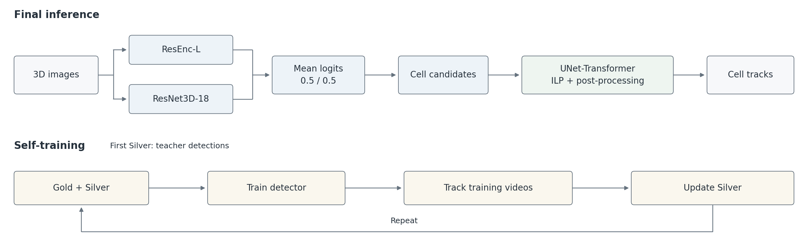

# 16th place — r3takahashi: 16th Place Solution

> Self-Trained 3D U-Net Detectors on the Public Tracking Stack

| | |
|---|---|
| Private | rank 16, 0.94340 (Gold) |
| Public | rank 75, 0.96355 |
| Team | r3takahashi (@r3takahashi) |
| Writeup by | r3takahashi |
| Published | 2026-09-30 (updated 2026-09-30) |
| Source | https://www.kaggle.com/competitions/biohub-cell-tracking-during-development/writeups/16th-place-solution |
| Comments | 0 |

---
Thank you to CZ Biohub and Kaggle for a great competition, and to everyone who shared notebooks and discussions. This was the first Kaggle competition I submitted to. My two selected submissions scored **0.963 and 0.960 on the public leaderboard; both scored 0.943 on the private leaderboard**, placing me 16th. The first was a two-detector blend, and the second used ResEnc-L alone.

### TL;DR

- Detection: two 3D U-Net center-heatmap detectors, nnU-Net ResEnc-L and a Kinetics-pretrained ResNet3D-18 U-Net. I trained them over several self-training rounds using the competition's sparse annotations (Gold) and pseudo-labels (Silver). Silver came first from teacher detections, then from my own tracking output. The final blend averages the two detectors' logits.
- Linking: the public UNet-Transformer edge predictor + ILP tracking stack, with the edge head fine-tuned on my own candidates.
- The larger gains on Private came from changes to the detectors.

*Figure 1. Final inference (top) and the self-training loop (bottom).*

---

### 1. Pipeline

**Detection.** Each 3D frame has a shape of 64×256×256 and voxel spacing of 1.625×0.40625×0.40625 µm (z, y, x). I downsampled it in x and y before feeding it to a 3D U-Net that predicts a Gaussian heatmap around cell centers. Moving from 4× in-plane pooling (64×64) to 2× (128×128) raised Public from 0.946 to 0.951 in a paired comparison using the same training recipe. Candidate extraction uses local maxima with a 3 µm suppression radius, four-view in-plane flip TTA, and parabolic sub-voxel refinement.

**Training with sparse labels.** Gold labels cover only some cells, so I avoided treating every unlabeled region as background. I used a weighted binary cross-entropy (BCE) loss against the Gold heatmap: 12 near Gold centers, 1 in selected background regions, and 0.02 for most other voxels. The heatmaps used a Gaussian width of σ = 1.625 µm.

For students, I added a separate BCE loss for Silver pseudo-labels, scaled by 0.25.

**Using FOCUS-3D for background supervision.** I selected background from dark regions. For students, I also used instance centroids from the external pretrained segmentation model FOCUS-3D as reference points, selecting additional background more than 5 µm from any Gold, Silver, or FOCUS-3D point. The aim was to avoid treating unlabeled nuclei as background. On 124 training videos from the 6bba embryo, 88% of Gold centers had a FOCUS-3D point within 4 µm, compared with 78% for a difference-of-Gaussians (DoG) detector. FOCUS-3D coverage was 82% for the dimmest 20% of annotated cells. These are nearest-point coverage rates, distinct from the competition's 7 µm matching metric.

Sparse annotations made overall precision hard to assess, so I used these points only as background references in the final recipe. False detections can remove useful background supervision, but they do not become positive targets. This applies only to the additional background mask; voxels near FOCUS-3D centroids can still be included in the original dark-background mask.

In a separate Gold-only teacher experiment, adding this background term reduced recall on the calibration videos (0.945 vs 0.973). I kept this term out of the teacher recipe and retained its existing rule of ignoring unknown voxels near DoG candidates not matched to Gold (a positive-unlabeled treatment).

**Self-training.** The first Silver labels came from a Gold-only R(2+1)D U-Net teacher with a Conv1D temporal mixer over three consecutive frames. I merged detections from two teacher seeds. Each student is then trained on Gold + Silver, and its own tracking output (final nodes after ILP and post-processing) becomes the Silver for the next round. Within each student family, the training recipe and seed are fixed across rounds; only the Silver changes. Every round is trained afresh using the same initialization scheme: Kinetics-400 pretrained encoders for the R(2+1)D teacher and ResNet3D-18, and random initialization for ResEnc-L. Round numbers below follow the pseudo-label lineage, so ResEnc-L first appears at round 2.

| Round | Detector | Silver (pseudo-labels) from | Post-processing¹ | Public | Private | In final blend |
|---|---|---|---|---:|---:|:---:|
| 0 (teacher) | R(2+1)D temporal U-Net, 2 seeds, 4× pooling | — (Gold only) | — | — | — | |
| 1 | ResNet3D-18 | teacher detections | old (relink on) | 0.947 | 0.935 | |
| 2 | ResNet3D-18 | tracking output of round 1 | old (relink on) | 0.953 | 0.942 | |
| 2 | ResNet3D-18 (same weights as above) | tracking output of round 1 | new (relink off + revised settings) | 0.959 | 0.940 | ✓ |
| 2 | ResEnc-L | tracking output of round 1 (same Silver as above) | new (relink off + revised settings) | 0.955 | 0.944 | |
| 3 | ResEnc-L | tracking output of ResEnc-L round 2 | new (relink off + revised settings) | 0.960 | 0.943 | ✓ |
| 4 | ResEnc-L | tracking output of ResEnc-L round 3 | new (relink off + revised settings) | 0.959 | 0.941 | |

¹ "old" = the public stack's defaults with motion relink on; "new" = motion relink off plus a set of post-processing parameters adopted from the public notebook `biohub-x138` (Section 2).

The final blend averages the logits of the two ✓ models with equal weights (0.5/0.5); the other selected submission uses ResEnc-L round 3 alone. Comparing rows with the same post-processing, ResNet3D-18 round 2 scored higher than round 1 on both Public and Private. For ResEnc-L, Public rose in round 3, but neither round 3 nor round 4 beat round 2 on Private.

This lineage grew as I added experiments. I had intended to train a 3D ResNet teacher and run two rounds for each detector from its Silver. Instead, I kept the R(2+1)D temporal U-Net teacher from early experiments and started ResEnc-L from ResNet3D-18's round-1 tracking output. This let me compare the student architectures on identical pseudo-labels, but ResEnc-L was never trained directly on the teacher's Silver.

**Linking and post-processing.** I used the public tracking stack (UNet-Transformer edge predictor + ILP + division and gap-closing post-processing), replacing its detector with mine. Whenever I changed the detector, I fine-tuned the edge head on the new candidates (transformer part only, 5 epochs, using the final checkpoint). For the final models, I recalibrated the candidate threshold to match a fixed candidate-count target on four calibration videos from the 6bba embryo. I excluded these videos from detector training and edge-head fine-tuning, though other videos from the same embryo were used for training.

---

### 2. Changes and their Public and Private scores

Each row compares a submission with the configuration it was changed from (Δ in parentheses). All of these changes are included in the final blend submission. Self-training rounds are in the table above. Private scores were revealed after the deadline, so they did not inform these choices.

| Change | Compared to | Public (Δ) | Private (Δ) |
|---|---|---:|---:|
| 4× → 2× in-plane pooling (single ResNet3D-18) | 4× pooling | 0.951 (+0.005) | 0.939 (+0.004) |
| Disable motion relink | relink on | 0.958 (+0.005) | 0.943 (+0.001) |
| Post-processing parameters from a public notebook | relink off only | 0.959 (+0.001) | 0.940 (−0.003) |
| ResEnc-L + ResNet3D-18 logit blend | ResEnc-L alone (round 3) | 0.961 (+0.001) | 0.944 (+0.001) |
| Lighter linefit smoothing (0.8 → 0.4) | blend | 0.963 (+0.002) | 0.943 (−0.001) |

Looking back with Private scores:

- **ResEnc-L stood out:** with identical Silver and post-processing, it scored lower than ResNet3D-18 on Public but higher on Private.
- **The post-processing gains on Public mostly did not carry over to Private.**

Why I disabled motion relink: after the ILP, it re-links track ends using motion extrapolation. In local diagnostics on training-embryo videos, wrong links between neighboring cells (7–11 µm apart) were a major source of edge errors. Disabling relink reduced these errors, suggesting that it introduced more wrong links than it corrected in this configuration. On Private, however, the observed difference was small (+0.001).

---

### 3. What did not improve my pipeline

Many ideas left Public scores almost unchanged or made them worse. Given the seed variation in Section 5, I would not read much into Public differences of around 0.003 or less. I kept some changes in this range: local diagnostics favored the revised post-processing settings and lighter smoothing, while the blend combined different architectures and had the highest Public score at the time.

These local diagnostics used embryos represented in training, so they do not establish generalization to unseen embryos. The following approaches did not show a clear benefit in my setup; some were rejected in local diagnostics without a leaderboard submission:

- Seed ensembles of the same recipe, adding more detector members, 8-view TTA.
- Synthetic training data (physically simulated nuclei and divisions), learned division heads.
- Tuning ILP costs, candidate suppression radius, candidate count.
- A learned coordinate-refinement head (as in some public notebooks) and several learned position regressors applied before linking (local evaluations only).
- Fine-tuning the detector on Gold labels only (recall fell on the calibration videos; not submitted).

---

### 4. Analysis: large position offsets are shared across the models I tested

Why positions matter: the metric matches predicted nodes to annotations within 7 µm. For a predicted edge to count as correct, its endpoints must match the endpoints of a corresponding annotated edge. In the ambiguous cases I inspected, neighboring nuclei could be only 7–11 µm apart, so a detection a few µm off could lose its match or be matched to a neighbor, invalidating the associated links.

On the four calibration videos (excluded from my training, but from an embryo also represented in training), about **14% of annotated cell positions** were matched to a detection ≥ 2.5 µm away when recall was matched across models. The fraction was similar across ResNet3D-18, ResEnc-L, their blend, and different self-training lineages. In a four-model comparison, the per-position error correlation between models was **0.93–0.96**. Of the 413 annotated positions with a large offset in at least one of those four models, 274 (~66%) had a large offset in all four.

Looking at incorrect links, I found cases where the annotation lay between two detections about 9 µm apart. Some pairs were aligned along z, with no clear boundary visible in the image.

As an experiment, I moved matched detections to the ground-truth coordinates before linking. This raised the local score by about 0.05 across 71 videos. The experiment used ground truth on an embryo seen during detector training, so the gain may not carry over to a practical model. Still, it suggests there is room to improve localization and association.

The ensembles and self-training variants I tried did little to reduce the fraction of large offsets, and position regression did not improve the tracking score. This was still unresolved when the competition ended.

---

### 5. Public vs Private

After the deadline, my top 31 submissions by Private score ranged from **0.939 to 0.946**, compared with 0.943 to 0.963 on Public for the same submissions. In one comparison with the same training recipe, changing only the random seed produced a gap of 0.006 on Public and 0.001 on Private. It was only one pair, but the Public gap was as large as many of the improvements I had been chasing.

My submission with the highest Private score (0.946) used a ResEnc-L detector with an MAE-pretrained encoder. It scored 0.953 on Public, and I had not selected it. For another submission, I retrained the teacher at 2× pooling (128×128) and repeated the self-training chain. With the same post-processing, it scored 0.947 on Public versus 0.959 for the original lineage (−0.012), so I left it out too. On Private, that comparison went the other way: 0.944 vs 0.940 (+0.004). In hindsight, small Public differences were not a reliable way to choose between closely related configurations.

---

### 6. Acknowledgements

- @pilkwang for the public tracking stack and its datasets used in my final notebook: `biohub-tracking-support-pack-50ep-v1` (UNet-Transformer edge predictor and tracking code), `biohub-temporal-unet3d-seed314159-v1`, and `biohub-deepcenter-unet3d-center-prior-v1` (DeepCenter).
- @anvithpothula for the notebook `biohub-x138`, from which I adopted a set of post-processing parameters.
- My submission notebook is built on the code of [nusrati/0-936](https://www.kaggle.com/code/nusrati/0-936), which descends from [rishabhr0y/933-biohub-bidir30](https://www.kaggle.com/code/rishabhr0y/933-biohub-bidir30) and [stephennedumpally/pls-upvote-share-higher-scoring-ideas](https://www.kaggle.com/code/stephennedumpally/pls-upvote-share-higher-scoring-ideas). Thanks to @nusrati, @rishabhr0y and @stephennedumpally.
- @hengck23 for introducing FOCUS-3D to this competition ([discussion 738217](https://www.kaggle.com/competitions/biohub-cell-tracking-during-development/discussion/738217)), and the FOCUS-3D authors ([yu-lab-vt/FOCUS-3D](https://github.com/yu-lab-vt/FOCUS-3D), BSD-3-Clause; weights on Hugging Face `Qinghua-thu/FOCUS-3D`), whose detections I used as reference points.
- nnU-Net / dynamic_network_architectures (ResEnc-L architecture).
- torchvision's Kinetics-400 pretrained R(2+1)D-18 and ResNet3D-18 weights.

---

## Comments (0)

*(none)*
