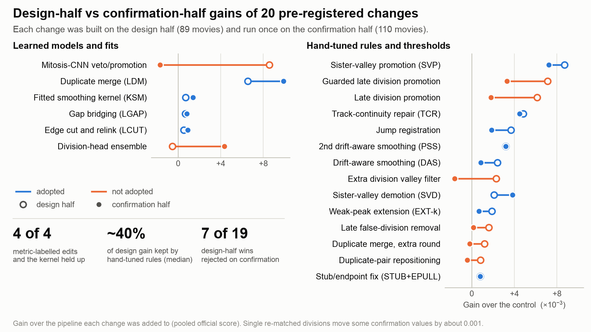
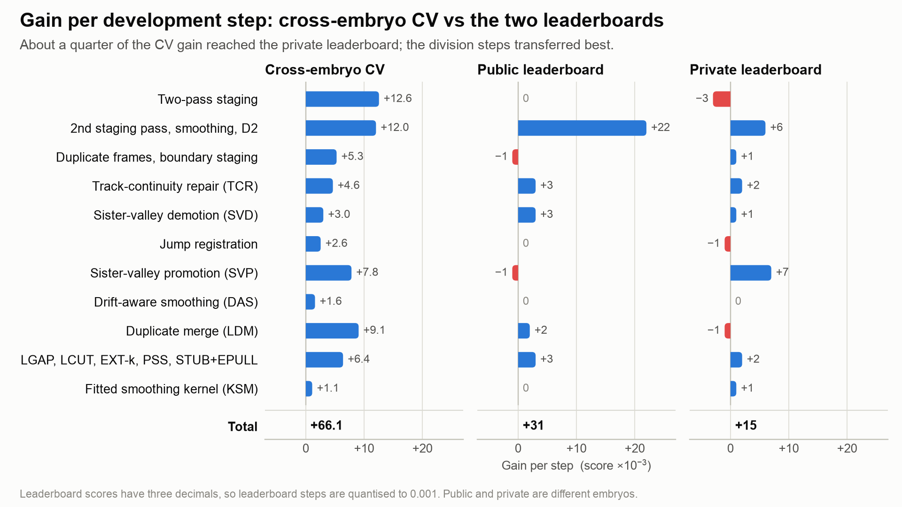
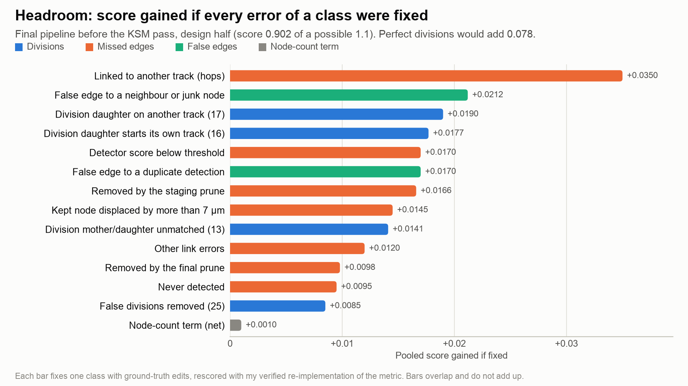
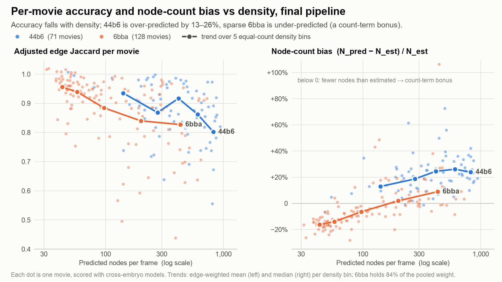

# 17th place — ibyyue: 17th Place Solution: Gradient-Boosted Tracking + Metric-Labelled Graph Edits

| | |
|---|---|
| Private | rank 17, 0.94235 (Gold) |
| Public | rank 40, 0.96696 |
| Team | by (@ibyyue) |
| Writeup by | by |
| Published | 2026-10-01 (updated 2026-10-04) |
| Source | https://www.kaggle.com/competitions/biohub-cell-tracking-during-development/writeups/17th-place-solution |
| Comments | 0 |

---
**Private 0.942 · Public 0.966.** Tracking-by-detection with a 3D U-Net detector ensemble, a gradient-boosted linker solved as an augmented LAP, a gradient-boosted division head, and a chain of small learned and rule-based graph edits.

**Only competition data was used, and all models were trained from scratch.**

## 1. What shaped the design

- **The test embryos are new.** Training has two embryos: 44b6 (71 movies; dense, small nuclei; about 4 annotated tracks per movie) and 6bba (128 movies; larger nuclei; about 29 tracks per movie). The public and private leaderboards use two further, different embryos. Movie-level CV overstated transfer, so all the validation holds out an embryo.
- **Annotation is sparse, and extra nodes are taxed.** Only about 2.5% of nuclei are annotated, and only edges touching them count. The edge Jaccard is multiplied by `1 − 0.1·(N_pred − N_est)/N_est`, which is signed and unclipped. An extra node almost always pays this count term and rarely gains an edge, which ruled out most "more recall" ideas.
- **Division Jaccard is micro-pooled over movies.** With final submission 1's 46 TP / 54 FP / 105 FN over the 199 training movies, one recovered division is worth about +0.0005. The 0.1-weighted division term was the largest single loss (about 0.078).
- **The data have three traps:**
  - A detector trained on 44b6 double-peaks on the larger 6bba nuclei, which creates parallel duplicate tracks. The per-frame 7 µm matching then hops between them, costing one FN and up to two FPs per hop.
  - 6bba has about 950 byte-identical, forward-filled frames.
  - Both embryos have whole-field stage jumps of 5 µm or more (median 4 per 6bba movie).

## 2. Validation

- **Cross-embryo CV:** all 199 training movies, each scored with models trained on the other embryo. Every learned component is trained this way except the fitted smoothing kernel. That kernel (KSM, section 3.4) was fitted on design-half positions of both embryos; its strictly cross-embryo version gave +0.0008 over all 199 movies.
- **Design and confirmation halves:** each late change was designed on a fixed half of the movies (89). Its code and model hashes and its pass rule were then frozen: a minimum pooled gain plus a floor on each embryo. It was then run once on the other half (110 movies). Seven of the 19 changes in Figure 1 that won on the design half were rejected after confirmation.
- **Leaderboards:** public and private are different embryos, so the public LB was only a noisy check. The two final division heads differed by +0.005–0.006 on public in all five paired submissions, and by at most 0.001 on private.



*Figure 1. Gain on the design half (hollow) and on the confirmation half (filled) for 20 of the pre-registered changes.*

- **Learned:** the metric-labelled edits (LDM, LGAP, LCUT) and the fitted kernel (KSM) gained at least as much on confirmation as on design. The mitosis CNN reversed.
- **Hand-tuned rules** kept a median of about 40% of their design gain. Single re-matched divisions move some confirmation values by about 0.001.
- **Division rules:** the sister-valley rules (SVP, SVD) held. The later division rules lost most of their gain or reversed.

## 3. Pipeline

```text
raw 64×256×256 (1.625 / 0.406 / 0.406 µm)
 → 4×4 mean-pool in y/x → 64³ isotropic, percentile-normalised
 → detection: 2 × 3D U-Net + flip TTA → centre heatmap → peaks ≥ 0.18   [adaptive down-scaling for large nuclei]
 → staging: distance bootstrap → learned linker ×2 on all peaks → drop components < 5 frames (< 3 at t=0/T−1)
 → linking: learned linker + augmented LAP (pass 2) → 1-frame gap closing
 → divisions: D2 triple classifier + sister-valley promotion/demotion → track-continuity repair
 → prune (span ≥ 8; ≥ 2 if mean link p ≥ 0.95; ≥ 20 if mean link p < 0.7; components with a fork kept)
 → drift-aware smoothing
 → post-edits: LDM → LGAP → LCUT → EXT-k → PSS → STUB+EPULL → KSM → CSV
```

Names used below:

| Name | Meaning |
| --- | --- |
| D2 | division classifier on mother–daughter triples |
| SVP / SVD | division promotion / fork demotion by sister valley |
| DAS | drift-aware smoothing |
| TCR | track-continuity repair |
| LDM | learned duplicate merge |
| LGAP | learned gap bridging |
| LCUT | learned edge cut and relink |
| EXT-k | track extension along weak detector peaks |
| PSS | second drift-aware smoothing pass |
| STUB+EPULL | stub removal and endpoint pull |
| KSM | fitted smoothing kernel |

### 3.1 Detection

- **Network:** a 3D U-Net (4 levels, 32–256 channels, InstanceNorm, SiLU) predicting a Gaussian centre heatmap (σ = 2.2 µm).
- **Loss:** a CenterNet-style focal loss with a sparse-annotation mask. Supervision is full inside balls around annotated cells and weakly negative on dark background. Everything else is unsupervised, because unlabelled does not mean negative.
- **Checkpoint selection** on held-out crops:
  - first model: recall at 1.25× the expected node count;
  - retrain: one-to-one recall within 1.5 µm.
- **Ensemble:** two all-data models (a short run and a longer retrain) with averaged probability maps. On 6bba the pair beat either model (CV 0.844 vs 0.829 / 0.826), at a cost of 0.006 on 44b6.
- **Inference:** 4 flip variants, 3×3×3 local maxima above 0.18, and quadratic sub-voxel refinement.
- **Adaptive scale:** when the frame-median 2nd-nearest-neighbour spacing exceeds a reference, the volume is downscaled by reference/spacing (no further than 0.6×) and detection is rerun.
  - This fixed the nucleus-size mismatch: with a single fold detector and its own reference (9.5 µm), 6bba CV rose from 0.717 to 0.829.
  - The deployed all-data detectors use 13.6 µm.
  - Up-scaling and multi-scale averaging both lost.

### 3.2 Linking

- **Linker:** each candidate pair within 13 µm gets 47 features, scored by a HistGradientBoosting model (400 trees). The features are:
  - displacement and its residual against the track's own velocity and a k-NN local motion field (z and xy split);
  - detector scores;
  - contention rank and margin among competing candidates;
  - local density and patch-descriptor similarity;
  - agreement with a distance-only bootstrap linking.
- **Assignment:** a Jaqaman augmented LAP per frame pair, with cost −log p, birth/death cost −½ log 0.35 and top-5 candidates per side, solved with scipy's sparse `min_weight_full_bipartite_matching`.
- **Two-pass staging:** the learned linker runs on all detections, then again using its own links as motion fields. Components shorter than 5 frames (3 at the time boundaries) are removed before the final pass, so short-lived distractors cannot contend for targets. The first learned pass replaced a prune driven by distance-only linking and gained +0.0126. The second pass and the boundary rule came in later steps.
- **Duplicate frames:** byte-identical frames are detected by hash. Velocities and the bootstrap are Δt-aware, and copies are folded into one node during smoothing.
- **Whole-field jumps (+0.0026):** a per-transition global shift is estimated by voting over peak displacements. Shifts of 5 µm or more register the target frame and residualise the motion features.

### 3.3 Divisions

- **D2 head (+0.0061; only works on two-pass graphs):**
  - **Candidates:** triples (mother at t, two daughters at t+1) built from the linker's candidate pairs. Each mother gets up to 5 daughters by link probability, with mother–daughter ≤ 14 µm, sisters 2.5–20 µm apart, and the daughter midpoint ≤ 8 µm from the mother.
  - **Classifier:** a HistGradientBoosting model on 38 scale-invariant features (link probabilities and contention, geometry normalised by local spacing, appearance, track history).
  - **Decoding:** greedy, with ±2-frame / 8 µm suppression. Daughters may be taken from other tracks.
- **SVP (+0.0078):** triples with 0.1·thr ≤ p < thr are accepted when both daughters are unclaimed and an intensity valley (ratio < 0.8) separates them at t+1 and t+2.
- **SVD (+0.0030):** accepted forks without a valley (ratio ≥ 0.95) at both t+1 and t+2 lose their weaker daughter edge.
- **TCR (+0.0046):** a link whose tail of ≤ 2 nodes dies is moved onto the start of a long parentless track (linker p ≥ 0.1). The mirror case handles short heads of ≤ 6 nodes.
- **Two final heads:** the two final submissions differ only in the D2 head.
  - One was trained on tables from an earlier version of the pipeline.
  - The other was refitted on current-pipeline tables of all 199 movies. It failed the cross-embryo check (+0.0004) but led on public.
  - I kept both as a hedge, and they tied on private (0.942).

### 3.4 Smoothing and post-edits

**Smoothing.** Positions are rounded to the CSV grid, smoothed with `[w, 1−2w, w]` along one-to-one chains, and rounded again. The filter skips forks, folds duplicate copies, and works in the co-moving frame (position minus the cumulative jump shift). It does not bring nodes closer to the GT; it helps by stopping per-frame matching flips between neighbouring cells.

**Learned edits: labelled by the metric.** The three learned graph edits (LDM, LGAP, LCUT) label each candidate by its local effect on the metric, `u = ΔTP − 0.87·ΔFP`, plus the count term for edits that add nodes. They do not use a semantic label such as "is a duplicate". For LDM, strict duplicate labels reached AUC 0.78–0.82 offline but lost 0.004–0.074 when applied; metric labels made the same features profitable. These edits use small GBMs on label-free features, trained cross-embryo for CV and refitted on all data for deployment.

| Step | What it does | Confirmation gain |
| --- | --- | --- |
| LDM | Scores parallel tracklet pairs (< 14 µm, ≥ 2 frames) on 22 features: separation statistics, co-motion, intensity valley along the pair axis, detector scores, births/deaths nearby. Pairs with p ≥ 0.40 become one node per frame at the midpoint | **+0.0099** |
| LGAP | Bridges a track end at t to a track start at t+1 directly, or at t+3 through two synthetic nodes; 49 features, 4 GBMs, p ≥ 0.40 | +0.0008 |
| LCUT | Cuts edges whose false-positive probability is ≥ 0.6 and adds 1-frame links where it is ≤ 0.1 | +0.0009 |
| EXT-k | Extends track ends along chains of sub-threshold peaks (score ≥ 0.06, ≤ 3 µm from the predicted position, up to 25 frames, ≥ 3 peaks or bridging) | +0.0007 |
| PSS | A second drift-aware smoothing pass (w = 0.35), only in movies with median 2nd-NN spacing ≥ 9 µm | +0.0032 (+0.0021 from edges) |
| STUB+EPULL | Drops components shorter than 3 frames; pulls each track endpoint 25% toward the adjacent node of its own track | +0.0008 |
| KSM | An extra smoothing pass with a ±3-frame kernel (separate z and xy weights, one-sided at track ends), least-squares fitted to GT positions on the design half | +0.0014 |

Order matters: LCUT placed before LGAP lost most of its gain.

## 4. Results

CV is the cross-embryo score over all 199 training movies. Each row adds a step to the row above.

| Pipeline | CV | Public | Private |
| --- | --- | --- | --- |
| Starting point: detector ensemble with adaptive scale, learned linker, simpler division model | 0.8413 | 0.930 | 0.927 |
| + two-pass staging | 0.8539 | 0.930 | 0.924 |
| + second staging pass, round-first smoothing, D2 divisions | 0.8659 | 0.952 | 0.930 |
| + duplicate-frame handling, boundary-aware staging | 0.8712 | 0.951 | 0.931 |
| + TCR | 0.8759 | 0.954 | 0.933 |
| + SVD | 0.8789 | 0.957 | 0.934 |
| + jump registration | 0.8814 | 0.957 | 0.933 |
| + SVP | 0.8893 | 0.956 | 0.940 |
| + drift-aware smoothing | 0.8908 | 0.956 | 0.940 |
| + LDM | 0.8999 | 0.958 | 0.939 |
| + LGAP, LCUT, EXT-k, PSS, STUB+EPULL | 0.9063 | 0.961 | 0.941 |
| + KSM: **final submission 1** | 0.9074 | 0.961 | **0.942** |
| Same, with the refitted division head: **final submission 2** | 0.9075 | 0.966 | **0.942** |



*Figure 2. Gain of each development step on CV and on both leaderboards.*

- **Transfer:** 23% of the CV gain reached private (+0.015 of +0.066).
- **What transferred best:**
  - SVP: +0.007 on private;
  - the step that added the second staging pass, smoothing and D2 divisions: +0.006.
- **What did not transfer:**
  - two-pass staging: −0.003 on private;
  - LDM and jump registration: −0.001 each;
  - drift-aware smoothing and the duplicate-frame step: flat.

## 5. Where the remaining headroom is



*Figure 3. Score gained by fixing each error class with ground-truth edits, on the final pipeline before the last smoothing pass (design half).*

- **Divisions:** fixing all division errors would add 0.078.
  - Each missed division is worth about +0.0011 when recovered. 17 had a daughter linked to another track, and 16 had a second daughter that started its own track.
  - Removing all 25 false forks would add only +0.0085, because a false fork only enlarges the Jaccard denominator.
- **Edges:** the largest class is edges whose ends are both detected but linked to another track (+0.035, mostly hops between two detections of one cell). The detector-limited classes are each worth +0.009–0.017: score below threshold, removed by staging, never detected. I found no separable signal for these (section 6).



*Figure 4. Per-movie accuracy and node-count bias against density.*

- **Accuracy:** the edge-weighted adjusted Jaccard falls from the sparsest to the densest third of movies: from 0.947 to 0.837 in 6bba, and from 0.908 to 0.836 in 44b6.
- **Node count:**
  - 44b6 is over-predicted by 13–26% (bin medians), a count-term cost of about 2%.
  - 6bba ranges from −16% in its sparsest fifth to +9% in its densest. The signed count term turns the under-prediction into a bonus.

## 6. What did not work

- **Adding nodes:** beyond the narrow EXT-k chains, LGAP bridges and the time-boundary staging rule, nothing that added nodes survived validation. I tried lower detection thresholds, returning peaks removed by staging, restoring pruned components, single-peak insertion at track ends and 2-frame gap closing. The extra recall was paid back through the count term or false links.
- **Removing nodes:** trimming toward the estimated node count always lost, and learned junk-track removal beyond LDM and STUB found no profitable pool.
- **Duplicate merging before linking** with an intensity-valley rule gained on CV for 6bba but lost on both leaderboards (public 0.910 vs 0.930, private 0.849 vs 0.916 on the same base). Adaptive detection scale replaced it; LDM later removed duplicates after linking.
- **Linker refit** on current-pipeline tables gave about 0 (+0.0002 within an embryo, −0.001 across).
- **Image CNNs:**
  - A mitosis CNN used to veto and promote forks made division decisions more conservative and lost recall (Figure 1).
  - A pair-image CNN for duplicates and a probability-map saddle feature added nothing over the GBM features.
- **Division rules and ensembles:**
  - An extra valley filter and two late division-promotion rules lost most of their design-half gain or reversed (Figure 1). The late promotion rules gained +0.003–0.004 on 6bba but lost on 44b6.
  - D2 augmentation, capacity tuning and bagging did not pass their checks.
  - An ensemble of the two division heads passed confirmation (+0.004). I did not ship it, because it was negative on the design half and only +0.002 overall.
- **Localisation:** intensity-centroid snapping and z refinement did nothing across embryos, because the offset to the GT is an annotation convention (for example a per-embryo z bias). For the same reason I did not train sub-voxel offset heads.
- **Hops:** two detections straddle one annotated cell, with the GT at their midpoint. No feature separated such straddling pairs from two touching cells (AUC 0.45–0.61), and the predictor of which detection the GT matches was at chance.

## 7. Takeaways

1. Hold out embryos, not movies. A division-head refit looked +0.0074 better in an in-embryo CV (partly from extra training movies), gave +0.0004 across embryos, and tied on private.
2. When learning post-hoc edits, label each candidate by its effect on the competition metric, including the count term when the edit adds nodes. All the metric-labelled edits held up on confirmation (Figure 1).
3. Design on one half, freeze the rule, and confirm once on the other. Seven of 19 design-half wins were rejected after confirmation, and hand-tuned rules kept a median of about 40% of their design gain.

---

## Comments (0)

*(none)*
