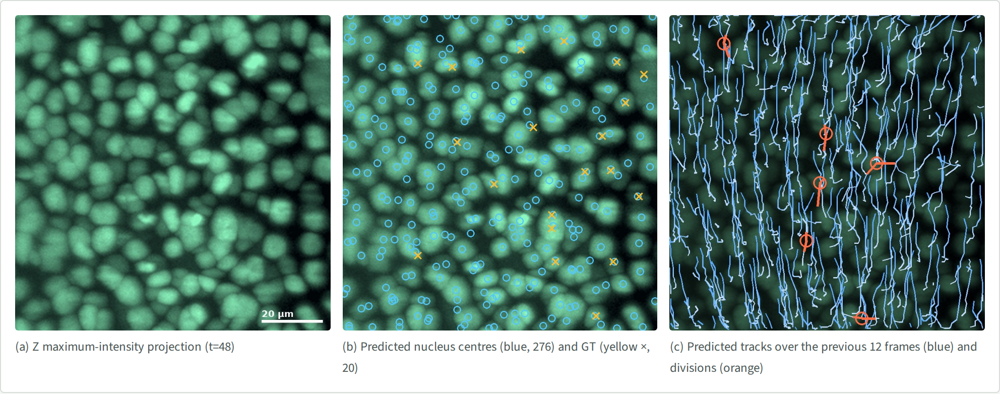
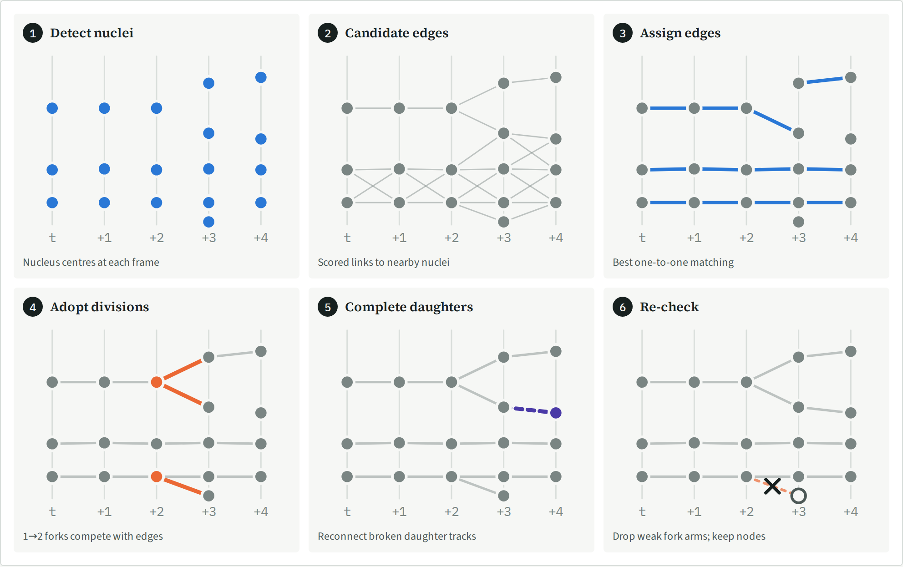
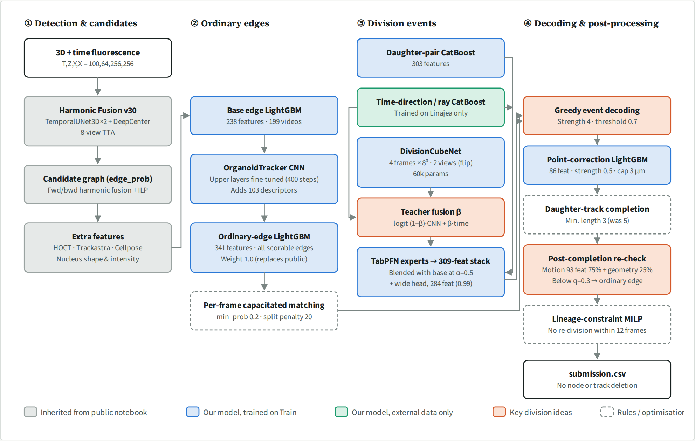
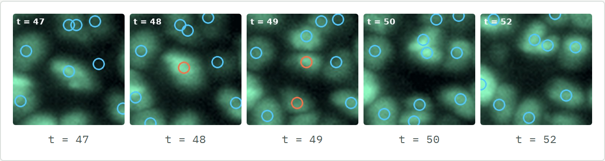
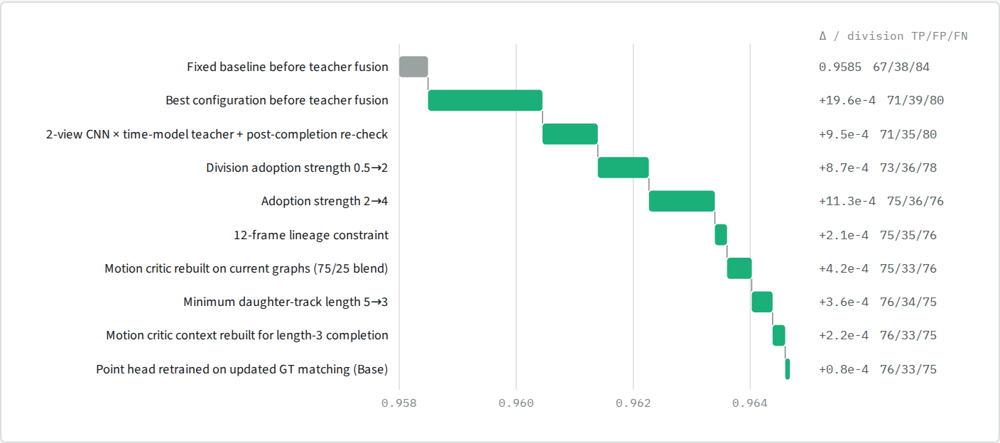
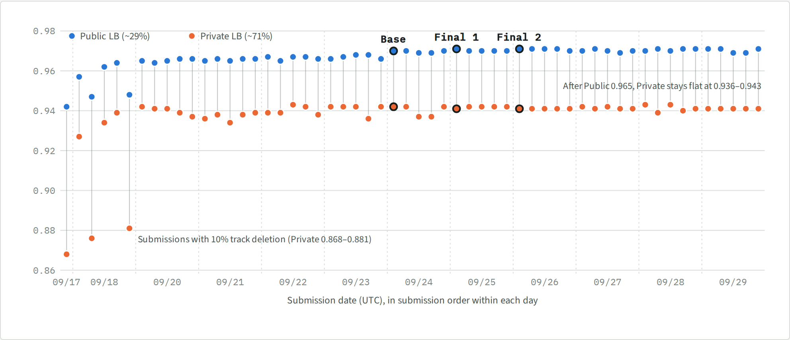
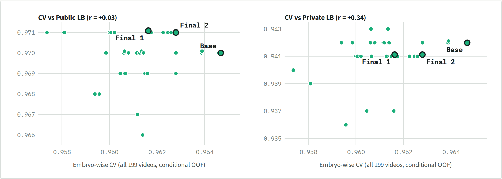

# 18th place — ymg_aq: 18th Place Solution: Lineage Graph Refinement Focused on Cell Divisions  

> Few labels, many divisions: refining a public tracker

| | |
|---|---|
| Private | rank 18, 0.94188 (Silver) |
| Public | rank 9, 0.97163 |
| Team | ymg_aq (@ymgpalaqs) |
| Writeup by | ymg_aq |
| Published | 2026-09-30 (updated 2026-09-30) |
| Source | https://www.kaggle.com/competitions/biohub-cell-tracking-during-development/writeups/18th-place-solution-lineage-graph-refinement |
| Comments | 1 |

---
## 1. Overview  

  
**Figure 1.** A training video (embryo 6bba, video 6bba_cdcfe533, 104 µm wide). Panels (b) and (c) are predictions of the base solution under embryo-wise CV. At this frame only 20 nuclei carry GT, so most predictions cannot be scored. The tissue drifts vertically while cells divide inside it.  
  
We started from a public notebook (Biohub Harmonic Fusion v30) and kept its nucleus detection and candidate-graph generation. Everything after that, which edges to keep and where to place divisions, was rebuilt with our own models and rules.  
  
Four principles guided the work.  
  
- **Focus on divisions, where the headroom was.** The inherited pipeline already linked most cells correctly, but it recovered only 23 of the 151 GT divisions. Most of our effort went into judging and adopting divisions.  
- **Use parts that survive sparse labels.** GT covers about 2.8% of the estimated nodes and contains only 151 divisions. Instead of retraining large models, we used light LightGBM and CatBoost heads on top of existing model outputs, TabPFN for few-sample problems, and a small CNN pretrained on external data (Linajea and synthetic images).  
- **Judge the graph you submit.** Later steps such as daughter-track completion change the graph. The final division decision is made on the finished graph that is written to the submission.  
- **Never delete nodes, and decide on all 199 videos.** With sparse GT, deletions and gains on small validation sets easily backfire on the LB. We did not delete tracks, and every change was accepted only after embryo-wise CV on all 199 videos.  
  
## 2. Pipeline  
  
  
**Figure 2.** The flow at a glance. In each panel the horizontal axis is time and the vertical axis is position; only what changes in that step is coloured. Ordinary edges are chosen one-to-one from the candidates (3). Divisions are judged separately and compete with ordinary edges (4). Broken daughter tracks are reconnected to their parent (5), and divisions are re-checked on the finished graph (6). Step 6 removes only the wrong fork arm and keeps every cell node.  
  
  
**Figure 3.** Inference pipeline of the base solution. Grey: inherited from the public notebook. Blue: our models trained on the competition Train set. Green: our models trained on external data only. Orange: the division ideas that mattered most. All our models were retrained on all 199 videos for submission.  
  
The pipeline has four streams. ① The public notebook detects nuclei and builds a candidate graph. ② Ordinary (one-to-one) edges are rescored by our LightGBM and selected by per-frame matching. ③ Division candidates (one parent, two daughters) are scored by external-data classifiers, an image CNN and a TabPFN stacking head. ④ Divisions are adopted against competing ordinary edges, coordinates are corrected and daughter tracks are completed. Finally, divisions are re-checked on the finished graph and a lineage constraint is applied.  
  
## 3. Differences from the public notebook  
  
We inherited [flexonafft's "Biohub Harmonic Fusion" v30](https://www.kaggle.com/code/flexonafft/biohub-harmonic-fusion) (Public 0.947) up to candidate-graph generation: detection with TemporalUNet3D (2 seeds) and DeepCenter, 8-view TTA, forward/backward harmonic fusion and ILP. Almost everything downstream was rebuilt. Scored on all 199 training videos, the public pipeline gives 0.9116 with division TP/FP/FN = 23/102/128. Edges were largely right; divisions were mostly missed. That is why most of our changes target divisions.  
  
**Table 1.** Differences from the public notebook. CV gain is the change in all-199-video CV when each stage was introduced. The CV protocol changed over time, so treat these as rough magnitudes.  
  
| Stage | Public notebook | Ours | CV gain |  
| --- | --- | --- | ---: |  
| Edge probability | SimpleNodeTransformer + fwd/bwd harmonic fusion | Replaced by a 341-feature LightGBM | +0.021 |  
| Edge selection | ILP (appear, disappear, division costs) | Per-frame capacitated bipartite matching |  |  
| Coordinates | Detector output | 3-axis LightGBM correction | +0.020 |  
| Division base probability | Geometric division rules | 303-feature CatBoost on parent–daughter triplets |  |  
| Division image model | — | 3D CNN pretrained on external data + time-direction model | +0.021 |  
| Division stacking | — | TabPFN stacking of expert heads (α=0.5) + wide head | +0.006 |  
| Division adoption | Costs inside the ILP | Greedy competition with ordinary edges (strength 4) | +0.006 |  
| Daughter tracks | Short-track handling, gap filling | Reconnect orphan daughter tracks to their parent (min. length 3) |  |  
| Division re-check | — | Judge on the completed graph; below q=0.3 revert to an ordinary edge |  |  
| Lineage | — | No re-division within 12 frames on the same lineage |  |  
| Post-processing | Post-processing re-tuned on Train | Not used; no node or track deletion |  |  
  
  
### 3.1 Edge probability: rescoring with LightGBM  
  
The public edge probability becomes just one feature. We added edge scores from HOCT (`ctc_v0`, `general_v1`) and Trackastra (`ctc`), nucleus shape and intensity measured with Cellpose and from the image, and motion context over neighbouring frames. A base edge LightGBM was trained on these 238 features. We then fine-tuned the upper layers of the OrganoidTracker division CNN and added 103 of its intermediate descriptors, giving a 341-feature "ordinary-edge head".  
  
As labels we used every edge the official metric can judge, not only GT edges. GT covers only about 2.8% of the estimated nodes; treating only GT edges as positives would teach the model that unscored edges are negatives. In the end, the ordinary-edge head fully replaced the public edge probability (blend weight 1.0).  
  
### 3.2 Edge selection: per-frame matching  
  
Instead of the ILP, edges are selected by capacitated bipartite matching (minimum-cost matching) between neighbouring frames. A parent may take up to two children. Edges below probability 0.2 are not used, and assigning two children to one parent costs a penalty of 20. Divisions are judged and adopted later, separately. Rescoring plus matching raised CV from 0.9116 to 0.9327 (+0.021).  
  
### 3.3 Coordinate correction and division base probability  
  
Detected nucleus centres are corrected by LightGBM (Huber loss, one model per axis) on 86 features. The applied shift is 0.5 × the prediction, capped at 3 µm. The metric matches nodes within 7 µm.  
  
Division candidates are enumerated as triplets of one parent and two daughter candidates. Each triplet is scored by a CatBoost on 303 features, including HOCT and Trackastra scores, nucleus shape and intensity, and the context of surrounding cells. Together with coordinate correction, CV rose from 0.9327 to 0.9528 (+0.020).  
  
### 3.4 Division image model: a CNN and a time-direction model trained on external data  
  
The competition has only 151 labelled divisions, which is too few to train an image model alone, so we used external data.  
  
- **DivisionCubeNet.** A small 3D CNN with three convolution layers (60,449 parameters). It crops 8³ cubes at four time points (−1, 0, +1, +3 relative to the parent) aligned to the axis between the two daughters. It was pretrained on synthetic 1→2 division images, trained further with real zebrafish divisions from Linajea (70 events), and finally fine-tuned on the competition data. At inference we average two views (original and flipped).  
- **Time-direction model.** A CatBoost that tells whether a Linajea division is played forwards or backwards. A dividing cell goes from one to two nuclei; played backwards it goes from two to one. The model learns this asymmetry and uses no competition labels at all.  
  
  
**Figure 4.** A real division (6bba_cdcfe533, around the parent at t=48, 24 µm square, maximum projection over the parent's Z ± 5 slices). The orange parent at t=48 splits into two orange daughters at t=49. DivisionCubeNet sees these time points (−1, 0, +1, +3) as small cubes aligned to the daughter axis. Circles are base-solution predictions.  
  
The two probabilities are blended in logit space into one "teacher" probability:  
  
$$  
p_{\mathrm{teacher}} = \sigma\!\left( (1-\beta)\,\operatorname{logit} p_{\mathrm{CNN}} + \beta\,\operatorname{logit} p_{\mathrm{time}} \right)  
$$  
  
The base solution uses $\beta=0.5$. The teacher is then combined with the daughter-pair probability from 3.3 and the time-direction probability, again in logit space:  
  
$$  
\operatorname{logit} p_{\mathrm{base}} = 0.5\,\operatorname{logit} p_{\mathrm{pair}} + 0.375\,\operatorname{logit} p_{\mathrm{teacher}} + 0.125\,\operatorname{logit} p_{\mathrm{time}}  
$$  
  
The teacher is also fed as a feature to the TabPFN stacking head below. This stage added +0.021 CV.  
  
### 3.5 Division stacking with TabPFN  
  
Divisions have few positives, and GBDTs with many features overfit easily. We therefore trained experts separately: an image TabPFN (112 features), a temporal TabPFN (192 features), a CELLECT head (145 features) and the OrganoidTracker CNN. Their predictions, together with appearance and assignment context, form 309 features that TabPFN 3.5 stacks. TabPFN uses its public pretrained weights; training data is only passed as "context". The context holds 1,139 rows (115 positives) built from expert predictions with the outer fold excluded. The stacked probability is blended with the base probability at α=0.5.  
  
A separate 284-feature "wide head" picks up candidates outside the stacking head's query range; only candidates above 0.99 are added.  
  
### 3.6 Division adoption: competing with ordinary edges  
  
Adopting a division removes the ordinary edges attached to its parent and daughters. We define the gain of a division as below and adopt, greedily, only divisions whose gain beats the probability of the ordinary edges they replace:  
  
$$  
g = s\,\bigl(\operatorname{logit} p - \operatorname{logit} 0.7\bigr)  
$$  
  
$s$ is the adoption strength. A cell may not divide again within two frames. Raising $s$ from the initial 0.5 to 4 gave +0.002 CV and moved Public from 0.968 to 0.970: divisions supported by the models stopped losing to competing ordinary edges.  
  
### 3.7 Daughter-track completion  
  
Right after a division the daughter nuclei are small and close together, so detection and linking often break. If an orphan daughter track persists long enough, it is reconnected to its parent through an unused candidate edge (probability ≥ 0.8). We require the daughters to be at least 3 µm apart and their distance to grow by at least 1 µm. Lowering the minimum track length from 5 to 3 points gained one TP.  
  
### 3.8 Division re-check after completion  
  
We used to re-check divisions before completing daughter tracks, so the judged divisions differed from the submitted ones. We moved the check after completion and compute features from the graph that is actually submitted. There are 93 features: 42 describe the graph (track length, confidence, whether completion was used, and so on) and 51 describe parent–daughter motion after subtracting the surrounding tissue motion, at horizons of 1, 3, 7 and 15 frames. A TabPFN scores these and is blended in logit space with a geometry critic on 86 features:  
  
$$  
\operatorname{logit} p_{\mathrm{final}} = 0.75\,\operatorname{logit} p_{\mathrm{motion}} + 0.25\,\operatorname{logit} p_{\mathrm{geom}}  
$$  
  
For divisions with $p_{\mathrm{final}} < q = 0.3$, the weaker arm is cut and replaced by an ordinary edge. No cell node is deleted.  
  
### 3.9 Lineage constraint and post-processing  
  
When divisions follow each other within 12 frames on one lineage, a MILP keeps the maximum-weight compatible set. We did not use the public notebook's later post-processing, which is re-tuned on Train, and we delete no short tracks or components. Deleting 10% raised CV but lowered the LB sharply: −0.015 on Public and about −0.06 on Private. Fewer nodes help the node-count adjustment, but correct edges are lost with them, and CV on sparse GT hides that loss.  
  
## 4. Our models  
  
Each model was trained with the outer fold excluded and accepted or rejected by CV on all 199 videos. Accepted models were retrained on all 199 videos for submission.  
  
  
**Table 2.** Models we trained. The whole set is about 9 MB and was loaded from a private Dataset in the submission notebook.  
| Model | Inputs / features | Training data | Role |  
| --- | --- | --- | --- |  
| Base edge LightGBM | 238 features (HOCT `ctc_v0/general_v1`, Trackastra `ctc`, nucleus shape and intensity, long-range context) | Candidate edges: 125,889 positive, 650,448 negative | Edge rescoring |  
| OrganoidTracker CNN | Public division CNN (Keras → PyTorch); lower two blocks frozen, upper layers fine-tuned | 11,994 samples (283 positive), 400 updates | 103 division/edge descriptors |  
| Ordinary-edge LightGBM | 341 features | ~1.4M rows; labels on every officially scorable edge | Final edge probability |  
| Daughter-pair CatBoost | 303 features (parent + two daughters) | 243 positive, 413,851 negative | Division base probability |  
| Time-direction / ray CatBoost | 138 features; forward vs reversed playback | **External data only**: 489 Linajea zebrafish samples (70 divisions) | Direction of division |  
| DivisionCubeNet | 3D CNN (3 conv layers, GroupNorm, 60,449 params); 8³ cubes at t −1, 0, +1, +3 aligned to the sister axis | Synthetic 1→2 pretraining → Linajea + synthetic → fine-tuned on 199 videos (243 positives) | Division image score; 2-view average (original + flip) |  
| TabPFN experts ×3 + stacking | Image 112, temporal 192, CELLECT 145 features → 309-feature stack | Context 1,139 rows (115 positive); expert predictions exclude the outer 5-fold | Division stacking (α=0.5) |  
| Wide TabPFN | 284 features | Context 1,260 rows | Divisions outside the stacking range (threshold 0.99) |  
| Point-correction LightGBM | 86 features, per-axis Huber | 130,934 rows with updated GT matching | Node coordinate correction |  
| Post-completion critic (motion + geometry) | 93 features = 42 final-graph + 51 tissue-relative motion (1/3/7/15 frames); geometry 86 features | Motion context 120 rows (67 positive), built from completed graphs excluding the video itself and the outer fold | Keep or revert each final division (q=0.3) |  

  
  
**Figure 5.** Embryo-wise CV build-up from teacher fusion to the base solution (all 199 videos, official aggregation). The right column shows the step gain and division TP/FP/FN (151 GT divisions). Most of the gain came from the adoption strength and from rebuilding the critics for the completed graph.  
  
## 5. Datasets and external resources  
  
**Table 3.** Datasets and external resources used in the final solution. All are public and free to obtain. 

| Resource | Use | License |  
| --- | --- | --- |  
| Competition Train, 199 videos | Training and CV of all heads | Competition data |  
| Harmonic Fusion v30 (Tracking Support Pack v10, TemporalUNet3D seed314159 v2, DeepCenter v5) | Detection and candidate graph (inherited) | Public notebook; input Datasets CC0-1.0 |  
| HOCT `ctc_v0` / `general_v1` | Edge and division features | MIT |  
| Trackastra `ctc` | Edge and division features | BSD-3-Clause |  
| Cellpose | Nucleus shape features | BSD-3-Clause |  
| Linajea zebrafish 160328 (70 divisions, 419 negatives) | CNN pretraining, time-direction model | BSD-3-Clause |  
| Synthetic 1→2 division images | CNN pretraining | Self-generated |  
| OrganoidTracker 2 division CNN | Descriptors, expert head | CC BY 4.0 |  
| CELLECT | Expert head | GPL-2.0 |  
| TabPFN 3.5 Fast (public weights) | Stacking, wide and critic heads (context only) | TABPFN-3.5 Non-Commercial License (explicitly permits Kaggle-style competitions) |  
  
  
## 6. CV design  
  
Train contains only two embryos, so our main CV is **embryo-wise holdout**: train the added parts on one embryo, predict the other, do both directions, and score the 199 final CSVs together with the official metric. Video-level 5-fold CV was measured as a secondary check.  
  
- The public upstream models were trained on all of Train, so both CVs are **conditional OOF** for the added parts only, and not fully nested.  
- There are only 151 GT divisions; one division is worth roughly 0.0003–0.0007.  
- Changes that gained +0.005 to +0.012 on 8–16-video checks repeatedly turned into −0.001 to −0.003 on all 199 videos. We therefore always decided on the final CSVs of all 199 videos.  
  
## 7. Base solution and final submissions  
  
**Table 4.** Base solution vs. final submissions. All three share code and models and differ only in the teacher-fusion β. LB values are shown to three decimals; Final submission 1 was the best on Public. Division TP/FP/FN are from embryo-wise CV (151 GT divisions).  
|  | β | Embryo CV | 5-fold CV | Div. TP/FP/FN | Public | Private |  
| --- | ---: | ---: | ---: | ---: | ---: | ---: |  
| Base solution | 0.5 | **0.96468** | **0.96151** | 76/33/75 | 0.970 | **0.942** |  
| **Final submission 1** | 0.75 | 0.96163 | 0.96094 | 72/37/79 | **0.971** | 0.941 |  
| **Final submission 2** | 0.625 | 0.96279 | 0.96131 | 73/34/78 | 0.971 | 0.941 |  
  
  
Raising β added false divisions and lowered CV, yet raised Public by 0.001. We picked β=0.75 and 0.625 for the final submissions based on Public, but on Private the base solution was 0.001 higher, as CV had predicted.  
  
## 8. Public vs. Private vs. CV  
  
Figure 6 shows Public and Private for every submission. Public kept rising to the end, while Private reached 0.942 on 9/20 when TabPFN division stacking was added and then stayed between 0.936 and 0.943.  
  
  
**Figure 6.** Public (blue) and Private (orange) for all submissions. Vertical lines join the two scores of the same submission. Submissions with 10% track deletion (9/17–9/18) dropped especially hard on Private.  
  
**Table 5.** Milestones. Embryo CV is conditional OOF on all 199 videos; "—" means not measured with the same protocol. The public-notebook value scores its all-Train weights directly and is for reference only.  
| Date | Main change | Embryo CV | Public | Private |  
| --- | --- | ---: | ---: | ---: |  
| — | Public notebook (Harmonic Fusion v30) | (0.9116) | 0.947 | — |  
| 9/17 | Our heads added (edges, daughter pairs, point correction) + 10% track deletion | — | 0.942 | 0.868 |  
| 9/18 | Same models without track deletion | — | 0.957 | 0.927 |  
| 9/18 | External division CNN + time-direction model | — | 0.964 | 0.939 |  
| 9/20 | TabPFN division stacking, wide head, daughter completion | 0.9605 | 0.965 | 0.942 |  
| 9/23 | 2-view CNN × time-model teacher + post-completion re-check | 0.9614 | 0.966 | 0.942 |  
| **9/24** | Adoption strength 4, length-3 completion, rebuilt motion critic, lineage constraint (base solution) | 0.9647 | 0.970 | 0.942 |  
  
  
### 8.1 Correlation between CV, Public and Private  
  
How strongly the three scores agree depends on how large the compared changes are.  
  
**Table 6.** Correlations between scores, using LB values as displayed (three decimals). For the 34 submissions from 9/23, the p-value of r is about 0.05 for CV–Private and 0.19 or higher for the other pairs.  
| Submissions | n | Pair | Pearson r | Spearman ρ |  
| --- | ---: | --- | ---: | ---: |  
| All submissions | 56 | Public – Private | 0.92 | 0.45 |  
| Excluding the 3 with track deletion | 53 | Public – Private | 0.67 | 0.35 |  
| From 9/23, with embryo CV | 34 | Public – Private | 0.09 | −0.23 |  
|  |  | CV – Public | 0.03 | 0.07 |  
|  |  | CV – Private | **0.34** | 0.23 |  
  
  
  
**Figure 7.** CV vs. Public (left) and CV vs. Private (right) for the 34 submissions from 9/23 with embryo CV. LB values have three decimals, so tied points are offset slightly. Submissions at the top Public score of 0.971 range from 0.957 to 0.963 in CV and reach only 0.939–0.941 on Private.  
  
For large changes such as track deletion, Public and Private move together (r=0.92 over all submissions), and judging them on Public was fine. The 34 submissions from 9/23 are small changes to β and thresholds: Public differs by at most 0.005 and Private by at most 0.007. In that range Public and Private are almost uncorrelated, and so are CV and Public. Only CV and Private show a weak positive correlation (r=0.34).  
  
LB scores are rounded to three decimals and many submissions share the same value, so these estimates are coarse. Even so, trusting CV on all 199 videos tracked Private better than chasing Public differences of 0.001–0.002. The comparison between the base solution and the final submissions in Section 7 points the same way.

---

## Comments (1)

### kk.sky.9k (EXPERT) — 2026-09-30 — 1 votes

What an excellent insight and solution. Congratulations on a job well done!
