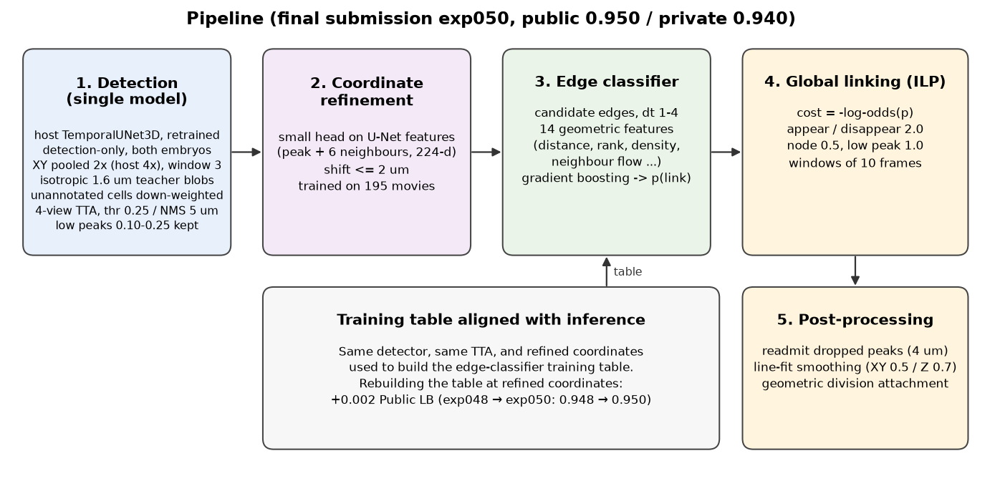
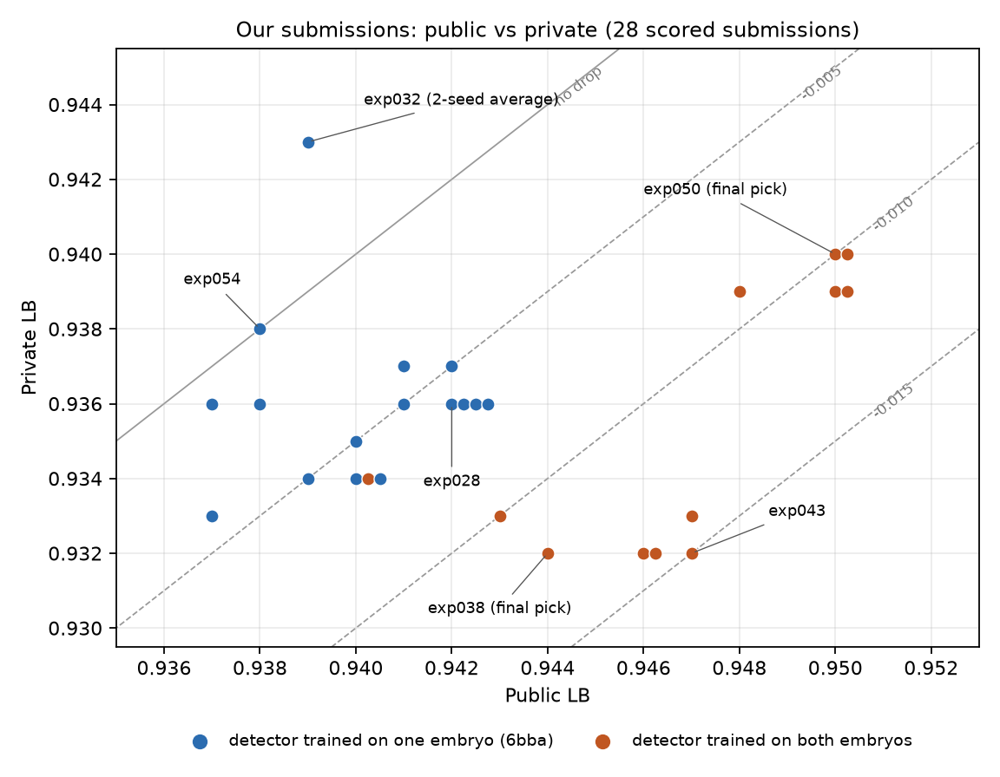

# 20th place — Yurinchi: 20th Place Solution

>  A Single Own Detector, Geometric Linking, and a Small Public-to-Private Drop

| | |
|---|---|
| Private | rank 20, 0.94085 (Silver) |
| Public | rank 1067, 0.95055 |
| Team | Yurinchi (@plandic) |
| Writeup by | Yurinchi |
| Published | 2026-10-05 (updated 2026-10-05) |
| Source | https://www.kaggle.com/competitions/biohub-cell-tracking-during-development/writeups/20th-place-solution |
| Comments | 0 |

---
First of all, thank you to the Biohub team and Kaggle for hosting this competition, for the clean baseline and metric implementation, and for the quick answers in the discussions. Thanks also to everyone who shared notebooks, checkpoints and analyses; several ideas in this solution started from them. This was my first image competition, and I learned a lot from reading this community.

## 1. Result and the question I kept in mind
- Public 0.950 → Private 0.940. The drop was held to about 0.01, and a shake-up of 1,047 places brought the solution to 20th.
- A host comment in the discussions said the test set was roughly the same size as the training set. It was natural to assume that the test contained several embryos, and that Public and Private might be different embryos.
- Since the test distribution could not be predicted, I was consistently wary of adapting too closely to the Public LB.

## 2. Pipeline overview

- Detection: a single model built on the host's network (temporal 3D U-Net), retrained for detection only. Changes from the host's training: XY pooled 2× (host: 4×), a 3-frame window, Gaussian targets that are isotropic in physical units, and a loss that down-weights unannotated cells. The final model was trained on both embryos. Inference uses 4-view TTA, threshold 0.25, NMS 5 µm, and keeps low peaks (0.10–0.25) as optional nodes.
- Coordinate refinement: a small network predicts the offset of each centre (up to 2 µm) from the detector's internal features at the peak and its 6 neighbours (224-d). Trained on 195 movies from both embryos.
- Linking: candidate edges spanning 1–4 frames are scored by gradient boosting on 14 geometric features (distance, rank, local density, neighbour motion, …). A global ILP selects the edges with cost = −log-odds(p), appearance / disappearance 2.0, node 0.5, low-peak node 1.0.
- Training table aligned with inference: the edge-classifier table was built with the same detector, the same TTA, and the refined coordinates used at inference. Rebuilding the table at refined coordinates gave +0.002 Public (exp048 → exp050).
- Post-processing: readmit dropped detections (4 µm), line-fit smoothing (XY 0.5 / Z 0.7, ±4 frames), and geometric division attachment.

## 3. How the solution became my own
- Starting from the host's detector, I built my own linking: hand-made features, a light classifier, and global optimisation.
- Improving the linking was hard. Seven submissions in one week did not move the score, and divisions never got beyond geometric rules.
- Meanwhile the detector was left untouched, and development stayed on a single-embryo detector for a long time.

## 4. The turning point
- While trying a division-precursor classifier, a division discriminator, and coordinate refinement, I learned a rule of thumb: parts that learned image appearance how images look do not transfer across embryos, while parts based on geometry transfer reasonably well.
- So I retrained the part that looks at images, the detector, on both embryos. This was four days before the deadline.

## 5. Dealing with public solutions
- Public notebooks were strong and I wavered at times, but I never replaced my pipeline with one. I took only ideas from their components (readmitting dropped detections, coordinate refinement, motion features) and rebuilt them on my own detector and my own training table.
- As a result, the final pipeline did not depend on any public pretrained checkpoints.

## 6. Public vs Private

- Submissions with the single-embryo detector lost about 0.005 from Public to Private; submissions with the two-embryo detector lost about 0.010–0.015.
- On Private the gap between the two families almost disappeared, and the best Private score came from a two-seed average of the single-embryo detector (exp032), which had ranked low on Public.
- Several decisions made on Public differences of 0.001–0.003 turned out the other way on Private.

## 7. What remains
- The small Private drop is a fact, but how much each component contributed is not separated.
- The move to two-embryo training came late, leaving too little time to improve divisions on that setup. Not keeping a calibration set of movies when switching made the dependence on Public stronger.
- I stayed with a single model, yet a two-seed average was the best on Private. Discarding it over −0.003 on Public was a mistake.
- This was my first image competition. Pushing on with my own models cut both ways: the final solution had a small Public-to-Private drop, but too much time went into testing linking ideas, leaving too little time for divisions, where the top solutions pulled away.

---

## Comments (0)

*(none)*
