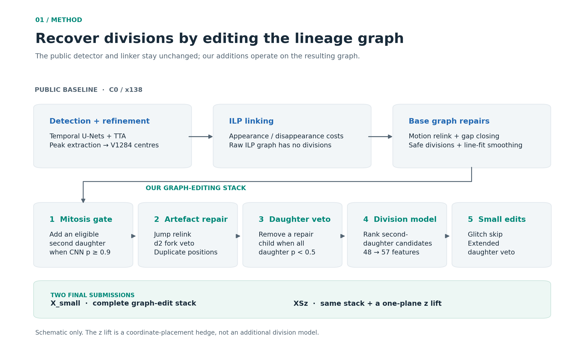
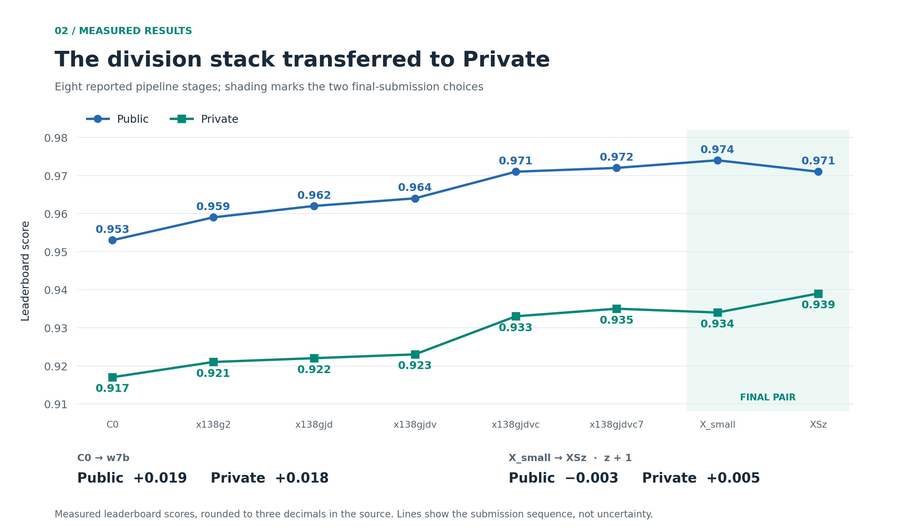
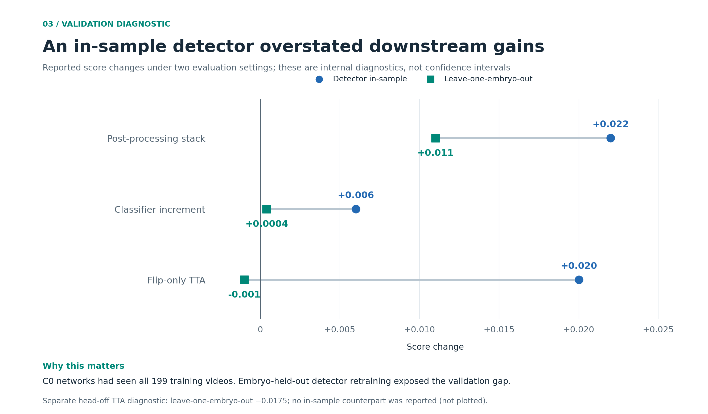

# 23rd place — taiseiu: 23rd Place Solution: Division Recovery on a Public Cell Tracker

| | |
|---|---|
| Private | rank 23, 0.93939 (Silver) |
| Public | rank 4, 0.97475 |
| Team | taiseiu (@taiseiu) |
| Writeup by | taiseiu |
| Published | 2026-10-03 (updated 2026-10-03) |
| Source | https://www.kaggle.com/competitions/biohub-cell-tracking-during-development/writeups/23rd-place-solution-division-recovery-on-a-public |
| Comments | 0 |

---
# 23rd Place Solution: Division Recovery on a Public Cell Tracker

**Team taiseiu · Biohub – Cell Tracking During Development · Silver medal**  
**Final rank: 23 / 4,017 · Private: 0.939 · Public for the scored submission: 0.971**  
Best Public score across our submissions: **0.974** · Total submissions: **102**

## Summary

We built our solution on the public **x138** notebook, which scored **0.953 Public / 0.917 Private**. We kept its detection and linking networks unchanged in the submitted pipeline and focused on recovering missed cell divisions and removing unreliable repair edges.

Our strongest division-recovery stack reached **0.972 Public / 0.935 Private**. Relative to x138, that was **+0.019 Public and +0.018 Private**. The largest single improvement came from a gradient-boosted classifier that selected a second daughter for a potential dividing cell.

Our final **0.939 Private** score came from a second selected submission that shifted every node by one z-plane. This embryo-dependent adjustment lost **0.003 on Public** but gained **0.005 on Private** relative to our other selected submission.

The most important caveat is our validation setup: **our checkpoint audit indicated that the public detector models had been trained on all 199 training videos, including our development videos**. Our development scores were therefore internal diagnostics, not clean held-out estimates of end-to-end generalization. Several detection experiments looked promising locally and failed on the leaderboards. A late leave-one-embryo-out experiment exposed how much our local results depended on this overlap.

This write-up covers what transferred, what failed, and how we selected the two final submissions.

## 1. Why we focused on divisions

The competition evaluates a graph: detected cells are nodes, temporal links are edges, and a mother with two daughters forms a division. The [official metric](https://github.com/royerlab/kaggle-cell-tracking-competition/blob/075fc5f5a52d11077f9dc2b074644618f26939e2/metrics.md) combines adjusted edge Jaccard with **0.1 × division Jaccard**.

A few details strongly influenced our choices:

- Nodes were matched per frame using Hungarian assignment within **7 µm**. The voxel spacing was **(z, y, x) = (1.625, 0.40625, 0.40625) µm**.
- An edge was scored only when it touched an annotated continuing cell. Edges between unannotated cells did not contribute directly to the edge score.
- The adjusted edge score is **max(0, EJ × [1 − 0.1 × (N_pred − N_est) / N_est])**. It is floored at zero but not capped at one, as specified in the [official implementation](https://github.com/royerlab/kaggle-cell-tracking-competition/blob/075fc5f5a52d11077f9dc2b074644618f26939e2/src/tracking_cellmot/metrics.py).
- A division predicted one frame early or late could still count as a true positive when the metric's local topology conditions were met.

The approximate value of individual corrections in our **72-video development pool** was:

| Correction | Approximate score gain |
|---|---:|
| Recover one true division | +0.00060 |
| Remove one false division | +0.00017 |
| Recover one true edge | +0.00002 |

These are local estimates, not universal constants. They made division recovery an attractive target and discouraged indiscriminate graph pruning.

Our error analysis attributed **87% of the remaining edge-score headroom** after x138 to detection failures: annotated nuclei without a nearby prediction, often in dense, hazy, or low-contrast regions. Only **7.7%** was clean linking error. An oracle that recovered missed divisions suggested approximately **+0.05** of potential gain.

Detection offered more headroom, but we lacked a reliable validation setup for changing it. Division recovery gave us a tractable way to improve the existing graph using image appearance, geometry, and track history.

### Acquisition artifacts also mattered

We measured three recurring effects:

- **Duplicate frames:** 811 bit-identical frames appeared in 99 of the 109 training videos from embryo **6bba**. The edge false-negative rate was **8%** on the transition after a duplicate, compared with **2.9%** elsewhere.
- **Whole-field jumps:** shifts larger than **4 µm**, with a median of about **7 µm**, occurred in **2.3%** of transitions from embryo **44b6** and **4.8%** from 6bba. At flagged transitions, non-ILP repair edges included **18 true positives and 185 false positives**.
- **Different z offsets:** the mean ground-truth-minus-prediction z offset was **+0.55 µm** on 6bba and **−0.04 µm** on 44b6. Their use of the end slices also differed.

Those observations motivated targeted repairs and, eventually, our z-shift hedge.

## 2. The unchanged baseline

We refer to the original x138 pipeline as **C0**.

### Detection

C0 combined the primary and secondary pilkwang temporal U-Nets using **0.2 × P + 0.8 × S**. Peaks were **3 × 3 × 3 local maxima** above a sigmoid threshold of **0.965**. If the blend retained fewer than **90%** of the primary model's peaks in a frame, it fell back to the primary model alone.

Each detector used an eight-view test-time augmentation implementation. In that implementation, the anti-transpose duplicated flip-x, leaving seven distinct views. The learned **V1284** head then refined each center by up to **2 µm**.

### Linking and repair

The integer linear program used appearance, disappearance, and division weights of **0, 2, and 1.2**, respectively. Under this configuration, the raw ILP output contained no divisions. C0 added them later through its repair stages:

1. Motion relinking
2. Re-admission of sub-threshold peaks and gap closing
3. Geometric “safe divisions,” vetoed by a DeepCenter prior
4. Line-fit smoothing over a **±2-frame** window, with weight **0.8**

All divisions in C0 came from the safe-division repair. We retained these networks and added graph-editing stages around their output.

*Figure 1. Overview of the submitted solution. The baseline networks were unchanged; our additions repaired edges, recovered divisions, and adjusted coordinates. This is a pipeline schematic, not a microscopy example.*

## 3. Recovering and filtering divisions

The development results below describe changes measured on the existing detector outputs. Even when a set was reserved from a particular post-processing experiment, it was **not unseen by the baseline detectors**. The final classifier also used supervised training: “GT-free features” means that its features can be computed without ground truth at inference time, not that the model was trained without labels.

### 3.1 A mitosis-appearance gate

Our first addition proposed an orphan cell as a second daughter when the geometry was plausible and a small CNN classified the mother as mitotic with probability **≥ 0.9**.

The geometric limits were:

| Relationship | Limit |
|---|---:|
| Mother to its linked daughter | ≤ 6 µm |
| Mother to the orphan candidate | ≤ 13 µm |
| Distance between daughters | 5–15 µm |
| Mother to the daughters' midpoint | ≤ 7 µm |

Greedy geometric assignment ran before the appearance gate. This stage added neither new nodes nor competing claims on an already linked daughter.

The CNN received a **6 × 64 × 64** input: the central slice and a maximum projection over **z ± 3**, at **t−1, t, and t+1**, pooled to **0.81 µm/pixel**. It had three convolutional blocks with **16/32/64** channels. Training used **151 annotated mothers** as positives, **20 one-child cells per video** as negatives, AdamW, a OneCycle schedule, and **15 epochs**, with positives repeated eight times.

The reported development AUC was **0.921**. In a pre-registered post-processing test, the score improved by **0.0040**, with division counts **[TP, FP, FN]** changing from **[5, 8, 36] to [7, 8, 34]**. Gains were concentrated in one or two videos per set, which was an early warning about their variability.

On the leaderboards, this stage improved C0 by **+0.006 Public / +0.004 Private**.

### 3.2 Drift-aware relinking and duplicate-frame handling

We estimated whole-field motion between adjacent frames using background-subtracted FFT cross-correlation. Its median error against the ground-truth mean displacement was **0.73 µm** in our measurements.

A transition was flagged when:

- Image motion and the median displacement of final graph edges disagreed by more than **4 µm**, and
- More than **10%** of its edges came from repair stages

At flagged transitions, we removed repair edges and used Hungarian assignment to reconnect childless nodes to parentless nodes. Matching used raw positions corrected by the estimated drift, with a **4 µm** distance limit.

The local improvement ranged from **+0.006 to +0.010** across development sets. On the reserved **V4** set, it was **+0.0074**, with 12 videos improving and none declining.

We bundled this with two small rules:

- **d2 fork veto:** remove the repair child of a fork when the two children's successors were less than **8 µm** apart at **t+2**. This was close to neutral on the final baseline.
- **Duplicate canonicalization:** for bit-identical frames and raw positions within **0.5 µm**, assign the later node the earlier node's smoothed position. This changed coordinates without changing graph topology and typically added **0.001–0.003** locally.

The bundled leaderboard increment was **+0.003 Public / +0.001 Private**. The edge-repair gain transferred much less strongly than its development results suggested.

### 3.3 A daughter-appearance veto

Next, we filtered forks created by C0's repair stage. If **every child** had daughter-CNN probability below **0.5**, we removed the lowest-probability repair child.

The daughter model was a three-seed CNN ensemble trained on newborn cells as positives and one-child cells as negatives, including hard negatives **4–15 µm** from a mother.

We observed no lost true divisions on the development sets. At this stage, false divisions on V4 fell from **10 to 5**. The leaderboard increment was **+0.002 Public / +0.001 Private**.

### 3.4 A learned second-daughter classifier

This produced our largest single leaderboard improvement.

Each candidate consisted of **(m, a, b, q)**:

- **m:** a potential mother
- **a:** its currently linked child
- **b:** the proposed second daughter
- **q:** the current parent of b, if b was already linked

The model could therefore recover a division involving either an orphan or a daughter incorrectly assigned to another parent. Candidates were processed greedily from highest score to lowest, with each node used at most once. Accepting a candidate added **m → b** and, if needed, removed **q → b**.

We used histogram gradient boosting with **48 inference-time features**, covering:

- Mitosis, daughter, and pre-mitosis CNN probabilities
- Sister geometry and symmetry
- Raw-versus-repair edge provenance and image-intensity dips
- Track history and nearby track ends

Evaluation used leave-one-set-out splits with an inner threshold search. Per-fold thresholds ranged from **0.17 to 0.54**, so a single sharp optimum was not convincing. The out-of-fold curve had a relatively flat region from **0.37 to 0.60**; we used this stability information rather than relying only on a fold-specific peak.

On the recorded V4 evaluation, division counts changed from **[8, 5, 12] to [11, 6, 9]**. The full stack then stood **+0.041 above C0** on that set. Its leaderboard increment over the preceding stage was **+0.007 Public / +0.010 Private**.

The next version, **w7b**, expanded the feature set to **57**. It added:

- **gap_open:** the intensity dip along the m–q line at t minus the dip along the a–b line at t+1
- Track-window mitosis features, taking the maximum CNN response over ancestors at **t−3 through t** and descendants at **t+1 through t+3**

These features added **+0.001 Public / +0.002 Private**. They were designed after inspecting true positives across the development sets, so their local improvement was exploratory rather than a blind confirmation.

## 4. Results and the two final submissions

Scores and derived leaderboard deltas are rounded to three decimals. All reported leaderboard increments are therefore approximate.

*Figure 2. The main submission sequence. These are cumulative pipeline versions, not a factorial ablation study. The final scored submission was XSz; X_small had our highest Public score.*

| Submission | Added change | Public | Private |
|---|---|---:|---:|
| C0 | Public x138 baseline | 0.953 | 0.917 |
| x138g2 | Mitosis gate | 0.959 | 0.921 |
| x138gjd | Jump relink, d2 veto, duplicate handling | 0.962 | 0.922 |
| x138gjdv | Daughter veto | 0.964 | 0.923 |
| x138gjdvc | Learned second-daughter classifier | 0.971 | 0.933 |
| x138gjdvc7 | w7b features | 0.972 | 0.935 |
| **X_small — final selection 1** | Glitch skip and extended daughter veto | **0.974** | 0.934 |
| **XSz — final selection 2, scored** | Shift every node by one z-plane | 0.971 | **0.939** |

The full post-processing stack through w7b, including both division and artifact-edge edits, improved **Private by 0.018**, close to its **0.019 Public** improvement. The next small edits improved Public but reduced Private by **0.001**.

### Final selection 1: X_small

X_small added two conservative rules:

- Skip jump relinking at **12 frames** with z-roll exceeding **25 µm** on two consecutive steps. These frames had no ground-truth labels, so the rule was precautionary rather than supported by a measured score gain there.
- Extend the daughter veto to forks with at least one non-C0 child. This removed **two false divisions and no true divisions** locally, for about **+0.0004**.

### Final selection 2: the z + 1 hedge

XSz shifted every predicted node by one z-plane, clipped at the final slice: **z ← min(z + 1, Z − 1)**.

Locally, this gave **+0.0037 on 6bba** and **−0.0171 on 44b6**. Our analysis suggested the effect came from borderline matches near the **7 µm** matching radius, rather than simply correcting the average z offset.

We selected it because its effect varied strongly by embryo. Under the competition's two-submission selection rule, the better Private score would determine our result, so X_small provided a baseline while XSz offered a different outcome under a different test distribution.

The result was **−0.003 Public / +0.005 Private** relative to X_small. XSz was our best Private submission and produced the final **0.939** score.

### How we made the selection

We used a probability model of Private rank built from a leaderboard snapshot **26 hours before the deadline**. It represented team-level Public-to-Private shifts and uncertainty in the effects of individual changes. Its assumed shift standard deviations were **0.0035 or 0.0050**, depending on the embryo scenario.

Under those assumptions, adding XSz to X_small increased the modeled probability of a top-seven finish from **0.508 to 0.568**. XSz was preferred in **10 of 10 field scenarios** and **22 of 26 model variants**.

These were subjective decision-model outputs, not calibrated forecasts. The useful role of the model was to make assumptions explicit and test whether the second-slot choice was robust to them.

Before evaluating one last D4-TTA variant, we fixed a replacement rule: it would displace XSz only if it reached **Public ≥ 0.975**. It scored **0.970**, so we retained the pair. In hindsight, the pair contained our best Private result.

## 5. Validation and what it could not tell us

Our development pool contained **72 videos**, enriched for divisions: **25 from 44b6 and 47 from 6bba**. We used four development sets for leave-one-set-out experiments and a **19-video 6bba set, V4**, for reserved checks during development. Changes were evaluated using the official scorer on the full pipeline output.

V4's role needs a qualification. It was reserved for particular checks, but it was consulted at multiple stages, and later w7b feature design used observations across the development sets. It should not be read as one untouched final test for the entire development process.

More fundamentally, **our checkpoint audit indicated that the C0 networks had already seen all 199 training videos**. Holding out videos from a new post-processing model did not hold them out from the upstream detector. The resulting detector-training overlap affected the entire end-to-end diagnostic.

The classifier showed a further overfitting warning: **66 true-positive and 8 false-positive divisions** on its own training/development data, compared with **10 true positives and 11 false positives** in the recorded leave-one-set-out evaluation. Training-set performance was a poor guide to transfer.

### A late leave-one-embryo-out check

On **28 September**, we retrained detectors from scratch on one embryo and evaluated on the other. This was a separate diagnostic experiment; those retrained detectors were not part of the final submitted pipeline.

*Figure 3. Reported gains under the original detector-overlapping development setup and a later leave-one-embryo-out check. These measurements illustrate sensitivity to the validation setup; they are not confidence intervals or proof of a single causal explanation.*

| Change | Original in-sample diagnostic | Leave-one-embryo-out |
|---|---:|---:|
| Our post-processing stack | +0.022 | +0.011 |
| Learned classifier increment | +0.006 | +0.0004 |
| Flip-only TTA | +0.020 | −0.001 |
| Flip-only TTA with V1284 head disabled | Not reported | −0.0175 |

The post-processing stack retained roughly half its measured gain, while the classifier's increment became much smaller. Flip-only TTA lost its apparent benefit. Another **30,000 training iterations** improved performance on the training embryo without materially improving the unseen one.

The lesson is broader than detector selection: an upstream model trained on the validation data can distort comparisons throughout a pipeline. Our development setup helped diagnose errors, but the observed Private-board gains, rather than local scores alone, support the claim that the final division stack transferred.

## 6. Experiments that did not make the final pair

The following probes used the final stack as their reference. Deltas are relative to **X_small: 0.974 Public / 0.934 Private**.

| Probe | Public | Private | Public delta | Private delta |
|---|---:|---:|---:|---:|
| Lower division-classifier threshold | 0.969 | 0.936 | −0.005 | +0.002 |
| Lower mitosis gate from 0.9 to 0.8 | 0.973 | 0.934 | −0.001 | 0.000 |
| Increase line-fit weight from 0.8 to 1.0 | 0.965 | 0.934 | −0.009 | 0.000 |
| Undo non-jump relinks | 0.974 | 0.934 | 0.000 | 0.000 |
| Replace duplicate view with true D4 TTA | 0.970 | 0.934 | −0.004 | 0.000 |
| Eight flip-only TTA views | 0.957 | 0.928 | −0.017 | −0.006 |
| Four-flip TTA plus two public checkpoints | 0.960 | 0.928 | −0.014 | −0.006 |
| Fine-tuned detection helper | 0.960 | 0.927 | −0.014 | −0.007 |

The three larger detection variants lost **0.006–0.007 Private**, despite promising local results. Replacing the duplicate TTA view also failed to improve Private. This pattern was consistent with our validation problem, although it does not by itself establish memorization as the sole cause.

Other negative results included:

- **Adaptive batch normalization:** more than 90% of the local gain came from one dim video; we did not ship it.
- **Self-training and test-time training:** they increased the number of peaks, but recall was **0.4–2.5 percentage points worse at equal peak count**.
- **Adding nodes at missed nuclei:** none of **72 variants** produced a positive local result.
- **Classifier bagging, adding V4 to training, provenance-only features, and triplet-CNN features:** these failed their pre-registered development criteria.
- **Earlier pipeline variants:** 16 one-shot variants on Public **0.946–0.948** baselines all finished around **0.914–0.915 Private**.

Small Public differences were especially unreliable for selecting among our strongest candidates. The lower classifier threshold lost **0.005 Public** but gained **0.002 Private**; the z-shift lost **0.003 Public** but gained **0.005 Private**.

## 7. What we would do differently

1. **Build an embryo-held-out reference pipeline early.** Even a weaker detector trained without the evaluation embryo would have given us a more credible basis for comparing changes. A post-processing holdout cannot repair training overlap upstream.

2. **Track gains by mechanism.** Division recovery, artifact-edge repair, and detection changes had very different transfer behavior. A large local delta was not enough to justify treating them equally.

3. **Use the second final slot to cover a plausible different outcome.** The z-shift worked as a hedge in this competition because it responded differently across embryos. That is a task-specific result, not a general guarantee that higher variance is better.

4. **Be cautious with tiny Public differences.** Changes of a few thousandths did not reliably order our strongest submissions on Private. A fixed selection rule helped us avoid reacting to every small movement.

5. **Keep reserved checks genuinely reserved.** Repeated inspection and later feature design reduce the evidential value of a holdout. We would separate exploratory diagnostics, post-processing model selection, and final embryo-level confirmation more clearly.

The main positive result was concrete: **our full post-processing stack improved the public baseline from 0.917 to 0.935 Private without retraining its networks**. The final coordinate hedge raised that to **0.939**. The main lesson was equally concrete: our validation pipeline needed the same scrutiny as the model pipeline.

## Acknowledgements

Thanks to Biohub's Royer lab and Kaggle for the data and metric documentation; to [**anvithpothula**](https://www.kaggle.com/anvithpothula) for x138 and the V1284 head; and to [**pilkwang**](https://pilkwangkim.github.io/) for the detection and linking models and support packs.

We also thank the authors of the public notebooks we reproduced, and **yu4u, Tang, Corwin, Vibes & Edges Trade-Off, ymg_aq**, and others whose solution write-ups helped us interpret the Private results.

Most implementation and measurement was done with AI coding agents, **Claude Code and Codex**, under pre-registered decision rules. The team set the direction and resource limits.

## References

- [Official competition metric documentation](https://github.com/royerlab/kaggle-cell-tracking-competition/blob/075fc5f5a52d11077f9dc2b074644618f26939e2/metrics.md)
- [Official metric implementation](https://github.com/royerlab/kaggle-cell-tracking-competition/blob/075fc5f5a52d11077f9dc2b074644618f26939e2/src/tracking_cellmot/metrics.py)

The metric links are pinned to a specific repository revision. Experimental measurements and submission scores in this article are from our own development records.

---

## Comments (0)

*(none)*
